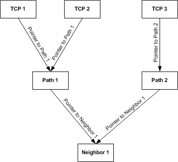

# Offload Target's Internal State Trees

\[The TCP chimney offload feature is deprecated and should not be used.\]

The offload target must create its own internal version of the state tree that the host stack passes to the offload target's [*MiniportInitiateOffload*](https://msdn.microsoft.com/library/windows/hardware/ff559393) function. The offload target can create this internal version by:

-   Linking each offloaded TCP connection state object to an offloaded path state object.

-   Linking each offloaded path state object to an offloaded neighbor state object.

Each offloaded neighbor state object is the root of a separate internal state tree. The offload target creates one internal state tree for each offloaded neighbor state object. The offload target does not link an offloaded neighbor state object to another offloaded neighbor state object.

The following figure shows a sample internal state tree.

Note the pointers that link offloaded state objects:

-   A TCP state object's pointer references a path state object. For example, the TCP1 and TCP2 state objects' pointers reference the Path1 state object.

-   A path state object's pointer references a neighbor state object. For example, the Path1 and Path2 state objects' pointers reference the Neighbor1 state object.

The pointer that links a TCP connection state object to a path state object can be the handle that the offload target supplied to the host for referencing the offloaded path state object. The offload target wrote this handle to the memory location that is pointed to by the **MiniportOffloadContext** member of the NDIS\_MINIPORT\_OFFLOAD\_BLOCK\_LIST structure that the host stack used to offload the path state object. (For more information about this handle, see [Storing and Referencing Offloaded State](storing-and-referencing-offloaded-state.md).)

Similarly, a pointer that links a path connection state object to a neighbor state object can be the handle that the offload target supplied to the host for referencing the offloaded neighbor state object.

Note that an offload target's internal state tree is "inverted" in that the neighbor state object is the root and the TCP connection state objects are the leaves. The links point "downward" in the tree from TCP connection state objects to path state objects to a neighbor state object. The tree is set up in this way to facilitate sending data. When sending a TCP segment, the offload target:

1.  Uses the offloaded TCP state to construct the TCP header.

2.  Follows the link from the TCP state object to a path state object.

3.  Uses the offloaded path state to construct the IP header.

4.  Follows the link from the path state object to a neighbor state object.

5.  Uses the offloaded neighbor state to construct a medium access control (MAC) header.

As a result, the inverted tree provides the offload target with a logical path to construct the headers that are necessary to send a TCP segment.

All of the information that an offload target requires to process a received TCP segment is contained in the segment headers. This information consists of the MAC address, the IP source and destination addresses, and the TCP port numbers. The offload target does not have to traverse an internal state tree to process a receive segment. Instead, the offload target can directly look up the TCP connection state object.

Note that the preceding description of an offload target's internal state trees is just an example and is not meant to be prescriptive. The implementation determines how an offload target actually represents offloaded state internally.

 

 

