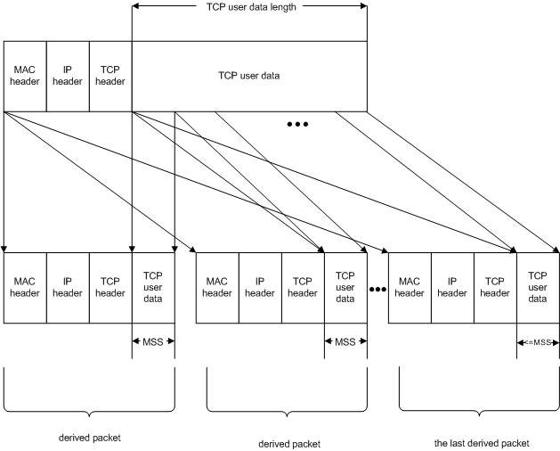

# Offloading the Segmentation of Large TCP Packets

NDIS miniport drivers can offload the segmentation of large TCP packets that are larger than the maximum transmission unit (MTU) of the network medium. A NIC that supports the segmentation of large TCP packets must also be able to:

-   Calculate IP checksums for send packets that contain IP options.

-   Calculate TCP checksums for send packets that contain TCP options.

NDIS versions 6.0 and later support large send offload version 1 (LSOV1), which is similar to large send offload (LSO) in NDIS 5.*x*. NDIS versions 6.0 and later also support large send offload version 2 (LSOV2), which provides enhanced large packet segmentation services, including support for IPv6.

A miniport driver that supports LSOV2 and LSOV1 must determine the offload type from the [**NET\_BUFFER\_LIST**](https://msdn.microsoft.com/library/windows/hardware/ff568388) structure OOB information. The driver can use the **Type** member of the [**NDIS\_TCP\_LARGE\_SEND\_OFFLOAD\_NET\_BUFFER\_LIST\_INFO**](https://msdn.microsoft.com/library/windows/hardware/ff567882) structure to determine whether the driver stack is using LSOV2 or LSOV1 and perform the appropriate offload services. Any NET\_BUFFER\_LIST structure that contains the LSOv1 or LSOv2 OOB data also contains a single [**NET\_BUFFER**](https://msdn.microsoft.com/library/windows/hardware/ff568376) structure. For more information about NDIS\_TCP\_LARGE\_SEND\_OFFLOAD\_NET\_BUFFER\_LIST\_INFO, see [Accessing TCP/IP Offload NET\_BUFFER\_LIST Information](accessing-tcp-ip-offload-net-buffer-list-information.md).

However, in a case where the miniport has received [**OID\_TCP\_OFFLOAD\_PARAMETERS**](https://msdn.microsoft.com/library/windows/hardware/ff569807) to turn off LSO feature on the miniport and after the miniport has completed the OID successfully, the miniport shall drop all [**NET\_BUFFER\_LIST**](https://msdn.microsoft.com/library/windows/hardware/ff568388) which contain any non-zero LSOv1 or LSOv2 OOB data([**NDIS\_TCP\_LARGE\_SEND\_OFFLOAD\_NET\_BUFFER\_LIST\_INFO**](https://msdn.microsoft.com/library/windows/hardware/ff567882)). 

The TCP/IP transport offloads only those large TCP packets that meet the following criteria:

-   The packet is a TCP packet. The TCP/IP transport does not offload large UDP packets for segmentation.

-   The packet must be divisible by at least the minimum number of segments specified by the miniport driver. For more information, see [Reporting a NIC's LSOV1 TCP-Packet-Segmentation Capabilities](reporting-a-nic-s-lsov1-tcp-packet-segmentation-capabilities.md) and [Reporting a NIC's LSOV2 TCP-Packet-Segmentation Capabilities](reporting-a-nic-s-lsov2-tcp-packet-segmentation-capabilities.md).

-   The packet is not a loopback packet.

-   The packet will not be sent through a tunnel.

Before offloading a large TCP packet for segmentation, the TCP/IP transport:

-   Updates the large-packet segmentation information that is associated with the [**NET\_BUFFER\_LIST**](https://msdn.microsoft.com/library/windows/hardware/ff568388) structure. This information is an [**NDIS\_TCP\_LARGE\_SEND\_OFFLOAD\_NET\_BUFFER\_LIST\_INFO**](https://msdn.microsoft.com/library/windows/hardware/ff567882) structure that is part of the **NET\_BUFFER\_LIST** information that is associated with the **NET\_BUFFER\_LIST** structure. For more information about **NET\_BUFFER\_LIST** information, see [Accessing TCP/IP Offload NET\_BUFFER\_LIST Information](accessing-tcp-ip-offload-net-buffer-list-information.md). The TCP/IP transport sets the **MSS** value to the maximum segment size (MSS).

-   Writes the total length of the large TCP packet to the Total Length field of the packet's IP header. The total length includes the length of the IP header, the length of the IP options if they are present, the length of the TCP header, the length of the TCP options if they are present, and the length of the TCP payload.

-   Calculates a one's complement sum for the TCP pseudoheader and writes this sum to the Checksum field of the TCP header. The TCP/IP transport calculates the one's complement sum over the following fields in the pseudoheader: Source IP Address, Destination IP Address, and Protocol. The one's complement sum for the pseudoheader provided by the TCP/IP transport gives the NIC an early start in calculating the real TCP checksum for each packet that the NIC derives from the large TCP packet without having to examine the IP header. Note that RFC 793 stipulates that the pseudo-header checksum is calculated over the Source IP Address, Destination IP Address, Protocol, and TCP Length. (The TCP Length is the length of the TCP header plus the length of the TCP payload. The TCP Length does not include the length of the pseudo-header.) However, because the underlying miniport driver and NIC generate TCP segments from the large packet that is passed down by the TCP/IP transport, the transport does not know the size of the TCP payload for each TCP segment and therefore cannot include the TCP Length in the pseudo-header. Instead, as described below, the NIC extends the pseudo-header checksum that was supplied by the TCP/IP transport to cover the TCP Length of each generated TCP segment.

-   Writes the correct sequence number to the Sequence Number field of the TCP header. The sequence number identifies the first byte of the TCP payload.

After the miniport driver obtains the [**NET\_BUFFER\_LIST**](https://msdn.microsoft.com/library/windows/hardware/ff568388) structure in its [*MiniportSendNetBufferLists*](https://msdn.microsoft.com/library/windows/hardware/ff559440) or [**MiniportCoSendNetBufferLists**](https://msdn.microsoft.com/library/windows/hardware/ff559365) function, it can call the [**NET\_BUFFER\_LIST\_INFO**](https://msdn.microsoft.com/library/windows/hardware/ff568401) macro with an *\_Id* of **TcpLargeSendNetBufferListInfo** to obtain the MSS value written by the TCP/IP transport.

The miniport driver obtains the total length of the large packet from the packet's IP header and uses the MSS value to divide the large TCP packet into smaller packets. Each of the smaller packets contains MSS or less user data bytes. Note that only the last packet that was created from the segmented large packet should contain less than MSS user data bytes. All other packets that were created from the segmented packet should contain MSS user data bytes. If you do not follow this rule, the creation and transmission of unnecessary extra packets could degrade performance.

The miniport driver affixes MAC, IP, and TCP headers to each segment that is derived from the large packet. The miniport driver must calculate the IP and TCP checksums for these derived packets. To calculate the TCP checksum for each packet that was derived from the large TCP packet, the NIC calculates the variable part of the TCP checksum (for the TCP header and TCP payload), adds this checksum to the one's complement sum for the pseudoheader calculated by the TCP/IP transport, and then calculates the 16-bit one's complement for the checksum. For more information about calculating such checksums, see RFC 793 and RFC 1122.

The following figure shows the segmentation of a large packet.

The length of the TCP user data in the large TCP packet should be equal to or less than the value that the miniport driver assigns to the **MaxOffLoadSize** value. For more information about the **MaxOffLoadSize** value, see [Reporting a NIC's LSOV1 TCP-Packet-Segmentation Capabilities](reporting-a-nic-s-lsov1-tcp-packet-segmentation-capabilities.md) and [Reporting a NIC's LSOV2 TCP-Packet-Segmentation Capabilities](reporting-a-nic-s-lsov2-tcp-packet-segmentation-capabilities.md).

After a driver issues a status indication to indicate a change to the **MaxOffLoadSize** value, the driver must not crash if it receives an LSO send request that uses the previous **MaxOffLoadSize** value. Instead, the driver can fail the send request.

An intermediate driver that independently issues status indications that report a change in the **MaxOffLoadSize** value must ensure that the underlying miniport adapter that has not issued a status indication does not get any packets that are larger in size than the **MaxOffLoadSize** value that the miniport adapter reported.

A miniport-intermediate driver that responds to [OID\_TCP\_OFFLOAD\_PARAMETERS](https://msdn.microsoft.com/library/windows/hardware/ff569807) to turn off LSO services must be prepared for a small window of time where LSO send requests could still reach the miniport driver.

The length of the TCP user data in a segment packet must be less than or equal to the MSS. The MSS is the ULONG value that the TCP transport passes down by using the LSO NET\_BUFFER\_LIST information that is associated with the [**NET\_BUFFER\_LIST**](https://msdn.microsoft.com/library/windows/hardware/ff568388) structure. Note that only the last packet that was created from the segmented large packet should contain less than MSS user data bytes. All other packets that were created from the segmented packet should contain MSS user data bytes. If you do not follow this rule, the creation and transmission of unnecessary extra packets could degrade performance.

The number of segment packets that were derived from the large TCP packet must be equal to or greater than the **MinSegmentCount** value that is specified by the miniport driver. For more information about the **MinSegmentCount** value, see [Reporting a NIC's LSOV1 TCP-Packet-Segmentation Capabilities](reporting-a-nic-s-lsov1-tcp-packet-segmentation-capabilities.md) and [Reporting a NIC's LSOV2 TCP-Packet-Segmentation Capabilities](reporting-a-nic-s-lsov2-tcp-packet-segmentation-capabilities.md).

The following assumptions and restrictions apply to processing IP and TCP headers:

-   The MF bit in the IP header of the large TCP packet that the TCP/IP transport offloaded will not be set, and the Fragment Offset in the IP header will be zero.

-   The URG, RST, and SYN flags in the TCP header of the large TCP packet will not be set, and the urgent offset (pointer) in the TCP header will be zero.

-   If the FIN bit in the TCP header of the large packet is set, the miniport driver must set this bit in the TCP header of the last packet that it creates from the large TCP packet.

-   If the PSH bit in the TCP header of the large TCP packet is set, the miniport driver must set this bit in the TCP header of the last packet that it creates from the large TCP packet.

-   If the large TCP packet contains IP options or TCP options (or both), the miniport driver copies these options, unaltered, to each packet that it derived from the large TCP packet. Specifically, the NIC will not increment the Time Stamp option.

-   All packet headers (Ethernet, IP, TCP) will be in the first MDL of the packet. The headers will not be split across multiple MDLs. 
    > [!TIP]
    > This assumption is valid when LSO is enabled. Otherwise, when LSO is not enabled, miniport drivers cannot assume that IP headers are in the same MDL as Ethernet headers.

The miniport driver must send the packets in [**NET\_BUFFER\_LIST**](https://msdn.microsoft.com/library/windows/hardware/ff568388) structures in the order that it receives the NET\_BUFFER\_LIST structures from the TCP/IP transport.

When processing a large TCP packet, the miniport adapter is responsible only for segmenting the packet and affixing MAC, IP, and TCP headers to the packets that are derived from the large TCP packet. The TCP/IP transport performs all other tasks (such as adjusting the send window size based on the remote host's receive window size).

Before completing the send operation for the large packet (such as with [**NdisMSendNetBufferListsComplete**](https://msdn.microsoft.com/library/windows/hardware/ff563668) or [**NdisMCoSendNetBufferListsComplete**](https://msdn.microsoft.com/library/windows/hardware/ff563570)), the miniport driver writes the [**NDIS\_TCP\_LARGE\_SEND\_OFFLOAD\_NET\_BUFFER\_LIST\_INFO**](https://msdn.microsoft.com/library/windows/hardware/ff567882) value (NET\_BUFFER\_LIST information for large-send offloads) with the total number of TCP user data bytes that are sent successfully in all packets that were created from the large TCP packet.

In addition to the previous LSO requirements, LSOV2-capable miniport drivers must also:

-   Support IPv4 or IPv6 or both IPv4 and IPv6.

-   Support replication of the IPv4 options, from the large packet, in each segment packet that the network interface card (NIC) generates.

-   Support replication of the IPv6 extension header, from the large TCP packet, in each TCP segment packet.

-   Support replication of TCP options in each TCP segment packet that the miniport driver generates.

-   Use the IP and TCP header in the [**NET\_BUFFER\_LIST**](https://msdn.microsoft.com/library/windows/hardware/ff568388) structure as a template to generate TCP/IP headers for each segment packet.

-   Use IP identification (IP ID) values in the range from 0x0000 to 0x7FFF. (The range from 0x8000 to 0xFFFF is reserved for TCP chimney offload-capable devices.) For example, if the template IP header starts with an Identification field value of 0x7FFE, the first TCP segment packet must have an IP ID value of 0x7FFE, followed by 0x7FFF, 0x0000, 0x0001, and so on.

-   Use the byte offset in the **TcpHeaderOffset** member of [**NDIS\_TCP\_LARGE\_SEND\_OFFLOAD\_NET\_BUFFER\_LIST\_INFO**](https://msdn.microsoft.com/library/windows/hardware/ff567882) to determine the location of the TCP header, starting from the first byte of the packet.

-   Limit the number of [**NET\_BUFFER**](https://msdn.microsoft.com/library/windows/hardware/ff568376) structures that are associated with each LSOV2 [**NET\_BUFFER\_LIST**](https://msdn.microsoft.com/library/windows/hardware/ff568388) structure to one.

-   Determine the total length of the packet from the length of the first NET\_BUFFER structure in the NET\_BUFFER\_LIST structure.

-   Support TCP options, IP options, and IP extension headers.

-   When a send operation is complete, the miniport driver must set the **LsoV2TransmitComplete.Reserved** member of the  [**NDIS_TCP_LARGE_SEND_OFFLOAD_NET_BUFFER_LIST_INFO**](https://msdn.microsoft.com/library/windows/hardware/ff567882) structure to zero and the **LsoV2TransmitComplete.Type** member to NDIS_TCP_LARGE_SEND_OFFLOAD_V2_TYPE. 
 

 

