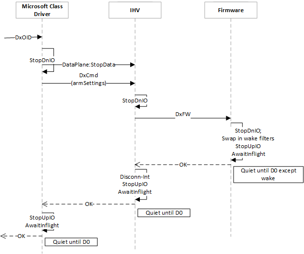

# OID\_WDI\_SET\_POWER\_STATE

OID\_WDI\_SET\_POWER\_STATE sets the power state of the device.

| Scope   | Set serialized with task | Normal execution time (seconds) |
|---------|--------------------------|---------------------------------|
| Adapter | Yes                      | 10                              |

 

A NIC comes up in D0 (device fully powered) when the system boots or when the NIC is plugged in to the system. When the condition is right (on AOAC platforms, this is when NIC Active reference is 0 on the NIC), the operating system prepares and puts the NIC in D0. When users are not present, the host goes to low power state to save power. The host may set the NIC into a lower power state where the NIC can keep connections autonomously for the host. The NIC wakes up the host for external events that the host expresses interest in.

OID\_WDI\_SET\_POWER\_STATE sets the device into D0, D1, D2, and D3. The D states are device class and platform specific. A Wi-Fi NIC usually supports only a subset of the states. For example, for Wi-Fi devices on SD bus, the supported set consists of D0, D2, and D3. The meaning of D2 and D3 are device-specific as well. For a Wi-Fi NIC on SDIO bus, it is defined to be able to wake from D2, but in D3, the NIC is halted.

A PCIe bus NIC supports D0 and D3, where D3 can be D3Hot or D3Cold. On the host software stack, there is only D3. D3hot or D3Cold depends on the host scenarios and underlying platform support. For example, in connected standby scenarios, the host offloads wake events to the NIC and sets the NIC in D3, which is D3hot with platform support to keep the NIC powered so that the NIC can watch for external events for the host. In the hibernation scenario, the host sets the NIC in D3 and the platform turns off the power to the NIC so the NIC does not use any power.

For an AOAC system that supports hibernation, the following is a summary of important system power states. On an AOAC system, a system sleep state is a connected standby state. This is the state where NICs are set to low power (D2 for SDBus NICs, D3 for PCIe NICs) and armed to wake. If the driver is suspended to the hard drive, it is the driver’s responsibility to resume firmware states as the driver does not go through reinitialization again (for example, DriverEntry is not called).

<table>
<colgroup>
<col width="20%" />
<col width="20%" />
<col width="20%" />
<col width="20%" />
<col width="20%" />
</colgroup>
<thead>
<tr class="header">
<th></th>
<th>Sleep</th>
<th>Hibernation</th>
<th>Hybrid shutdown</th>
<th>Full shutdown</th>
</tr>
</thead>
<tbody>
<tr class="odd">
<td>Request by</td>
<td>
Power button (default)
</td>
<td>
shutdown /h
</td>
<td>
shutdown /s /hybrid
</td>
<td>
shutdown /s
</td>
</tr>
<tr class="even">
<td>UI</td>
<td>
<strong>Start</strong> &gt; <strong>Power</strong> &gt; <strong>Sleep</strong>
</td>
<td>
--
</td>
<td>
<strong>Start</strong> &gt; <strong>Power</strong> &gt; <strong>Shutdown</strong>
</td>
<td>
--
</td>
</tr>
<tr class="odd">
<td>System state</td>
<td>
Connected standby
</td>
<td>
Hibernation
</td>
<td>
Hybrid shutdown
</td>
<td>
Power off
</td>
</tr>
<tr class="even">
<td>Driver state</td>
<td>
Alive - armed to wake
</td>
<td>
Suspend to hard drive
</td>
<td>
Suspend to hard drive
</td>
<td>
Power off
</td>
</tr>
</tbody>
</table>

 

For an AOAC system where hibernation is not required or supported, here is the summary of driver power states.

<table>
<colgroup>
<col width="33%" />
<col width="33%" />
<col width="33%" />
</colgroup>
<thead>
<tr class="header">
<th></th>
<th>Sleep</th>
<th>Full shutdown</th>
</tr>
</thead>
<tbody>
<tr class="odd">
<td>Request by</td>
<td>
Power button (default)
</td>
<td>
shutdown /s
</td>
</tr>
<tr class="even">
<td>UI</td>
<td>
<strong>Start</strong> &gt; <strong>Power</strong> &gt; <strong>Sleep</strong>
</td>
<td>
<strong>Start</strong> &gt; <strong>Power</strong> &gt; <strong>Shutdown</strong>
</td>
</tr>
<tr class="odd">
<td>System state</td>
<td>
Connected standby
</td>
<td>
Power off
</td>
</tr>
<tr class="even">
<td>Driver state</td>
<td>
Alive - armed to wake
</td>
<td>
Power off
</td>
</tr>
</tbody>
</table>

 

Set power commands cannot fail. The firmware should never fail such commands. The Microsoft component ensures that there are no outstanding tasks or commands when it sends any set power command. While the set power command is outstanding, the Microsoft component also guarantees that no other commands or tasks are sent to the IHV component.

| Power state                                            | Description                                                                                                                                                                                                                                                                                                                                                                                                                                                                                                |
|--------------------------------------------------------|------------------------------------------------------------------------------------------------------------------------------------------------------------------------------------------------------------------------------------------------------------------------------------------------------------------------------------------------------------------------------------------------------------------------------------------------------------------------------------------------------------|
| D0 (fully powered)                                     | The NIC is fully powered and ready to receive commands. The host never requests changes between low power states. For example, if the host wants to set the NIC power state from D2 to D3, it first sets the power state to D0, and then to D3.                                                                                                                                                                                                                                                            |
| D2 and armed for wake (SDBus NICs)                     | In D2, the host never sends requests to the firmware except the Set D0 command. See later sections in this topic for relevant flow charts.                                                                                                                                                                                                                                                                                                                                                                 |
| D3: power off (SDBus NICs), armed for wake (PCIe NICs) | For SDBus NICs, this state is powered off. For PCIe bus NICs, the operating system may arm NICs for wakes (D3Hot) or may turn off the power (D3Cold). Note that from the driver stack perspective, there is only D3 state. Multiple components are involved to enable the D3Hot state, including the ACPI table and the processing of NDIS system power IRPs that come from the operating system depending on end-user actions or inactions, such as hibernation, Connection Standby, and hybrid shutdown. |
| Dx for non-default ports                               | Dx is either D2 or D3. When the NIC is put into Dx all non-default ports are reset, which means all non-default ports are disconnected in Dx.                                                                                                                                                                                                                                                                                                                                                              |

 

## Set property parameters

<table>
<colgroup>
<col width="25%" />
<col width="25%" />
<col width="25%" />
<col width="25%" />
</colgroup>
<thead>
<tr class="header">
<th>TLV</th>
<th>Multiple TLV instances allowed</th>
<th>Optional</th>
<th>Description</th>
</tr>
</thead>
<tbody>
<tr class="odd">
<td>
<a href="https://msdn.microsoft.com/library/windows/hardware/dn898040" data-raw-source="[&lt;strong&gt;WDI_TLV_POWER_STATE&lt;/strong&gt;](https://msdn.microsoft.com/library/windows/hardware/dn898040)"><strong>WDI_TLV_POWER_STATE</strong></a>
</td>
<td></td>
<td></td>
<td>
The power state. This applies to the primary port.
</td>
</tr>
<tr class="even">
<td>
<a href="https://msdn.microsoft.com/library/windows/hardware/dn926303" data-raw-source="[&lt;strong&gt;WDI_TLV_ENABLE_WAKE_EVENTS&lt;/strong&gt;](https://msdn.microsoft.com/library/windows/hardware/dn926303)"><strong>WDI_TLV_ENABLE_WAKE_EVENTS</strong></a>
</td>
<td></td>
<td>X</td>
<td>
This field may only appear when the NIC is being put into low power and is armed to wake on any of the specified events (such as D2 on SD IO).
</td>
</tr>
<tr class="odd">
<td>
<a href="https://msdn.microsoft.com/library/windows/hardware/dn898060" data-raw-source="[&lt;strong&gt;WDI_TLV_SET_POWER_DX_REASON&lt;/strong&gt;](https://msdn.microsoft.com/library/windows/hardware/dn898060)"><strong>WDI_TLV_SET_POWER_DX_REASON</strong></a>
</td>
<td></td>
<td>X</td>
<td>
The set power reason.
</td>
</tr>
</tbody>
</table>

 

## Set property results

| TLV                                                                                 | Multiple TLV instances allowed | Optional | Description                                                                                                                                                                                                                                                                                                                                               |
|-------------------------------------------------------------------------------------|--------------------------------|----------|-----------------------------------------------------------------------------------------------------------------------------------------------------------------------------------------------------------------------------------------------------------------------------------------------------------------------------------------------------------|
| [**WDI\_TLV\_ADAPTER\_RESUME\_REQUIRED**](https://msdn.microsoft.com/library/windows/hardware/dn926120) |                                | X        | If the value is true, it signals to the OS that the firmware needs assistance in resuming its context. This should only occur when the driver is suspended to storage. The IHV component must reset the software state because the operating system issues a series of Wi-Fi commands to bring the firmware context and IHV component context up to date. |

 

## Enable wake events

A NIC specifies the set of events that it can detect to wake the stack. The operating system plumbs down a subset or full set of the events to the NIC with the low power command. Some wake event parameters are set much earlier than the Dx command. Others are set right before the Dx command to the firmware. All events only become enabled with the Dx command.

In this interface, the event that is set to enabled is plumbed down in the optional [**WDI\_TLV\_ENABLE\_WAKE\_EVENTS**](https://msdn.microsoft.com/library/windows/hardware/dn926303) TLV as part of the OID\_WDI\_SET\_POWER command for device power state Dx. The TLV is absent if the operating system does not want to arm the NIC to wake.

When the firmware receives a Dx command with [**WDI\_TLV\_ENABLE\_WAKE\_EVENTS**](https://msdn.microsoft.com/library/windows/hardware/dn926303), it may detect a wake event before it completes the Dx command. It should buffer the event, finish processing the command, and then assert the wake interrupt.

Each and every wake by the Wi-Fi NIC should be followed by a wake reason for why the NIC wakes the stack. A NIC wakes the stack by asserting the wake interrupt line, which is typically serviced by the bus or ACPI methods. The methods wake the CPU and required components to handle the wake event, and complete the Wi-Fi Wait Wake IRP for the stack. Subsequently, the operating system issues a D0 request to the driver and firmware. This request is a power OID to the driver that sends a D0 command to the firmware. The firmware holds the indication of the wake reason until it receives and completes the D0 command.

**Note**  If the NIC receives the D0 command for some other reason (for example, the NIC does not wake the host), the NIC should not indicate a wake reason.

 

## No enabled wake events

If there is no [**WDI\_TLV\_ENABLE\_WAKE\_EVENTS**](https://msdn.microsoft.com/library/windows/hardware/dn926303) present, the operating system does not need the NICs to run at low power. The NICs may be completely powered off. If suspended to a hard drive, the NICs drivers are expected to resume firmware context at resume.

## Power state interaction and transition examples

The following diagrams show interactions and sequences of transitions between D0 and Dx (D2 or D3) for the NIC. In this context, the "Miniport" represents the host or WDI compliant driver.

### D0 to Dx (armed to wake)

-   Stop \[DnIO|UpIO\]: DnIO are messages (controls and data) to lower layer. UpIO are messages to upper layer.

    -   Reject new requests from above layer (fail fast).
    -   Stop initiating IO from this layer (except this Dx command).
    -   Allow lower layer to inject TXs needed to go into Dx.
    -   Flush queues.
-   AwaitInflight: Waiting for IO calls to return, including DMA in progress. Flush queues.

-   Dx is any non-D0 state. For SDBus Wi-Fi, this is D2. For PCIe bus, this is D3Hot. Firmware shall not lose power.

### Dx (armed to wake) to D0 transition

-   If the NIC is armed to wake, it can't be D3Cold. Firmware must continue running in Dx.

### D0 to D3 (not armed to wake) transition

-   Stop \[DnIO|UpIO\]: DnIO are messages (controls and data) to lower layer. UpIO are messages to upper layer.

    -   Reject new requests from above layer (fail fast).
    -   Stop initiating IO from this layer (except this Dx command).
    -   Allow lower layer to inject TXs needed to go into Dx.
    -   Flush queues.
-   AwaitInflight: Waiting for IO calls to return, including DMA in progress. Flush queues.

-   D3 without PmParameters. The NIC may (D3Cold) or may not be powered off (for example, a shared power rail with a D0 device).

### Dx (not armed to wake) to D0 transition

-   D2 notArmToWake: Kept power, no reinitialization required.
-   D3 notArmtoWake: Might be Hot or Cold. Cold requires that context be restored.

Requirements
------------

<table>
<colgroup>
<col width="50%" />
<col width="50%" />
</colgroup>
<tbody>
<tr class="odd">
<td>
Minimum supported client
</td>
<td>
Windows 10
</td>
</tr>
<tr class="even">
<td>
Minimum supported server
</td>
<td>
Windows Server 2016
</td>
</tr>
<tr class="odd">
<td>
Header
</td>
<td>Dot11wdi.h</td>
</tr>
</tbody>
</table>

 

 

