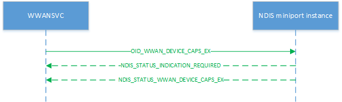

# OID\_WWAN\_DEVICE\_CAPS\_EX

OID\_WWAN\_DEVICE\_CAPS\_EX is similar to [OID\_WWAN\_DEVICE\_CAPS](oid-wwan-device-caps.md) but is a per-executor OID, unlike OID_WWAN_DEVICE_CAPS which is a per-device OID. This OID serves to indicate the hardware’s device/executor capability, including the capability on extended optional features such as LTE attach APN configuration.

Miniport drivers must process query requests asynchronously, initially returning NDIS\_STATUS\_INDICATION\_REQUIRED to the original request before later sending an [**NDIS\_STATUS\_WWAN\_DEVICE\_CAPS\_EX**](./ndis-status-wwan-device-caps-ex.md) status notification containing an [**NDIS\_WWAN\_DEVICE\_CAPS\_EX**](/windows-hardware/drivers/ddi/ndiswwan/ns-ndiswwan-_ndis_wwan_device_caps_ex) structure, which in turn contains a [**WWAN\_DEVICE\_CAPS\_EX**](/windows-hardware/drivers/ddi/wwan/ns-wwan-_wwan_device_caps_ex) structure, to provide information about the device's capability.

The following diagram illustrates a query request.

Set requests are not applicable.

## Remarks

It is critical for the driver to report service extension capability as a whole including from the driver to the actual device. If a driver supports a service but it is not supported by the underlying hardware, then the service capabilities should be marked as FALSE.

OID\_WWAN\_DEVICE\_CAPS\_EX is also used to retrieve each executor’s capability. This OID is the same in structure as existing [OID\_WWAN\_DEVICE\_CAPS](oid-wwan-device-caps.md) but with the addition of **Executor ID**. A miniport driver should report the highest OID version it supports.

Just as with [OID\_WWAN\_DEVICE\_CAPS](oid-wwan-device-caps.md), the parameters in this OID are not expected to change due to SIM cards but rather represent the modem’s RF capability of the selected executor. A physical hardware modem may have multiple executors and thus may have multiple interfaces that support OID\_WWAN\_DEVICE\_CAPS\_EX.

For possible future updates, if the OS’s requested version is newer than the device-supported version, the device should return the newest version of the OID structure it supports. If the OS’s requested version is older than the latest one supported by the device, then the device should return the version matching the OS’s specification. It is a requirement for IHVs to make sure all revisions of OID\_WWAN\_DEVICE\_CAPS\_EX are supported for backwards compatibility and legacy support.

Unlike other OIDs new to Windows 10 Version 1703 that are only required if the modem supports multi-SIM/multi-executors, this OID must be implemented for modems that would like to support any Microsoft-defined service extensions starting in Windows 10 Version 1703.

Versions of Windows prior to Windows 10 Version 1703 may still use the existing [OID\_WWAN\_DEVICE\_CAPS](oid-wwan-device-caps.md); their behavior with multi-executor capable modems is not a supported scenario. IHVs must define this behavior.

### Windows 10, version 1903

Starting in Windows 10, version 1903, OID_WWAN_DEVICE_CAPS_EX has been upgraded to revision 2. A miniport driver must use revision 2 of this OID and the data structures it contains if the miniport driver supports 5G.

When the host queries capabilities using this OID, the miniport driver must check if the underlying hardware supports 5G cellular capabilities. If it does, the miniport driver sets the bitmask in the **WwanDataClass** field of the [**WWAN_DEVICE_CAPS_EX**](/windows-hardware/drivers/ddi/wwan/ns-wwan-_wwan_device_caps_ex) structure according to hardware capabilties.

Additionally, in the **WwanOptionalServiceCaps** field of the **WWAN_DEVICE_CAPS_EX** structure, a new optional service bit is defined that covers support of all new 5G-related extensions.

For more info about 5G data class support, see [MB 5G data class support](./mb-5g-operations-overview.md).

## Requirements

<table>
<colgroup>
<col width="50%" />
<col width="50%" />
</colgroup>
<tbody>
<tr class="odd">
<td>
Version
</td>
<td>
Windows 10, version 1703
</td>
</tr>
<tr class="even">
<td>
Header
</td>
<td>Ntddndis.h (include Ndis.h)</td>
</tr>
</tbody>
</table>

## See also

[OID\_WWAN\_DEVICE\_CAPS](oid-wwan-device-caps.md)

[**NDIS\_STATUS\_WWAN\_DEVICE\_CAPS\_EX**](./ndis-status-wwan-device-caps-ex.md)

[**NDIS\_WWAN\_DEVICE\_CAPS\_EX**](/windows-hardware/drivers/ddi/ndiswwan/ns-ndiswwan-_ndis_wwan_device_caps_ex)

[**WWAN\_DEVICE\_CAPS\_EX**](/windows-hardware/drivers/ddi/wwan/ns-wwan-_wwan_device_caps_ex)