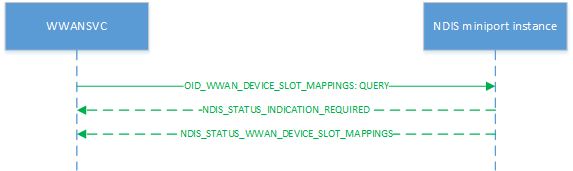

# OID\_WWAN\_DEVICE\_SLOT\_MAPPING\_INFO

OID\_WWAN\_DEVICE\_SLOT\_MAPPING\_INFO sets or returns the device-slot mappings of the MB device (i.e. the executor-slot mappings).

Miniport drivers must process query requests asynchronously, initially returning NDIS\_STATUS\_INDICATION\_REQUIRED to the original request before later sending an [**NDIS\_STATUS\_WWAN\_DEVICE\_SLOT\_MAPPING\_INFO**](./ndis-status-wwan-device-slot-mappings.md) status notification containing an [**NDIS\_WWAN\_DEVICE\_SLOT\_MAPPING\_INFO**](/windows-hardware/drivers/ddi/ndiswwan/ns-ndiswwan-_ndis_wwan_device_slot_mapping_info) structure to provide information on the executor-to-slot mappings.

The following diagram illustrates a query request.

Miniport drivers must process set requests asynchronously, initially returning NDIS\_STATUS\_INDICATION\_REQUIRED to the original request before later sending an [**NDIS\_STATUS\_WWAN\_DEVICE\_SLOT\_MAPPING\_INFO**](./ndis-status-wwan-device-slot-mappings.md) status notification containing an [**NDIS\_WWAN\_DEVICE\_SLOT\_MAPPING\_INFO**](/windows-hardware/drivers/ddi/ndiswwan/ns-ndiswwan-_ndis_wwan_device_slot_mapping_info) structure, which in turn contains a [**WWAN\_DEVICE\_SLOT\_MAPPING\_INFO**](/windows-hardware/drivers/ddi/wwan/ns-wwan-_wwan_device_slot_mapping_info) structure to indicate the current mapping status. This holds true even if the set request failed. The structure for set requests for OID\_WWAN\_DEVICE\_SLOT\_MAPPING\_INFO is [**NDIS\_WWAN\_SET\_DEVICE\_SLOT\_MAPPING\_INFO**](/windows-hardware/drivers/ddi/ndiswwan/ns-ndiswwan-_ndis_wwan_set_device_slot_mapping_info).

The following diagram illustrates a set request.

## Remarks

The host expects that on first boot, the modem would have a default mapping between slots and executors. The host performs a SET operation with OID\_WWAN\_DEVICE\_SLOT\_MAPPING\_INFO to define the slot that is bound to each executor. The host expects the modem to maintain the mapping across reboots and removals/insertions. This OID is not executor-specific and may be sent to any NDIS instance on the device. It may also query the current mapping as shown above.

## Requirements

<table>
<colgroup>
<col width="50%" />
<col width="50%" />
</colgroup>
<tbody>
<tr class="odd">
<td>
Version
</td>
<td>
Windows 10, version 1703
</td>
</tr>
<tr class="even">
<td>
Header
</td>
<td>Ntddndis.h (include Ndis.h)</td>
</tr>
</tbody>
</table>

## See also

[**NDIS\_STATUS\_WWAN\_DEVICE\_SLOT\_MAPPING\_INFO**](./ndis-status-wwan-device-slot-mappings.md)

[**NDIS\_WWAN\_DEVICE\_SLOT\_MAPPING\_INFO**](/windows-hardware/drivers/ddi/ndiswwan/ns-ndiswwan-_ndis_wwan_device_slot_mapping_info)

[**NDIS\_WWAN\_SET\_DEVICE\_SLOT\_MAPPING\_INFO**](/windows-hardware/drivers/ddi/ndiswwan/ns-ndiswwan-_ndis_wwan_set_device_slot_mapping_info)

 

