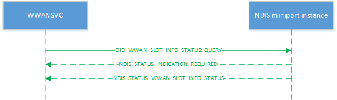

# OID\_WWAN\_SLOT\_INFO

OID\_WWAN\_SLOT\_INFO retrieves a high-level aggregated status of a specified UICC slot and the card within it (if any). It may also be used to deliver an unsolicited notification when the status of one of the slots changes.

Miniport drivers must process query requests asynchronously, initially returning NDIS\_STATUS\_INDICATION\_REQUIRED to the original request before later sending an [**NDIS\_STATUS\_WWAN\_SLOT\_INFO**](https://msdn.microsoft.com/library/windows/hardware/mt782398) status notification containing an [**NDIS\_WWAN\_SLOT\_INFO**](https://msdn.microsoft.com/library/windows/hardware/mt782408) structure, which in turn contains a [**WWAN\_SLOT\_INFO**](https://msdn.microsoft.com/library/windows/hardware/mt799892) structure, to provide information about the overall modem system capability.

Query requests specify [**NDIS\_WWAN\_GET\_SLOT\_INFO**](https://msdn.microsoft.com/library/windows/hardware/mt782404) structure as input. The miniport driver should return the slot status according to the slot ID specified in the **SlotIndex** member of the [**WWAN\_GET\_SLOT\_INFO**](https://msdn.microsoft.com/library/windows/hardware/mt799891) structure.

The following diagram illustrates a query request.

Set requests are not applicable.

An [**NDIS\_STATUS\_WWAN\_SLOT\_INFO**](https://msdn.microsoft.com/library/windows/hardware/mt782398) notification with a [**NDIS\_WWAN\_SLOT\_INFO**](https://msdn.microsoft.com/library/windows/hardware/mt782408) structure is sent to host when the slot/card state changes.

Remarks
-------

The host uses OID\_WWAN\_SLOT\_INFO to query the status of a specific slot on the modem. This OID is not executor-specific and may be sent to any NDIS instance belonging to one modem. The slot state represents a summary of both the slot and card state.

The set of reported states is constrained by the capability of the slot hardware. In the most restrictive case, the slot hardware may only be able to determine that a card is present when it is powered on and active—in such a case the **OffEmpty** and **Off** states will not be reported.

[OID\_WWAN\_READY\_INFO](oid-wwan-ready-info.md) and OID\_WWAN\_SLOT\_INFO perform the same core function of retrieving the device ready-state of a SIM card slot; however, OID\_WWAN\_READY\_INFO is a per-executor command whereas OID\_WWAN\_SLOT\_INFO could be used on any physical instance (executor) and is expected to return the appropriate slot state even if it is not mapped to any executors at the moment.

Requirements
------------

<table>
<colgroup>
<col width="50%" />
<col width="50%" />
</colgroup>
<tbody>
<tr class="odd">
<td>
Version
</td>
<td>
Windows 10, version 1703
</td>
</tr>
<tr class="even">
<td>
Header
</td>
<td>Ntddndis.h (include Ndis.h)</td>
</tr>
</tbody>
</table>

## See also

[**NDIS\_STATUS\_WWAN\_SLOT\_INFO**](https://msdn.microsoft.com/library/windows/hardware/mt782398)

[**NDIS\_WWAN\_SLOT\_INFO**](https://msdn.microsoft.com/library/windows/hardware/mt782408)

[**WWAN\_SLOT\_INFO**](https://msdn.microsoft.com/library/windows/hardware/mt799892)

[**NDIS\_WWAN\_GET\_SLOT\_INFO**](https://msdn.microsoft.com/library/windows/hardware/mt782404)

[**WWAN\_GET\_SLOT\_INFO**](https://msdn.microsoft.com/library/windows/hardware/mt799891)

[**WWAN\_UICCSLOT\_STATE**](https://msdn.microsoft.com/library/windows/hardware/mt799894)

[OID\_WWAN\_READY\_INFO](oid-wwan-ready-info.md)

 

 

