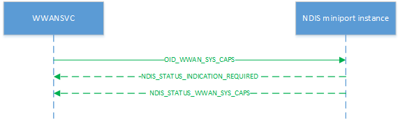

# OID\_WWAN\_SYS\_CAPS\_INFO

OID\_WWAN\_SYS\_CAPS\_INFO retrieves information about the modem. It can be sent on any of the NDIS instances exposed by the modem.

Miniport drivers must process query requests asynchronously, initially returning NDIS\_STATUS\_INDICATION\_REQUIRED to the original request before later sending an [**NDIS\_STATUS\_WWAN\_SYS\_CAPS\_INFO**](https://msdn.microsoft.com/library/windows/hardware/mt782400) status notification containing an [**NDIS\_WWAN\_SYS\_CAPS\_INFO**](https://msdn.microsoft.com/library/windows/hardware/mt782410) structure, which in turn contains a [**WWAN\_SYS\_CAPS\_INFO**](https://msdn.microsoft.com/library/windows/hardware/mt799893) structure, to provide information about the overall modem system capability.

The following diagram illustrates a query request.

Set requests are not applicable.

Remarks
-------

The host uses OID\_WWAN\_SYS\_CAPS\_INFO to query the number of devices (executors) and slots in the modem as well as the number of executors that may be active concurrently. A dual-standby modem would have a concurrency of 1; a dual-active modem would have a concurrency of 2. This OID is not executor-specific and may be sent to any NDIS instance.

The modem may expose multiple configurations with differing numbers of executors and slots. Regardless of which configuration is selected, this query will return the maximum number of devices and slots that the modem can support as currently configured.

A modem supporting OID\_WWAN\_SYS\_CAPS\_INFO is expected to also support [OID\_WWAN\_DEVICE\_CAPS\_EX](oid-wwan-device-caps-ex.md). Versions of Windows that support multi-executor modems will not use the legacy [OID\_WWAN\_DEVICE\_CAPS](oid-wwan-device-caps.md) if the underlying modem supports OID\_WWAN\_SYS\_CAPS\_INFO. For legacy versions of the OS (any version before Windows 10 Version 1703 for the purposes of this OID), a multi-executor modem would be represented as multiple independent modems and the existing OID\_WWAN\_DEVICE\_CAPS, available starting in Windows 8, will be used.

Requirements
------------

<table>
<colgroup>
<col width="50%" />
<col width="50%" />
</colgroup>
<tbody>
<tr class="odd">
<td>
Version
</td>
<td>
Windows 10, version 1703
</td>
</tr>
<tr class="even">
<td>
Header
</td>
<td>Ntddndis.h (include Ndis.h)</td>
</tr>
</tbody>
</table>

## See also

[**NDIS\_STATUS\_WWAN\_SYS\_CAPS\_INFO**](https://msdn.microsoft.com/library/windows/hardware/mt782400)

[**NDIS\_WWAN\_SYS\_CAPS\_INFO**](https://msdn.microsoft.com/library/windows/hardware/mt782410)

[**WWAN\_SYS\_CAPS\_INFO**](https://msdn.microsoft.com/library/windows/hardware/mt799893)

[OID\_WWAN\_DEVICE\_CAPS\_EX](oid-wwan-device-caps-ex.md)

[OID\_WWAN\_DEVICE\_CAPS](oid-wwan-device-caps.md)

 

 

