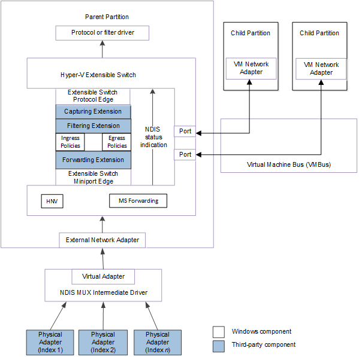
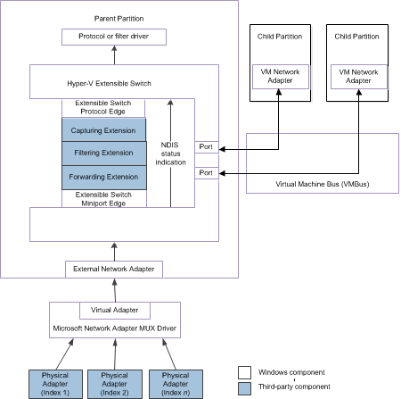

# Originating NDIS Status Indications from Physical Network Adapters

This topic discusses the method that is used by an extensible switch forwarding extension to originate NDIS status indications for a network adapter that is connected to the switch. The extension can originate an NDIS status indication for the following types of adapters:

-   One or more underlying physical adapters that are bound to the [external network adapter](external-network-adapters.md) of the extensible switch.

    For example, the external network adapter can be bound to the virtual miniport edge of an NDIS multiplexer (MUX) intermediate driver. The MUX driver is bound to a team of one or more physical networks on the host. This configuration is known as an *extensible switch team*.

    In this configuration, an extensible switch extension is exposed to every network adapter in the team. This allows the extension to manage the configuration and use of individual network adapters in the team. For example, a forwarding extension can provide support for a load balancing failover (LBFO) solution over the team by forwarding outgoing packets to individual adapters. A forwarding extension that manages an extensible switch team is known as a *teaming provider*. For more information about teaming providers, see [Teaming Provider Extensions](teaming-provider-extensions.md).

-   A virtual machine (VM) network adapter that is exposed within a Hyper-V child partition and connected to an extensible switch port.

The following figure shows the Hyper-V extensible switch control path for NDIS status indications from physical and VM network adapters for NDIS 6.40 (Windows Server 2012 R2) and later.

The following figure shows the Hyper-V extensible switch control path for NDIS status indications from physical and VM network adapters for NDIS 6.30 (Windows Server 2012).

**Note**  In the extensible switch interface, NDIS filter drivers are known as *extensions* and the driver stack is known as the *extensible switch driver stack*.

 

A forwarding extension can originate encapsulated hardware offload status indications to overlying drivers in the extensible switch driver stack. This also allows the extension to change the current offload capabilities of the underlying team of physical adapters that are bound to the external network adapter of the extensible switch. When a team of adapters are bound to the external network adapter, only the common capabilities of the team are advertised to NDIS or overlying protocol and filter drivers. The extension can extend the advertised capabilities by originating encapsulated status indications to advertise capabilities that are supported by some adapters in the team. For example, the extension can issue an encapsulated [**NDIS\_STATUS\_RECEIVE\_FILTER\_CURRENT\_CAPABILITIES**](https://msdn.microsoft.com/library/windows/hardware/hh439814) indication to change the currently enabled receive filter capabilities for the entire team.

**Note**  Only forwarding extensions can originate encapsulated status indications. For more information about this type of extension, see [Forwarding Extension](forwarding-extensions.md).

 

Typically, the forwarding extension originates encapsulated NDIS status indications to change the advertised hardware offload capabilities of the underlying physical adapter. For example, the extension can originate status indications for the following types of hardware offloads:

-   Internet Protocol security (IPsec).

-   Virtualized machine queue (VMQ).

-   Single root I/O virtualization (SR-IOV).

The forwarding extension can also originate encapsulated NDIS status indications to change the hardware offload resources that are allocated for a Hyper-V child partition. Starting with NDIS 6.30, the extension can issue an encapsulated [**NDIS\_STATUS\_SWITCH\_PORT\_REMOVE\_VF**](https://msdn.microsoft.com/library/windows/hardware/hh598206) indication to remove the binding between a VM network adapter and a PCI Express (PCIe) virtual function (VF). The VF is exposed and supported by an underlying physical network adapter that supports the [single root I/O virtualization (SR-IOV)](single-root-i-o-virtualization--sr-iov-.md) interface.

If the forwarding extension originates an encapsulated NDIS status indication for the hardware offload resources of an underlying physical adapter, it must set the members of the [**NDIS\_SWITCH\_NIC\_STATUS\_INDICATION**](https://msdn.microsoft.com/library/windows/hardware/hh598217) structure in the following way:

-   The **DestinationPortId** member must be set to **NDIS\_SWITCH\_DEFAULT\_PORT\_ID**.
-   The **DestinationNicIndex** member must be set to **NDIS\_SWITCH\_DEFAULT\_NIC\_INDEX**

-   The **SourcePortId** member must be set to the identifier of the extensible switch port to which the external network adapter is connected.

-   The **SourceNicIndex** member must be set to **NDIS\_SWITCH\_DEFAULT\_NIC\_INDEX**. This allows the status indication to be interpreted as originating from the entire extensible switch team that is bound to the external network adapter.

    **Note**  The forwarding extension must also set this member to **NDIS\_SWITCH\_DEFAULT\_NIC\_INDEX** if only a single physical network adapter is bound to the external network adapter.

     

-   The **StatusIndication** member must be set to a pointer to an [**NDIS\_STATUS\_INDICATION**](https://msdn.microsoft.com/library/windows/hardware/ff567373) structure. This structure contains the data for the encapsulated NDIS status indication.

If the forwarding extension is originating an NDIS status indication for the hardware offload resources of a Hyper-V child partition, it must set the members of the [**NDIS\_SWITCH\_NIC\_STATUS\_INDICATION**](https://msdn.microsoft.com/library/windows/hardware/hh598217) structure in the following way:

-   The **DestinationPortId** and **DestinationNicIndex** members must be set to the corresponding values of the port and network adapter index for the network connection that is used by the partition.

-   The **SourcePortId** member must be set to **NDIS\_SWITCH\_DEFAULT\_PORT\_ID**.

-   The **SourceNicIndex** member must be set to **NDIS\_SWITCH\_DEFAULT\_NIC\_INDEX**.

-   The **StatusIndication** member must be set to a pointer to an [**NDIS\_STATUS\_INDICATION**](https://msdn.microsoft.com/library/windows/hardware/ff567373) structure. This structure contains the data for the encapsulated NDIS status indication.

When the extension issues the encapsulated NDIS status indication, it must follow these steps:

1.  The extension calls [*ReferenceSwitchNic*](https://msdn.microsoft.com/library/windows/hardware/hh598294) to increment a reference counter for the source or destination network adapter connection. This guarantees that the extensible switch interface will not delete the network adapter connection while its reference counter is nonzero.

    When the extension calls [*ReferenceSwitchNic*](https://msdn.microsoft.com/library/windows/hardware/hh598294), it sets the parameters in the following ways:

    -   If the forwarding extension is originating an encapsulated NDIS status indication for an underlying physical adapter, it sets the *SwitchPortId* parameter to the value specified for the **SourcePortId** member. The extension also sets the *SwitchNicIndex* parameter to the value specified for the **SourceNicIndex** member.

    -   If the forwarding extension is originating an NDIS status indication for a Hyper-V child partition, it sets the *SwitchPortId* parameter to the value specified for the **DestinationPortId** member. The extension also sets the *SwitchNicIndex* parameter to the value specified for the **DestinationNicIndex** member.

    **Note**  If [*ReferenceSwitchNic*](https://msdn.microsoft.com/library/windows/hardware/hh598294) does not return NDIS\_STATUS\_SUCCESS, the encapsulated NDIS status indication cannot be issued.

     

2.  The extension calls [**NdisFIndicateStatus**](https://msdn.microsoft.com/library/windows/hardware/ff561824) to forward the encapsulated status notification.

    **Note**  If the extension is forwarding a filtered OID request, it must call [**NdisFIndicateStatus**](https://msdn.microsoft.com/library/windows/hardware/ff561824) within the context of the call to its [*FilterStatus*](https://msdn.microsoft.com/library/windows/hardware/ff549973) function.

     

3.  After [**NdisFIndicateStatus**](https://msdn.microsoft.com/library/windows/hardware/ff561824) returns, the extension calls [*DereferenceSwitchNic*](https://msdn.microsoft.com/library/windows/hardware/hh598141) to clear the reference counter for the source or destination network adapter connection. The extension sets the *SwitchPortId* and *SwitchNicIndex* parameters to the same values that it used in the call to [*ReferenceSwitchNic*](https://msdn.microsoft.com/library/windows/hardware/hh598294).

 

 

