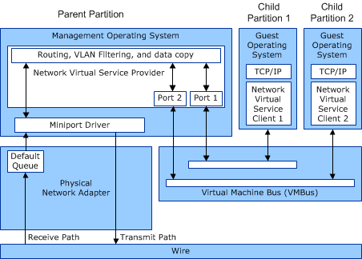

# Overview of Hyper-V

Hyper-V is a hypervisor-based virtualization technology for x64 versions of Windows Server 2008 and later versions of Windows Server. The hypervisor is the processor-specific virtualization platform that allows multiple isolated operating systems to share a single hardware platform.

Hyper-V supports isolation through separate *partitions*. A partition is a logical unit of isolation, supported by the hypervisor, in which operating systems execute. The virtualization stack runs in the management operating system of the Hyper-V parent partition, and has direct access to the hardware devices. The management operating system then creates the Hyper-V child partitions and starts the guest operating systems within them.

Partitions do not have access to the physical processor, nor do they handle the processor interrupts. Instead, they have a virtual view of the processor and run in a virtual memory address region that is private to each guest partition. The hypervisor handles the interrupts to the processor, and redirects them to the respective partition. Hyper-V can also hardware accelerate the address translation between various guest virtual address spaces by using an I/O memory management unit (IOMMU) which operates independently of the memory management hardware used by the processor. An IOMMU is used to remap physical memory addresses to the addresses that are used by the child partitions.

Child partitions also do not have direct access to other hardware resources. Instead, child partitions are presented a virtual view of the resources, known as *virtual devices*. Requests to the virtual devices are redirected either through the virtual machine bus (VMBus) or the hypervisor to the management operating system in the parent partition, which handles the device requests. The VMBus is a logical inter-partition communication channel, with separate channels allocated for communication between the parent partition and a child partition.

The management operating system hosts virtual service providers (VSPs) that communicate over the VMBus to handle device access requests from child partitions. The guest operating system on a child partition hosts virtual service clients (VSCs) that redirect device requests to VSPs in the management operating system by using the VMBus.

For network access to child partitions, a Network VSC (NetVSC) runs in a guest operating system. Networking requests and packets are sent between each NetVSC and the Network VSP that runs in the management operating system. The NetVSC also exposes a virtualized view of the physical network adapter on the host computer. This virtualized network adapter is known as a *synthetic network adapter*.

**Note**  Hyper-V also supports another less-efficient virtualized network adapter that is known as an *emulated network adapter*. An emulated network adapter mimics an Intel network adapter and uses hardware emulation to forward packets to and from the NetVSP.

 

The following figure shows the networking data paths in Hyper-V over synthetic network adapters.

These data paths are extended by using NDIS virtualized networking interfaces, such as the virtual machine queue (VMQ), single root I/O virtualization (SR-IOV), or Hyper-V extensible switch interfaces. For example, the NetVSC could be configured to connect to a Virtual Function (VF) of a physical network adapter that supports the SR-IOV interface. In this case, the NetVSC sends and receives packets directly over the underlying physical adapter and not over the VMBus.

For more information about Hyper-V, see [Hyper-V](http://go.microsoft.com/fwlink/p/?linkid=217079).

 

 

