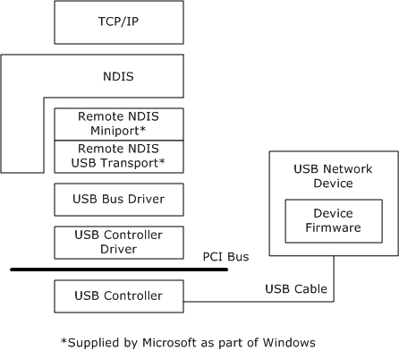

# Overview of Remote NDIS (RNDIS)

Remote NDIS (RNDIS) eliminates the need for hardware vendors to write an NDIS miniport device driver for a network device attached to the USB bus. Remote NDIS accomplishes this by defining a bus-independent message set and a description of how this message set operates over the USB bus. Because this Remote NDIS interface is standardized, one set of host drivers can support any number of networking devices attached to the USB bus. This significantly reduces the development burden on device manufacturers, improves the overall stability of the system because no new drivers are required, and improves the end-user experience because there are no drivers to install to support a new USB bus-connected network device. Currently Microsoft Windows provides support for Remote NDIS over USB.

The following figure shows the replacement of the device manufacturer's NDIS miniport with the combination of a Remote NDIS miniport driver and a USB transport driver. The device manufacturer can therefore concentrate on device implementation and not have to develop a Windows NDIS device driver.

Microsoft provides an NDIS miniport driver, Rndismp.sys, which implements the Remote NDIS message set and communicates with generic bus transport drivers, which in turn communicate with the appropriate bus driver. This NDIS miniport driver is implemented and maintained by Microsoft and is distributed as part of Windows.

The following Remote NDIS message set mirrors the semantics of the NDIS miniport driver interface:

-   Initializing, resetting, and halting device operation

-   Transmitting and receiving networking data packets

-   Setting and querying device operational parameters

-   Indicating media link status and monitoring device status

Microsoft also provides a USB bus transport driver that implements a mechanism for carrying the Remote NDIS messages across the USB bus. This driver transports standardized Remote NDIS messages between the Remote NDIS miniport driver and the bus-specific driver, such as USB. The bus-specific drivers are also required to map any bus-specific requirements, such as power management, into standardized Remote NDIS messages. The transport driver for USB 1.1 and 2.0 is implemented and maintained by Microsoft and distributed as part of Windows.

This structure allows a single device driver to be used for any Remote NDIS device for which there is a bus-specific transport layer. In addition, only one bus transport layer is required for all network devices on a specific bus.

This section includes the following additional topics:

[Benefits of Remote NDIS](benefits-of-remote-ndis.md)

[Remote NDIS Concepts and Definitions](remote-ndis-concepts-and-definitions.md)

[Remote NDIS File Naming Conventions](remote-ndis-file-naming-conventions.md)

[Remote NDIS Messaging](remote-ndis-messaging.md)

[Remote NDIS Device Control](remote-ndis-device-control.md)

[Remote NDIS INF Template](remote-ndis-inf-template.md)

[Types of Remote NDIS Devices](types-of-remote-ndis-devices.md)

## Related topics

[USB class drivers included in Windows](https://msdn.microsoft.com/library/windows/hardware/ff538820)

 

 

