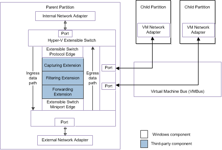

# Overview of the Hyper-V Extensible Switch

Windows Server 2012 introduces the Hyper-V Extensible Switch (also called the Hyper-V Virtual Switch), which is a virtual Ethernet switch that runs in the management operating system of the Hyper-V parent partition. This page covers the following subjects:

-   [Background Reading](#background-reading)
-   [Types of Hyper-V extensible switches and network adapters](#types-of-hyper-v--extensible-switches-and-network-adapters)
-   [Types of extensible switch extensions](#types-of-extensible-switch-extensions)
-   [Hyper-V extensible switch architectural diagrams](#hyper-v-extensible-switch-architectural-diagrams)

## Background Reading

For high-level technical overviews of this technology and its underpinnings, see the following TechNet documentation:

-   [Hyper-V Virtual Switch Overview](http://technet.microsoft.com/library/hh831823.aspx)
-   [Hyper-V Network Virtualization Overview](http://technet.microsoft.com/library/jj134230.aspx)
-   [Hyper-V Overview](http://technet.microsoft.com/library/hh831531.aspx)

## Types of Hyper-V extensible switches and network adapters

The Hyper-V Virtual Network Manager can be used to create, configure, or delete one or more extensible switches of the following types:

-   An external extensible switch that supports ports that connect to a single external network adapter as well as one or more virtual machine (VM) network adapters. This type of switch allows packets to be sent or received between all Hyper-V partitions and the physical network interface on the host.

    Also, applications and drivers that run in the management operating system can send or receive packets through this type of switch.

-   An internal extensible switch that supports ports that connect to one or more internal network adapters as well as one or more VM network adapters. This type of switch allows packets to be sent or received between the Hyper-V parent partition and one or more Hyper-V child partitions on the host.

    Also, applications and drivers that run in the management operating system can send or receive packets through this type of switch.

-   A private extensible switch that supports ports that connect to one or more VM network adapters. This type of switch allows packets to be sent or received only between Hyper-V child partitions.

    **Note**  Applications and drivers that run in the management operating system cannot send or receive packets through this type of switch.

     

Each extensible switch module routes incoming and outgoing packets over the network adapters that are used by the Hyper-V child and parent partitions. These network adapters include the following:

-   External network adapters that provide the connection to the physical network interface that is available on the host.

    For more information about this type of network adapter, see [External Network Adapters](external-network-adapters.md).

    **Note**  Only external extensible switches provide access to an external network adapter.

     

-   Internal network adapters that provide access to an extensible switch for processes that run in the management operating system of the Hyper-V parent partition. This allows these processes to send or receive packets over the extensible switch.

    For more information about this type of network adapter, see [Internal Network Adapters](internal-network-adapters.md).

    **Note**  Only external and internal extensible switches provide access to an internal network adapter.

     

-   VM network adapters that are exposed within the guest operating system that runs in a Hyper-V child partition. VM network adapters provide a connection to the extensible switch for packets to be sent or received by processes that run in the guest operating system of the child partition.

    For more information about this type of network adapter, see [Virtual Machine Network Adapters](virtual-machine-network-adapters.md).

Each Hyper-V child partition can be configured to have one or more VM network adapters. Each VM network adapter is configured to be associated with an instance of an extensible switch. This allows a child partition to be configured in the following way:

-   The child partition can be configured to have a single VM network adapter that is associated with one instance of an extensible switch.

-   The child partition can be configured to have multiple VM network adapters, with each VM network adapter associated with an instance of an extensible switch.

-   The child partition can be configured to have multiple VM network adapters, with one or more VM network adapters associated with the same instance of an extensible switch.

## Types of extensible switch extensions

The Hyper-V extensible switch supports an interface in which independent software vendors (ISVs) can extend the switch functionality in the following ways:

-   The Hyper-V extensible switch supports an interface that allows NDIS filter drivers, known as *extensions*, to bind within the extensible switch driver stack. This allows extensions to capture, filter, and forward packets to extensible switch ports. This also allows extensions to inject, drop, or redirect packets to ports that are connected to the network adapters exposed in the Hyper-V partitions.

    After extensions are installed, they can be enabled or disabled on separate instances of a Hyper-V extensible switch. For more information, see [Installing Hyper-V Extensible Switch Extensions](installing-hyper-v-extensible-switch-extensions.md).

-   The Windows Filtering Platform (WFP) provides an in-box filtering extension (Wfplwfs.sys) that allows WFP filters or callout drivers to intercept packets along the Hyper-V extensible switch data path. This allows the WFP filters or callout drivers to perform packet inspection or modification by using the WFP management and system functions.

    For an overview of WFP, see [Windows Filtering Platform](porting-packet-processing-drivers-and-apps-to-wfp.md).

    For an overview of WFP callout drivers, see [Windows Filtering Platform Callout Drivers](windows-filtering-platform-callout-drivers2.md).

    **Note**  To perform WFP-based filtering of extensible switch packet traffic, ISVs only need to extend their WFP filters and callout drivers to use extended WFP calls and data types. ISVs do not need to develop their own extensions.

     

The extensible switch interface supports the following types of extensions:

Capturing Extensions  
Extensions that capture and monitor packet traffic. This type of extension cannot modify or drop packets, or exclude packets from being delivered to extensible switch ports. However, capturing extensions can originate packet traffic, such as packets that contain traffic statistics that the extension sends to a host application.

Multiple capturing extensions can be bound and enabled in each instance of an extensible switch.

For more information on this type of extension, see [Capturing Extensions](capturing-extensions.md).

Filtering Extensions  
These extensions have the same capabilities as capturing extensions. However, based on port or switch policy settings, this type of extension can inspect and drop packets, or exclude packet delivery to extensible switch ports. Filtering extensions can also originate, duplicate, or clone packets and inject them into the extensible switch data path.

Multiple filtering extensions can be bound and enabled in each instance of an extensible switch.

For more information on this type of extension, see [Filtering Extensions](filtering-extensions.md).

Forwarding Extensions  
These extensions have the same capabilities as filtering extensions, but are responsible for performing the core packet forwarding and filtering tasks of extensible switches. These tasks include the following:

-   Determining the destination ports for a packet, unless the packet is an NVGRE packet. For more information, see [Hybrid Forwarding](hybrid-forwarding.md).

-   Filtering packets by enforcing standard port policies, such as security, profile, or virtual LAN (VLAN) policies.

**Note**  If a forwarding extension is not installed and enabled in the extensible switch, the switch determines a packet's destination ports as well as filters packets based on standard port settings.

 

Only one forwarding extension can be bound and enabled in each instance of an extensible switch.

For more information on this type of extension, see [Forwarding Extensions](filtering-extensions.md).

## Hyper-V extensible switch architectural diagrams

The following figure shows the components of the extensible switch interface for NDIS 6.40 (Windows Server 2012 R2) and later.

The following figure shows the components of the extensible switch interface for NDIS 6.30 (Windows Server 2012).

For more information about the components for the extensible switch interface, see [Hyper-V Extensible Switch Architecture](hyper-v-extensible-switch-architecture.md).

 

 

