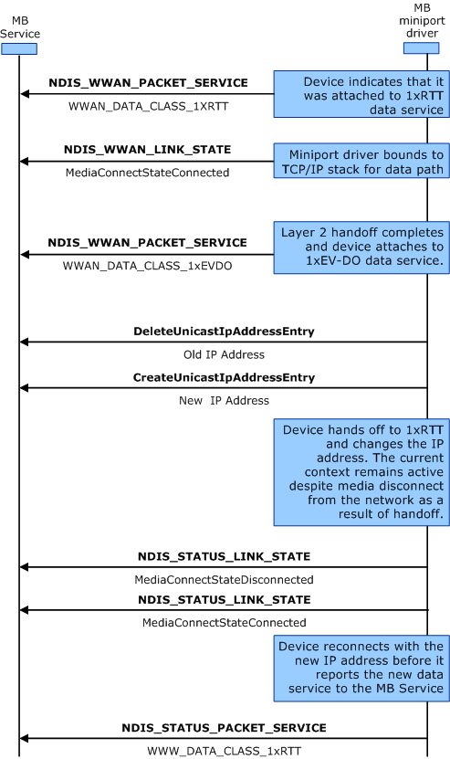

# Packet Data Service Handoffs

The following diagram shows the steps that miniport drivers should follow when packet service moves between different GSM-based technologies, such as GPRS, EDGE, UMTS, HSDPA, or TD-SCDMA, or moves between different CDMA-based technologies, such as 1xRTT, EV-DO, or EV-DO RevA. The labels in bold are OID identifiers or transactional flow control, and the labels in regular text are the important flags within the OID structure.

Be aware that unless the IP address changes in the handoff process, the MB Service handles the handoff event transparently without disrupting the existing connection. However, miniport drivers must still notify the MB Service about media disconnect events if, and only if, the IP address changes.

Miniport drivers and the MB device they manage should be able to handle the layer-2 handoff between different air interfaces automatically, with minimal impact to the MB Service and other overlaying applications. The only possible impact is the change to the IP address that might result from the technology handoff. In this case, miniport drivers should re-establish the MB connection before reporting the packet service change to the MB Service. Miniport drivers that do not implement DHCP functionality should use the [IP Helper](ip-helper.md) and associated [functions](https://msdn.microsoft.com/library/windows/hardware/ff557018). Miniport drivers that do implement DHCP functionality are not required to use the IP Helper functions, as shown in the following diagram.

To hand off packet data service, use the following procedure:

1.  The miniport driver sends [**NDIS\_STATUS\_WWAN\_PACKET\_SERVICE**](https://msdn.microsoft.com/library/windows/hardware/ff567850) to the MB Service.

2.  The miniport driver sends NDIS\_WWAN\_LINK\_STATE to the MB Service.

3.  The miniport driver sends [**NDIS\_STATUS\_WWAN\_PACKET\_SERVICE**](https://msdn.microsoft.com/library/windows/hardware/ff567850) to the MB Service.

4.  The miniport driver calls the [**DeleteUnicastIpAddressEntry**](https://msdn.microsoft.com/library/windows/hardware/ff546370) helper function with the old IP address

5.  The miniport driver calls the [**CreateUnicastIpAddressEntry**](https://msdn.microsoft.com/library/windows/hardware/ff546227) helper function with the new IP address

6.  The miniport driver sends [**NDIS\_STATUS\_LINK\_STATE**](https://msdn.microsoft.com/library/windows/hardware/ff567391) to the MB Service.

7.  The miniport driver sends [**NDIS\_STATUS\_LINK\_STATE**](https://msdn.microsoft.com/library/windows/hardware/ff567391) to the MB Service.

8.  The miniport driver sends [**NDIS\_STATUS\_WWAN\_PACKET\_SERVICE**](https://msdn.microsoft.com/library/windows/hardware/ff567850) to the MB Service.

 

 

