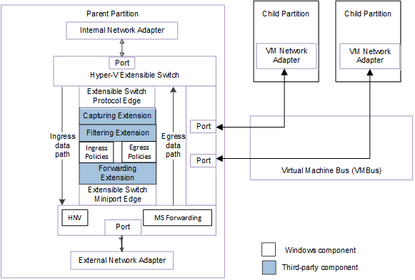

# Packet Flow through the Extensible Switch Data Path

This topic describes how packets move to or from extensible switch ports through the Hyper-V extensible switch data path.

**Note**  In the extensible switch interface, NDIS filter drivers are known as *extensible switch extensions* and the driver stack is known as the *extensible switch driver stack*. For more information about the extensions, see [Hyper-V Extensible Switch Extensions](hyper-v-extensible-switch-extensions.md).

**Note**  This page assumes that you are familiar with the information in [Overview of the Hyper-V Extensible Switch](overview-of-the-hyper-v-extensible-switch.md) and [Hybrid Forwarding](hybrid-forwarding.md).

All packet traffic that arrives at the extensible switch from its ports follows the same path through the extensible switch driver stack. For example, packet traffic received from the external network adapter connection or sent from a virtual machine (VM) network adapter connection moves through the same data path.

The following figure shows the extensible switch data path for NDIS 6.40 (Windows Server 2012 R2) and later.

The following figure shows the extensible switch data path for NDIS 6.30 (Windows Server 2012).

For more information about the components for the extensible switch interface, see [Hyper-V Extensible Switch Architecture](hyper-v-extensible-switch-architecture.md).

The extensible switch data path has the following parts, listed in the order that packets flow through them:

-   [Overlying protocol edge](#overlying-protocol-edge)
-   [Ingress data path](#ingress-data-path)
-   [Underlying miniport edge](#underlying-miniport-edge)
-   [Egress data path](#egress-data-path)

### Overlying protocol edge

1.  Packets arrive at the extensible switch from network adapters that are connected to the switch ports. These packets are first issued as send requests from the protocol edge of the extensible switch down the extensible switch ingress data path.

    The protocol edge of the extensible switch prepares the packets for the ingress data path. The protocol edge allocates a context area for these packets that contains the out-of-band (OOB) extensible switch forwarding context. It populates the OOB data with information about the source port and network adapter connection from which the packet was delivered to the extensible switch.

    For more information about the forwarding context, see [Hyper-V Extensible Switch Forwarding Context](hyper-v-extensible-switch-forwarding-context.md).

2.  In NDIS 6.40 (Windows Server 2012 R2) and later, if the packet is an NVGRE packet from an external network adapter, the extensible switch sets the **NativeForwardingRequired** flag in the packet's out-of-band (OOB) information. For more information, see [Hybrid Forwarding](hybrid-forwarding.md).

3.  If the packet arrived on a port where the traffic has a virtual subnet, the extensible switch sets the **VirtualSubnetId** member of the [**NDIS\_NET\_BUFFER\_LIST\_VIRTUAL\_SUBNET\_INFO**](https://msdn.microsoft.com/library/windows/hardware/jj614359) structure for the packet.

    **Note**  The virtual subnet could be an HNV subnet or a third-party virtual subnet.

### Ingress data path

1.  An extension obtains a packet from the ingress data path when its [*FilterSendNetBufferLists*](https://msdn.microsoft.com/library/windows/hardware/ff549966) function is called. The extension forwards the packet to underlying extensions on the ingress data path by calling [**NdisFSendNetBufferLists**](https://msdn.microsoft.com/library/windows/hardware/ff562616). Filtering and forwarding extensions can also drop the packet from the ingress data path by calling [**NdisFSendNetBufferListsComplete**](https://msdn.microsoft.com/library/windows/hardware/ff562618).

2.  When capturing extensions obtain packets on the ingress data path, they can inspect the packet data. However, capturing extensions must not complete the send requests for packets on the ingress data path. These extensions must always forward the packets to underlying extensions in the extensible switch driver stack.

    A capturing extension can also originate packets on the ingress data path. For example, the extension may originate packets in order to report traffic conditions to a remote monitoring application.

    For more information on originating packets by an extension, see [Originating Packet Traffic](originating-packet-traffic.md).

3.  When filtering extensions obtain packets on the ingress data path, they can do the following:

    -   Drop packets based on custom extensible switch or port policies.

        For more information about these policies, see [Hyper-V Extensible Switch Policies](hyper-v-extensible-switch-policies.md).

        **Note**  Packets obtained on the ingress data path do not have destination ports defined in the packet's OOB data. As a result, filtering extensions must only enforce custom policies based on the packet data or the packet's source port or network adapter connection.

-   Clone or modify packets obtained from the ingress data path.

-   Inject new packets into the ingress data path.

4.  In NDIS 6.40 and later, after the capturing and filtering extensions but before the forwarding extension on the ingress data path, the extensible switch does the following:
    -   If the packet is an NVGRE packet from an external network adapter, the address in the packet header is a provider address (PA) space address. The extensible switch indicates this by setting the **NativeForwardingRequired** flag in the packet's out-of-band (OOB) information. For more information, see [Hybrid Forwarding](hybrid-forwarding.md).

    -   The extensible switch applies the built-in ingress policies to the packet. These policies may include ingress access control lists (ACLs), DHCP Guard, and Router Guard.

5.  If a forwarding extension is not enabled in the extensible switch driver stack, the destination port array for a packet is determined by the extensible switch.

6.  If a forwarding extension is enabled, it must do the following when it obtains packets on the ingress data path:

    -   In NDIS 6.40 and later, if the packet is an NVGRE packet (see [Hybrid Forwarding](hybrid-forwarding.md)), the forwarding extension cannot modify the destination port array in the OOB data of the packet in the ingress data path. However, it can drop the packet.

    -   If the packet is not an NVGRE packet, the forwarding extension must add destination ports to the destination port array in the OOB data of the packet.

    -   The forwarding extension must drop packets based on standard or custom extensible switch or port policies. Standard switch or port policies include security and virtual LAN (VLAN) properties. If a forwarding extension is not enabled in the extensible switch driver stack, these policies are enforced by the extensible switch.

        **Note**  When the forwarding extension filters packets in the ingress data path, it applies filtering rules based on the source port as well as the destination ports that the extension assigns to the packet.

In addition, the forwarding extension can do the following:

-   Clone or modify packets obtained from the ingress data path.

-   Inject new packets into the ingress data path.

### Underlying miniport edge

1.  When the packet arrives at the underlying miniport edge of the extensible switch, the extensible switch applies its built-in policies to the packet. These policies include access control lists (ACLs) and quality of service (QoS) properties. If the packet is not dropped because of these policies, the extensible switch originates a receive indication for the packet and forwards the packet up the egress data path.

    **Note**  If port mirroring is enabled on a port that the packet is to be delivered to, the miniport edge adds a destination port to the packet's OOB data for the mirror port. The miniport edge does this regardless of whether a forwarding extension is installed and enabled in the extensible switch driver stack. The miniport edge only adds the mirror port if it is not already specified in the array of destination ports for the packet.

2.  If a forwarding extension is not enabled, the extensible switch determines the destination ports for the packet and add these destination ports to the packet's OOB data before it forwards the packet up the egress data path.

3.  In NDIS 6.40 and later, the HNV component performs any needed NVGRE encapsulation or decapsulation after ingress and before egress, so that the forwarding extension can see the packet in encapsulated and decapsulated form. For example, if the packet arrived from an external network adapter and is destined for an internal VM, the forwarding extension obtains the encapsulated packet on ingress and the decapsulated packet on egress.

    **Note**  In the encapsulated packet, the address in the packet header is a provider address (PA) space address. In the decapsulated packet, it is a customer address (CA) space address.

    1.  If the packet is an NVGRE packet that arrived from an external network adapter, the Hyper-V Network Virtualization (HNV) component of the extensible switch performs NVGRE decapsulation on the packet. The HNV component determines the destinations for the packet according to HNV policies, and then the extensible switch forwards the packet up the egress data path.

    2.  If the packet arrived from an internal VM, the HNV component will perform NVGRE encapsulation on the packet if HNV policies are set for the packet. The HNV component determines the destinations for the packet according to HNV policies, and then the extensible switch forwards the packet up the egress data path.

    3.  Otherwise, the forwarding extension forwards the packet up the egress data path.

4.  In NDIS 6.30, if a forwarding extension is enabled, it must forward the packet up the egress data path.

### Egress data path

1.  An extension obtains a packet from the egress data path when its [*FilterReceiveNetBufferLists*](https://msdn.microsoft.com/library/windows/hardware/ff549960) function is called. The extension forwards the packet to overlying extensions on the egress data path by calling [**NdisFIndicateReceiveNetBufferLists**](https://msdn.microsoft.com/library/windows/hardware/ff561820). Filtering and forwarding extensions can also drop the packet from the egress data path by calling [**NdisFReturnNetBufferLists**](https://msdn.microsoft.com/library/windows/hardware/ff562613).

2.  When the forwarding extension obtains a packet on the egress data path, it can inspect the packet's destination port information in the OOB data.

    **Note**  The extension obtains this information from the OOB data by calling [*GetNetBufferListDestinations*](https://msdn.microsoft.com/library/windows/hardware/hh598157).

Based on standard or custom switch or port policies, the extension can exclude the delivery of the packet to one or more destination ports that are contained within the OOB data.

3.  In NDIS 6.40 (Windows Server 2012 R2) and later, after the forwarding extension but before the filtering and capturing extensions on the egress data path, the extensible switch applies the built-in egress policies to the packet. These policies may include trunk mode, monitoring mode, egress ACLs, and quality of service (QoS) properties.

4.  When filtering extensions obtain a packet on the egress data path, they can inspect the packet's destination port information in the OOB data. Based on custom switch or port policies, the extension can exclude the delivery of the packet to one or more destination ports that are contained within the OOB data.

    If the filtering extension needs to modify the data in a packet, it must first clone the packet without preserving port destinations. Then, the extension must inject the modified packet into the ingress data path. This allows the underlying extensions to enforce policies on the modified packet and the forwarding extension can add port destinations.

    For more information, see [Cloning or Packet Traffic](cloning-or-duplicating-packet-traffic.md).

5.  When capturing extensions obtain packets on the egress data path, they can inspect the packet data. However, if the capturing extension needs to originate packets in order to report traffic conditions to a remote monitoring application, it must originate this packet traffic by calling [**NdisFSendNetBufferLists**](https://msdn.microsoft.com/library/windows/hardware/ff562616) to initiate a send operation on the ingress data path.

6.  When the packet arrives at the overlying protocol edge of the extensible switch, the extensible switch interface forwards the packet to all specified destination ports.

7.  Once the packet has been forwarded, the interface completes the packet through the same path in reverse. First, the interface calls the extension's [*FilterReturnNetBufferLists*](https://msdn.microsoft.com/library/windows/hardware/ff549964) function to complete packets forwarded on the egress data path. Then, the interface calls the extension's [*FilterSendNetBufferListsComplete*](https://msdn.microsoft.com/library/windows/hardware/ff549967) function to complete packets forwarded on the ingress data path.

    When the packet is completed on both the egress and ingress data path, the extension performs any necessary packet cleanup and post-processing that may be required.
