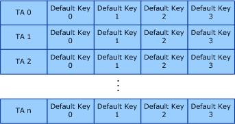

# Per-Station Default Keys

**Important**  The [Native 802.11 Wireless LAN](native-802-11-wireless-lan4.md) interface is deprecated in Windows 10 and later. Please use the WLAN Device Driver Interface (WDI) instead. For more information about WDI, see [WLAN Universal Windows driver model](wifi-universal-driver-model.md).

 

The Extensible Station (ExtSTA) operation mode defines a key type called per-station (STA) default keys. The operating system downloads these keys to the 802.11 station, operating in ExtSTA mode, when the station has connected to an independent BSS (IBSS) network under the following conditions:

-   The 802.11 station authenticated with the peer station by using the 802.11i Robust Security Network Association (RSNA) authentication algorithm. For more information about this algorithm, see [RSNA](rsna.md).

-   The cipher type used on the IBSS network connection is [AES-CCMP](aes-ccmp.md).

**Note**  A service, developed by the independent hardware vendor (IHV), can download per-station default keys to the 802.11 station for any cipher or authentication algorithm on any BSS network type.

 

The 802.11 station uses the per-STA default key type for cipher operations on all broadcast or multicast packets received from a peer station in the IBSS network. The 802.11 references these keys from a row of default keys indexed by the transmitter's MAC address (TA), as shown in the following figure.

If the 802.11 station supports the 802.11i RSNA authentication algorithm within IBSS networks, it is recommended that the station support a per-STA default key table that stores a minimum of 32 rows, with one row per TA.

The miniport driver, when operating in ExtSTA mode, reports the size of the 802.11 station's per-STA default key table when [OID\_DOT11\_EXTSTA\_CAPABILITY](https://msdn.microsoft.com/library/windows/hardware/ff569366) is queried.

 

 

