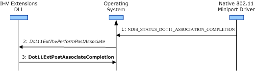

# Performing a Post-Association Operation

 

When the wireless LAN (WLAN) adapter successfully completes an 802.11 association operation with an access point (AP), the Native 802.11 miniport driver notifies the operating system by making an [NDIS\_STATUS\_DOT11\_ASSOCIATION\_COMPLETION](/previous-versions/windows/hardware/wireless/ndis-status-dot11-association-completion) indication. For more information about the association operation, see [Association Operations](/previous-versions/windows/hardware/wireless/association-operations).

**Note**  For Windows Vista, the IHV Extensions DLL supports only infrastructure basic service set (BSS) networks.

 

After the operating system receives the NDIS\_STATUS\_DOT11\_ASSOCIATION\_COMPLETION indication, it calls the [*Dot11ExtIhvPerformPostAssociate*](/windows-hardware/drivers/ddi/wlanihv/nc-wlanihv-dot11extihv_perform_post_associate) function to notify the IHV Extensions DLL of the following:

-   The creation of a new data port for the association with the AP. The IHV Extensions DLL is passed the current state of the data port through the *pPortState* parameter of the [*Dot11ExtIhvPerformPostAssociate*](/windows-hardware/drivers/ddi/wlanihv/nc-wlanihv-dot11extihv_perform_post_associate) function. For more information about the port state parameter, see [**DOT11\_PORT\_STATE**](/windows-hardware/drivers/ddi/wlclient/ns-wlclient-_dot11_port_state).

-   The parameters of the association between the wireless LAN (WLAN) adapter and the AP. The IHV Extensions DLL is passed the association parameters through the *pDot11AssocParams* parameter of the [*Dot11ExtIhvPerformPostAssociate*](/windows-hardware/drivers/ddi/wlanihv/nc-wlanihv-dot11extihv_perform_post_associate) function. For more information about the association parameters, see [**DOT11\_ASSOCIATION\_COMPLETION\_PARAMETERS**](/windows-hardware/drivers/ddi/windot11/ns-windot11-dot11_association_completion_parameters).

When [*Dot11ExtIhvPerformPostAssociate*](/windows-hardware/drivers/ddi/wlanihv/nc-wlanihv-dot11extihv_perform_post_associate) is called, the IHV Extensions DLL initiates a post-association operation with the AP to authenticate the data port. Through this operation, the IHV Extensions DLL can do the following:

-   Allocate any resources needed for the new data port.

-   Perform proprietary security processing on the data port for the association. The IHV Extensions DLL can determine the current state of the data port from *pPortState* parameter of the [*Dot11ExtIhvPerformPostAssociate*](/windows-hardware/drivers/ddi/wlanihv/nc-wlanihv-dot11extihv_perform_post_associate) function.

-   Call the [**Dot11ExtSendUIRequest**](/windows-hardware/drivers/ddi/wlanihv/nc-wlanihv-dot11ext_send_ui_request) function to request the IHV UI Extensions DLL to prompt the user for security parameters, such as the user's credentials.

-   Authenticate with the AP using the authentication algorithm enabled through [**Dot11ExtSetAuthAlgorithm**](/windows-hardware/drivers/ddi/wlanihv/nc-wlanihv-dot11ext_set_auth_algorithm). The IHV Extensions DLL calls **Dot11ExtSetAuthAlgorithm** during the pre-association operation. For more information about this operation, see [Pre-Association Operations](pre-association-operations.md).

-   Send security packets to the AP through calls to the [**Dot11ExtSendPacket**](/windows-hardware/drivers/ddi/wlanihv/nc-wlanihv-dot11ext_send_packet) function.

    When the security packet has been sent, the operating notifies the IHV Extensions DLL through a call to the [*Dot11ExtIhvSendPacketCompletion*](/windows-hardware/drivers/ddi/wlanihv/nc-wlanihv-dot11extihv_send_packet_completion) function.

    For more information about sending security packets, see [Send Operations](send-operations.md).

-   Receive security packets from the AP. The operating system calls the [*Dot11ExtIhvReceivePacket*](/windows-hardware/drivers/ddi/wlanihv/nc-wlanihv-dot11extihv_receive_packet) function for each security packet received by the WLAN adapter.

    Each received security packet is serialized and indicated in the order they were received from the WLAN adapter. The operating system only calls the [*Dot11ExtIhvReceivePacket*](/windows-hardware/drivers/ddi/wlanihv/nc-wlanihv-dot11extihv_receive_packet) function to indicate received security packets that match an entry in the list of IEEE EtherTypes, which were specified by the IHV Extensions DLL through a call to the [**Dot11ExtSetEtherTypeHandling**](/windows-hardware/drivers/ddi/wlanihv/nc-wlanihv-dot11ext_set_ethertype_handling) function.

    For more information about receiving security packets, see [Receive Operations](receive-operations.md).

-   Configure the WLAN adapter with the cipher keys that are derived through the authentication algorithm. The following IHV Extensibility functions can be called to download the cipher keys to the WLAN adapter.
    -   [**Dot11ExtSetDefaultKey**](/windows-hardware/drivers/ddi/wlanihv/nc-wlanihv-dot11ext_set_default_key)
    -   [**Dot11ExtSetDefaultKeyId**](/windows-hardware/drivers/ddi/wlanihv/nc-wlanihv-dot11ext_set_default_key_id)
    -   [**Dot11ExtSetKeyMappingKey**](/windows-hardware/drivers/ddi/wlanihv/nc-wlanihv-dot11ext_set_key_mapping_key)
-   Configure the WLAN adapter to exclude unencrypted packets through a call to the [**Dot11ExtSetExcludeUnencrypted**](/windows-hardware/drivers/ddi/wlanihv/nc-wlanihv-dot11ext_set_exclude_unencrypted) IHV Extensibility function.

After the data port has been authenticated, the IHV Extensions DLL must call [**Dot11ExtPostAssociateCompletion**](/windows-hardware/drivers/ddi/wlanihv/nc-wlanihv-dot11ext_post_associate_completion) to complete the post-association operation.

The following figure shows the steps involved during the post-association operation.

The IHV Extensions DLL must follow these guidelines when performing the post-association operation.

-   The IHV Extensions DLL must call [**Dot11ExtPostAssociateCompletion**](/windows-hardware/drivers/ddi/wlanihv/nc-wlanihv-dot11ext_post_associate_completion) asynchronously from the call to [*Dot11ExtIhvPerformPostAssociate*](/windows-hardware/drivers/ddi/wlanihv/nc-wlanihv-dot11extihv_perform_post_associate).

-   After completing the post-association operation, the IHV Extensions DLL can call [**Dot11ExtPostAssociateCompletion**](/windows-hardware/drivers/ddi/wlanihv/nc-wlanihv-dot11ext_post_associate_completion) whenever the authentication status of the data port changes.

-   If the [*Dot11ExtIhvAdapterReset*](/windows-hardware/drivers/ddi/wlanihv/nc-wlanihv-dot11extihv_adapter_reset) function is called, the IHV Extensions DLL must cancel all pending post-association operations by calling [**Dot11ExtPostAssociateCompletion**](/windows-hardware/drivers/ddi/wlanihv/nc-wlanihv-dot11ext_post_associate_completion). For more information about the reset operation, see [802.11 WLAN Adapter Reset](802-11-wlan-adapter-reset.md).

-   If the [*Dot11ExtIhvDeinitAdapter*](/windows-hardware/drivers/ddi/wlanihv/nc-wlanihv-dot11extihv_deinit_adapter) function is called, the IHV Extensions DLL must cancel all pending post-association operations internally. However, it must not call any of the IHV Extensibility functions that can be called only after adapter initialization, including [**Dot11ExtPostAssociateCompletion**](/windows-hardware/drivers/ddi/wlanihv/nc-wlanihv-dot11ext_post_associate_completion). For more information about the IHV Extensibility functions, see [Native 802.11 IHV Extensibility Functions](./native-802-11-ihv-extensibility-functions.md).

 

 
