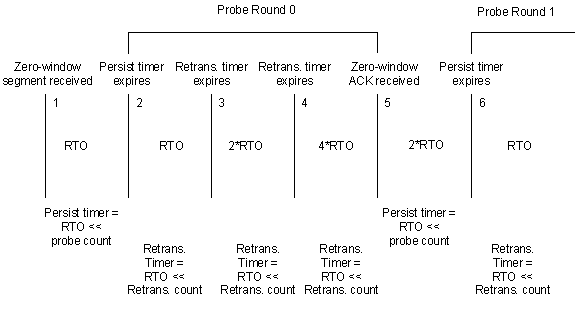

# Persist Timer

\[The TCP chimney offload feature is deprecated and should not be used.\]

When the window that is advertised by the remote TCP peer on an offloaded TCP connection is greater than 0 (that is, when the value of the **SndWnd** member of the [**TCP\_OFFLOAD\_STATE\_DELEGATED**](https://msdn.microsoft.com/library/windows/hardware/ff570939) structure in the TCP delegated state for the connection is not 0), the offload target does not need to use the persist timer for the connection. In this situation, an offload target uses the values of the retransmit **Count** and **TimeoutDelta** in the connection's TCP delegated state for keepalive processing. (For more information about keepalive processing, see [Keepalive Timer](keepalive-timer.md).) However, when the window size that is advertised by the remote TCP peer goes to 0 (which causes the value of **SndWnd** to go to 0), the values of the retransmit **Count** and **TimeoutDelta**, plus the value of **SndWndProbeCount** in the connection's TCP delegated state, represent the state of the persist timer for the connection. In this situation:

-   The value of **SndWndProbeCount** is the current round of probing.

-   The retransmit value of **Count** is the number of times that the offload target has retransmitted the window probe.

-   The value of **TimeoutDelta** is the number of ticks that remain until the persist timer expires.

The following figure illustrates the persist timer algorithm:

1.  An offload target receives a zero-window segment from the remote TCP peer on a connection, causing the offload target to start the persist timer for that connection. Specifically, the offload target:
    -   Sets the value of **SndWndProbeCount** to 0.
    -   Sets the retransmit value of **Count** to 0.
    -   Starts the persist timer with a value of retransmission timeout (RTO) &lt;&lt; **SndWndProbeCount**, which is equal to RTO.

2.  If the persist timer expires before the offload target receives an acknowledgement from the remote TCP peer, the offload target:
    -   Sends a window probe to the remote TCP peer. (This action starts the first round of probing.)
    -   Starts the retransmit timer with a value of RTO &lt;&lt; retransmit **Count**, which equals 1 ×RTO. (The value of the retransmit **Count** is 0.)
    -   Increments the value of the retransmit **Count** by 1.

3.  If the retransmit timer expires before the offload target receives an acknowledgement from the remote TCP peer, the offload target:
    -   Sends a window probe to the remote TCP peer.
    -   Starts the retransmit timer with a value of RTO &lt;&lt; retransmit **Count**, which equals 2 ×RTO. (The value of the retransmit **Count** is 1.)
    -   Increments the value of the retransmit **Count** by 1.

4.  If the retransmit timer expires before the offload target receives an acknowledgement from the remote TCP peer, the offload target:
    -   Sends a window probe to the remote TCP peer.
    -   Starts the retransmit timer with a value of RTO &lt;&lt; retransmit **Count**, which equals 4 ×RTO. (The value of the retransmit **Count** is 2.)
    -   Increments the value of the retransmit **Count** by 1.

5.  If the offload target receives a zero-window acknowledgment before the persist timer expires, the next round of probing (round 1) starts. The offload target:
    -   Increments the value of **SndWndProbeCount** by 1.
    -   Sets the value of the retransmit **Count** to 0.
    -   Starts the persist timer with a value of RTO &lt;&lt; **SndWndProbeCount**, which equals 2 ×RTO.

6.  If the persist timer expires before the offload target receives an acknowledgement from the remote TCP peer, the offload target:
    -   Sends a window probe to the remote TCP peer.
    -   Starts the retransmit timer with a value of RTO &lt;&lt; retransmit **Count**, which equals RTO.
    -   Increments the value of the retransmit **Count** by 1.

7.  The algorithm continues.

If, at any point during the algorithm, the offload target receives a nonzero window acknowledgment from the remote TCP peer, the offload target exits the algorithm and resumes sending data to the remote peer.

If the number of probe counts that are sent by the offload target during a probing round exceeds **TcpMaximumRetransmissions** for the connection, the offload target should call the [**NdisTcpOffloadEventHandler**](https://msdn.microsoft.com/library/windows/hardware/ff564595) function with the *EventType* parameter set to **TcpIndicateRetrieve** and the *EventSpecificInformation* parameter set to **TimeoutExpiration**. This call requests that the host stack terminate the offload of the connection. The host stack specified the value of the **TcpMaximumRetransmissions** member of the [**NDIS\_TASK\_TCP\_CONNECTION\_OFFLOAD**](https://msdn.microsoft.com/library/windows/hardware/ff567873) structure when setting the [OID\_TCP\_TASK\_OFFLOAD](https://msdn.microsoft.com/library/windows/hardware/ff569815) OID during the offload target's initialization.

When offloading a TCP connection for which it was running a persist timer, the host stack passes the current values of **SndWndProbeCount**, the retransmit **Count**, and the retransmit **TimeoutDelta** for the connection to the offload target. The offload uses these values to resume persist timer processing on the offloaded connection. If the host stack target was not running the persist timer, it supplies a value of -1 in the **TimeoutDelta** member.

If the offload of the TCP connection is terminated before persist timer processing has finished, the offload target must return the current values of **SndWndProbeCount**, the retransmit **Count**, and the retransmit **TimeoutDelta** to the host stack during the terminate operation. The host stack uses these values to resume persist timer processing. If the offload target was not running the persist timer, it should supply a value of -1 in the **TimeoutDelta** member. If the offload target supplies a value of 0 in the **TimeoutDelta** member, the host stack assumes that the persist timer was running, and the host stack's retransmit timer expires immediately.

 

 

