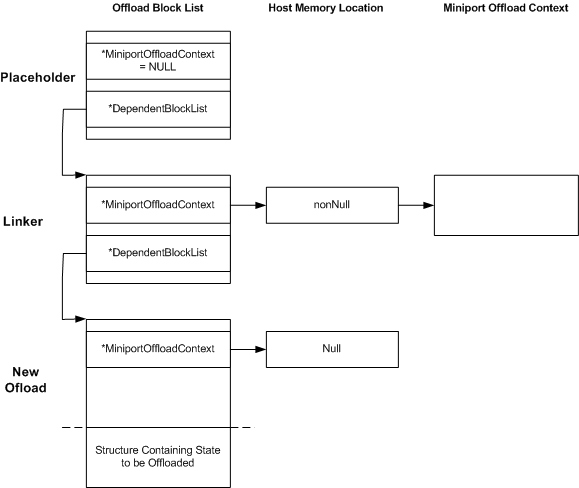

# Placeholders, Linkers, and New Offloads

\[The TCP chimney offload feature is deprecated and should not be used.\]

An [**NDIS\_MINIPORT\_OFFLOAD\_BLOCK\_LIST**](https://msdn.microsoft.com/library/windows/hardware/ff566469) structure in a state tree can perform one of several functions.

The following figure shows the various functions that an NDIS\_MINIPORT\_OFFLOAD\_BLOCK\_LIST structure can perform in a state tree that is passed to an offload target's [*MiniportInitiateOffload*](https://msdn.microsoft.com/library/windows/hardware/ff559393) function.

An offload block list acts as a *placeholder* if it has a **NULL** value in the **MiniportOffloadContext** member. No offload state is associated with a placeholder, and the placeholder does not reference an offloaded state object. The placeholder simply provides a node to which dependent block lists are attached.

A placeholder is not required to point to a dependent block list. If there is no dependent block list, the miniport must complete the request with NDIS\_STATUS\_SUCCESS.

When traversing a tree, an offload target uses the links that are provided by a placeholder. Before returning from an initiate offload, query offload, invalidate offload, update offload, or terminate offload operation, an offload target must write a status value to the **Status** member of the placeholder block list (NDIS\_MINIPORT\_OFFLOAD\_BLOCK\_LIST).

An offload block list acts as a *linker* if its **MiniportOffloadContext** member has a non-**NULL** value that points to a memory location that contains a non-**NULL** PVOID. No offload state is associated with a linker block list, but the block list does reference an offloaded state object. A linker block list always points to a dependent block list that is used to convey new offload state. The offload target links the new offload state with the offloaded state object that the linker referenced.

An offload block list acts as an *offload node* if its **MiniportOffloadContext** member has a non-**NULL** value that points to a memory location that contains a **NULL** PVOID value. Such a block list is always followed by the state that is to be offloaded.

The following table summarizes the differences between placeholders, linkers, and new offload block lists.

<table>
<colgroup>
<col width="25%" />
<col width="25%" />
<col width="25%" />
<col width="25%" />
</colgroup>
<thead>
<tr class="header">
<th align="left">Feature</th>
<th align="left">Placeholder</th>
<th align="left">Linker</th>
<th align="left">New offload block list</th>
</tr>
</thead>
<tbody>
<tr class="odd">
<td align="left">
Value of <strong>MiniportOffloadContext</strong>
</td>
<td align="left">
<strong>NULL</strong>
</td>
<td align="left">
non-<strong>NULL</strong>
</td>
<td align="left">
non-<strong>NULL</strong>
</td>
</tr>
<tr class="even">
<td align="left">
Value that is pointed to by

<strong>*MiniportOffloadContext</strong>
</td>
<td align="left">
Not significant
</td>
<td align="left">
non-<strong>NULL</strong>
</td>
<td align="left">
<strong>NULL</strong>
</td>
</tr>
<tr class="odd">
<td align="left">
Type
</td>
<td align="left">
Not significant
</td>
<td align="left">
Identifies the type of state
</td>
<td align="left">
Identifies the type of state to be offloaded
</td>
</tr>
<tr class="even">
<td align="left">
Followed by offload state?
</td>
<td align="left">
No
</td>
<td align="left">
No
</td>
<td align="left">
Yes
</td>
</tr>
<tr class="odd">
<td align="left">
Completion status that is written by offload target
</td>
<td align="left">
Always NDIS_STATUS_SUCCESS
</td>
<td align="left">
If all dependent blocks successfully offloaded:

NDIS_STATUS_SUCCESS

If one or more dependent blocks failed to offload:

NDIS_STATUS_PARTIAL_SUCCESS

If all dependent blocks failed to offload: NDIS_STATUS_FAILURE
</td>
<td align="left">
Depends on completion of offload operation
</td>
</tr>
</tbody>
</table>

 

 

 

