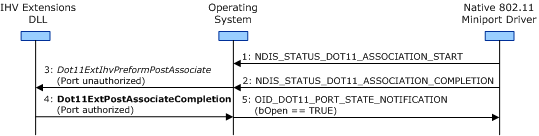

# Port Creation

**Important**  The [Native 802.11 Wireless LAN](native-802-11-wireless-lan4.md) interface is deprecated in Windows 10 and later. Please use the WLAN Device Driver Interface (WDI) instead. For more information about WDI, see [WLAN Universal Windows driver model](wifi-universal-driver-model.md).

 

The operating system creates a new port for network access for each access point (AP) or peer station with which the 802.11 station successfully completes an association operation. For more information about this operation, see [Association Operations](association-operations.md).

The operating system creates the port following the [NDIS\_STATUS\_DOT11\_ASSOCIATION\_COMPLETION](https://msdn.microsoft.com/library/windows/hardware/ff567319) indication made by the miniport driver. After this port has been authorized, the 802.11 station can send or receive media access control (MAC) service data unit (MSDU) packets.

**Note**  While the port is in an unauthorized state, the 802.11 station can only send or receive MSDU packets for the port-based authentication protocol.

 

The following guidelines describe how the operating system sets the port to an authorized state:

-   If the miniport driver manages port-based authentication, the driver must perform the authentication before it completes the association operation. If the authentication is successful, the miniport driver must set the **bPortAuthorized** member of the [NDIS\_STATUS\_DOT11\_ASSOCIATION\_COMPLETION](https://msdn.microsoft.com/library/windows/hardware/ff567319) indication to **TRUE**.

    In this situation, the operating system creates the port and sets it to the authorized state following the NDIS\_STATUS\_DOT11\_ASSOCIATION\_COMPLETION indication.

-   If the operating system manages port-based authentication, the operating system creates the port and sets it to the unauthorized state following the [NDIS\_STATUS\_DOT11\_ASSOCIATION\_COMPLETION](https://msdn.microsoft.com/library/windows/hardware/ff567319) indication. The operating system performs the authentication and sets the port to the authorized state if the authentication succeeds.

-   If the independent hardware vendor (IHV) installs an IHV Extensions DLL to manage the port-based authentication, the operating system first creates the port and sets it to the unauthorized state following the [NDIS\_STATUS\_DOT11\_ASSOCIATION\_COMPLETION](https://msdn.microsoft.com/library/windows/hardware/ff567319) indication. The operating system then notifies the IHV Extensions DLL about the new port through a call to the DLL's [*Dot11ExtIhvPerformPostAssociate*](https://msdn.microsoft.com/library/windows/hardware/ff547492) function.

    Following this call, the service performs the authentication. When the authentication completes, the IHV Extensions DLL notifies the operating system regarding the authorization state of the port through a call to [**Dot11ExtPostAssociateCompletion**](https://msdn.microsoft.com/library/windows/hardware/ff547530).

After the port is set to an authorized state, the operating system notifies the miniport driver through a set request of [OID\_DOT11\_PORT\_STATE\_NOTIFICATION](https://msdn.microsoft.com/library/windows/hardware/ff569401). The operating system sets the **bOpen** member to **TRUE** in the DOT11\_PORT\_STATE\_NOTIFICATION structure that accompanies the set request.

The following figure shows the sequence of events during port creation and authorization.

For more information about the IHV Extensions DLL, see [Native 802.11 IHV Extensions DLL](https://msdn.microsoft.com/library/windows/hardware/ff560614).

 

 

