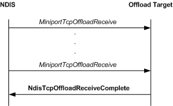

# Posting and Completing Receive Requests

\[The TCP chimney offload feature is deprecated and should not be used.\]

The following figure shows the call sequence for a receive operation that is performed by an offload target.

A client application can post receive requests (receive buffers) on an offloaded TCP connection. In response, NDIS calls an offload target's [*MiniportTcpOffloadReceive*](https://msdn.microsoft.com/library/windows/hardware/ff559460) function to post the receive requests. The offload target uses these requests to transfer data that is received on the connection to the client application. For more information about posting receive requests, see *MiniportTcpOffloadReceive*. If receive requests are posted on an offloaded connection, the offload target should always use them to transfer data that is received on the connection. For more information about the algorithm that the offload target uses to deliver received data, see [Delivery Algorithm](delivery-algorithm.md).

After filling posted receive requests with received data, an offload target calls the [**NdisTcpOffloadReceiveComplete**](https://msdn.microsoft.com/library/windows/hardware/ff564599) function to return the receive requests to the host stack. To improve system performance, an offload target can create a linked list that contains the [**NET\_BUFFER\_LIST**](https://msdn.microsoft.com/library/windows/hardware/ff568388) structures from multiple calls to its *MiniportTcpOffloadReceive* function. The offload target can pass such a linked list in a single call to the **NdisTcpOffloadReceiveComplete** function. For more information about completing receive requests, see **NdisTcpOffloadReceiveComplete**.

A posted receive request can be in either of two modes:

-   *Push mode*

-   *Nonpush mode*

Note that an offload target must support both push mode and nonpush mode.

To determine which mode a buffer is in, an offload target calls the [**NET\_BUFFER\_LIST\_INFO**](https://msdn.microsoft.com/library/windows/hardware/ff568401) macro to get the value of **TcpReceiveNoPush** from the **NetBufferListInfo** member of the NET\_BUFFER\_LIST structure that is associated with the receive request. If the value is **TRUE**, the receive request is in nonpush mode.

If the receive request is in push mode, the offload target starts the [push timer](push-timer.md) for the connection as soon as the offload target places the first byte of receive data into the receive request. The offload target always completes filled receive requests immediately. The offload target completes a partially filled receive request that is in push mode if either of the following occurs:

-   The push timer expires.

-   The offload target receives a TCP segment on the connection that has the PSH bit set.

If the receive request is in nonpush mode, the offload target does not start a push timer. The offload target completes the receive request only when the receive request is filled. The offload target ignores the PSH bit in TCP segments that it receives on the connection.

Note that, if a receive buffer is in push mode, the host stack will not pass down receive data in that buffer. However, if a receive buffer is in nonpush mode, the host stack can pass down receive data in that buffer. The offload target continues to fill the buffer with receive data and, when the buffer is full, completes the buffer by calling the [**NdisTcpOffloadReceiveComplete**](https://msdn.microsoft.com/library/windows/hardware/ff564599) function. If data is received on an offloaded connection while the push timer is running, the offload target must restart the push timer for that connection.

 

 

