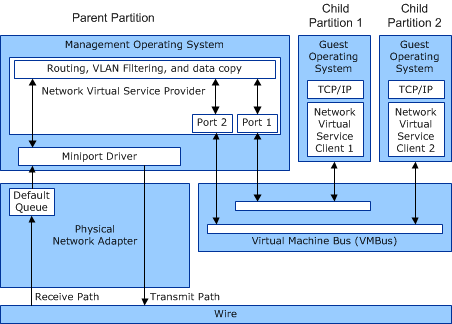

# Potential Performance Bottlenecks in an NDIS Virtualized Networking Environment

In a networking environment that supports device sharing, a virtual interface with its own media access control (MAC) address is exposed in each Hyper-V child partition. These virtual interfaces use the underlying virtual machine bus (VMBus) to connect to a port on the Hyper-V extensible switch module that runs in the management operating system of the Hyper-V parent partition. The extensible switch transmits all the outgoing frames from the different partitions by issuing send requests to the underlying shared network adapter.

The physical network adapter indicates all incoming frames that it receives up to the extensible switch in the management operating system. The extensible switch uses the destination MAC address to assign the indicated incoming frames to virtual network adapters. For each child partition, the incoming frames must be copied from network adapter buffers in the management operating system to secondary buffers that were preallocated from the associated child partition. A notification is sent to each virtual interface that has pending frames. The virtual interface in each child partition indicates the incoming frames to overlying transport drivers. After identifying the application, transport drivers copy the data payload from the secondary buffer to an application buffer.

Therefore, in the virtualization environment, incoming received frames are copied twice, first from the network adapter buffer to a temporary buffer that is allocated from the target memory address space of a child partition, and then again from this temporary buffer to an application buffer. The extensible switch in the management operating system must use CPU cycles to parse incoming frames and place them in separate queues based on their destination MAC address.

The following figure shows the performance bottlenecks for receive processing in a virtualized environment.

The performance issues in the previous figure include the following:

-   Each incoming packet must be examined to identify the target virtual network adapter.

-   Received data must be copied from the parent partition's memory address space to the child partition's memory address space.

-   Lack of concurrency for interrupts and DPCs.

### Overcoming Performance Bottlenecks with VMQ

To address performance issues, the virtual machine queue (VMQ) interface allows:

-   A network adapter to determine the target child partition by implementing MAC address filtering in hardware.

-   A network adapter to use DMA to transfer received packets directly to a child partition's memory address space.

-   A miniport driver to provide interrupt and DPC concurrency by indicating received packets for different child partitions on different CPUs.

**Note**  Packets that are received from the external network still have to be forwarded by the management operating system to the guest operating system over the VMBus.

 

For more information about the VMQ interface, see [Virtual Machine Queue (VMQ)](virtual-machine-queue--vmq-.md).

### Overcoming Performance Bottlenecks with SR-IOV

The single root I/O virtualization (SR-IOV) interface provides a standards-based foundation for efficiently sharing a PCI Express (PCIe) device among multiple child partitions. Physical I/O resources are virtualized within the PCIe device, so each device presents multiple virtual I/O interfaces called *virtual functions* (VFs). The management operating system can configure each VF on the device and assign them to particular child partitions.

A VF is exposed as a hardware device to the child partition. All data packets flow directly between the guest operating system and the VF. This eliminates the software path between the management operating system and the child partition for data traffic. It bypasses the involvement by the management operating system in data movement by providing independent memory space, interrupts, and DMA streams for each child partition. Frames are sent to the external network by using the physical port of the device or to another child partition by using the internal port connected to the VF.

In all cases, the SR-IOV interface eliminates the need for any involvement of the management operating system in the data path. As a result, the SR-IOV interface provides the following:

-   Improved I/O throughput and reduced CPU utilization.

-   Lower latency.

-   Improved scalability.

For more information about the SR-IOV interface, see [Single Root I/O Virtualization (SR-IOV)](single-root-i-o-virtualization--sr-iov-.md).

 

 

