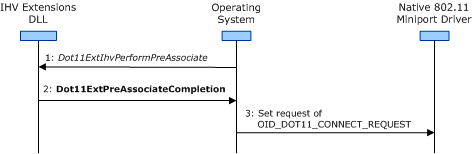

# Pre-Association Operation Overview

**Important**  The [Native 802.11 Wireless LAN](native-802-11-wireless-lan4.md) interface is deprecated in Windows 10 and later. Please use the WLAN Device Driver Interface (WDI) instead. For more information about WDI, see [WLAN Universal Windows driver model](wifi-universal-driver-model.md).

 

After the user has selected a profile for a basic service set (BSS) network connection, the operating system calls the [*Dot11ExtIhvPerformPreAssociate*](https://msdn.microsoft.com/library/windows/hardware/ff547499) function to initiate a pre-association operation. When this function is called, the IHV Extensions DLL does the following:

-   Verifies the IHV-defined extensions to the connectivity and security profile.

    If the IHV Extensions DLL determines that the profile is incorrect, it returns the appropriate error code as defined in Winerror.h. In this situation, the operating system notifies the user that the network profile cannot be used.

-   Initiates the pre-association operation based on the IHV-defined extensions to the connectivity and security profiles.

    After the pre-association operation is initiated, it must be completed asynchronously from the call to [*Dot11ExtIhvPerformPreAssociate*](https://msdn.microsoft.com/library/windows/hardware/ff547499).

The IHV Extension DLL completes the pre-association operation through a call to [**Dot11ExtPreAssociateCompletion**](https://msdn.microsoft.com/library/windows/hardware/ff547538). Following this call, the operating system initiates the connection operation by issuing a set request of [OID\_DOT11\_CONNECT\_REQUEST](https://msdn.microsoft.com/library/windows/hardware/ff569122) to the Native 802.11 miniport driver, which manages the WLAN adapter.

The following figure shows the steps involved during the pre-association operation.

When [*Dot11ExtIhvPerformPreAssociate*](https://msdn.microsoft.com/library/windows/hardware/ff547499) is called, the operating system passes the IHV-defined extensions to the connectivity and security profile through the following parameters.

*pIhvProfileParams*  
This parameter is passed a pointer to a [**DOT11EXT\_IHV\_PROFILE\_PARAMS**](https://msdn.microsoft.com/library/windows/hardware/ff547630) structure, which specifies the attributes of the basic service set (BSS) network to which the network profile will be applied. For example, the **DOT11EXT\_IHV\_PROFILE\_PARAMS** structure specifies the service set identifier (SSID) and type of the BSS network.

*pIhvConnProfile*  
This parameter is passed a pointer to a [**DOT11EXT\_IHV\_CONNECTIVITY\_PROFILE**](https://msdn.microsoft.com/library/windows/hardware/ff547619) structure that contains the settings for the connectivity profile. The operating system only passes the extensions to the connectivity profile defined by the IHV and selected by the user.

*pIhvSecProfile*  
This parameter is passed a pointer to a [**DOT11EXT\_IHV\_SECURITY\_PROFILE**](https://msdn.microsoft.com/library/windows/hardware/ff547632) structure that contains the settings for the security profile. The operating system only passes the extensions to the security profile defined by the IHV and selected by the user.

*pConnectableBssid*  
This parameter is passed a pointer to a [**DOT11\_BSS\_LIST**](https://msdn.microsoft.com/library/windows/hardware/ff547668) structure, which contains one or more 802.11 Beacon or Probe Response frames for the service set identifier (SSID) of the BSS network with which the DLL will perform the pre-association operation.

When performing the pre-association operation, the IHV Extensions DLL can do the following:

-   Call the [**Dot11ExtNicSpecificExtension**](https://msdn.microsoft.com/library/windows/hardware/ff547526) function to issue proprietary configuration requests for network connectivity to the Native 802.11 miniport driver.

    Through the *pIhvConnProfile* and *pIhvProfileParams* parameters, the IHV Extensions DLL can determine which proprietary connectivity settings were selected by the user.

    Through the *pConnectableBssid* parameter, the IHV Extensions DLL can determine the attributes of the BSS network and can configure proprietary network settings accordingly.

-   Configure the WLAN adapter with the proprietary authentication and cipher algorithms to be used over the BSS network connection.

    Through the *pszXmlFragmentIhvSecurity* parameter, the IHV Extensions DLL can determine which proprietary security algorithms were selected by the user.

    The following IHV Extensibility functions can be called to set the security algorithms.

    -   [**Dot11ExtSetAuthAlgorithm**](https://msdn.microsoft.com/library/windows/hardware/ff547571)
    -   [**Dot11ExtSetUnicastCipherAlgorithm**](https://msdn.microsoft.com/library/windows/hardware/ff547606)
    -   [**Dot11ExtSetMulticastCipherAlgorithm**](https://msdn.microsoft.com/library/windows/hardware/ff547599)
-   Call the [**Dot11ExtSendUIRequest**](https://msdn.microsoft.com/library/windows/hardware/ff547567) function to request that the IHV UI Extensions DLL prompt the user for security parameters, such as the user's credentials.

-   Call the [**Dot11ExtSetEtherTypeHandling**](https://msdn.microsoft.com/library/windows/hardware/ff547587) function to register a list of the IEEE EtherTypes for the security packets that the DLL will receive. After the list is registered, the operating system calls the [*Dot11ExtIhvReceivePacket*](https://msdn.microsoft.com/library/windows/hardware/ff547513) IHV Handler function for every packet whose EtherType matches an entry in the list.

    The IHV Extensions DLL can also specify a list of EtherTypes that will be excluded from payload decryption. For more information about registering EtherTypes, see [IEEE EtherType Handling](ieee-ethertype-handling.md).

-   Call the [**Dot11ExtSetProfileCustomUserData**](https://msdn.microsoft.com/library/windows/hardware/ff547603) function to save data in the registry that is specific to the user and current BSS network profile.

-   Call the [**Dot11ExtGetProfileCustomUserData**](https://msdn.microsoft.com/library/windows/hardware/ff547430) function to retrieve data from the registry that is specific to the user and current BSS network profile.

For more information about the IHV Extensibility functions, see [Native 802.11 IHV Extensibility Functions](https://msdn.microsoft.com/library/windows/hardware/ff560609).

For more information about connection operations with BSS networks, see [Connection Operations](connection-operations.md).

 

 

