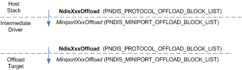

# Propagating a State-Manipulation Operation

\[The TCP chimney offload feature is deprecated and should not be used.\]

The following figure shows the propagation of a state-manipulation operation through an intermediate driver.

The host stack initiates a state-manipulation operation by calling one of the following NDIS functions:

-   [**NdisInitiateOffload**](https://msdn.microsoft.com/library/windows/hardware/ff562743)

-   [**NdisInvalidateOffload**](https://msdn.microsoft.com/library/windows/hardware/ff562774)

-   [**NdisQueryOffload**](https://msdn.microsoft.com/library/windows/hardware/ff563771)

-   [**NdisTerminateOffload**](https://msdn.microsoft.com/library/windows/hardware/ff564615)

-   [**NdisUpdateOffload**](https://msdn.microsoft.com/library/windows/hardware/ff564646)

When calling one of these functions, the host stack passes a pointer to an [**NDIS\_PROTOCOL\_OFFLOAD\_BLOCK\_LIST**](https://msdn.microsoft.com/library/windows/hardware/ff566833) structure. Any accompanying state immediately follows the NDIS\_PROTOCOL\_OFFLOAD\_BLOCK\_LIST structure in memory.

In response to the host stack's call to a state-manipulation function, NDIS calls an intermediate driver's corresponding state-manipulation function:

-   [*MiniportInitiateOffload*](https://msdn.microsoft.com/library/windows/hardware/ff559393)

-   [**MiniportInvalidateOffload**](https://msdn.microsoft.com/library/windows/hardware/ff559406)

-   [**MiniportQueryOffload**](https://msdn.microsoft.com/library/windows/hardware/ff559423)

-   [**MiniportTerminateOffload**](https://msdn.microsoft.com/library/windows/hardware/ff559468)

-   [**MiniportUpdateOffload**](https://msdn.microsoft.com/library/windows/hardware/ff560463)

NDIS converts the NDIS\_PROTOCOL\_OFFLOAD\_BLOCK\_LIST structure that was supplied by the host stack to an [**NDIS\_MINIPORT\_OFFLOAD\_BLOCK\_LIST**](https://msdn.microsoft.com/library/windows/hardware/ff566469) structure. NDIS passes a pointer to the NDIS\_MINIPORT\_OFFLOAD\_BLOCK\_LIST structure to the intermediate driver's *MiniportXxxOffload* function.

To propagate the state-manipulation operation to the underlying driver or offload target, the intermediate driver calls the corresponding NDIS state-manipulation function. For example, if NDIS called the intermediate driver's *MiniportQueryOffload* function, the intermediate driver calls **NdisQueryOffload**.

Before calling the corresponding NDIS state-manipulation function, the intermediate driver converts the NDIS\_MINIPORT\_OFFLOAD\_BLOCK\_LIST structure that was passed in by NDIS into an NDIS\_PROTOCOL\_OFFLOAD\_BLOCK\_LIST structure. This conversion involves storing the **ImReserved** and **SourceHandle** members of the NDIS\_MINIPORT\_OFFLOAD\_BLOCK\_LIST structure. (For more information about this process, see [Reusing an NDIS\_MINIPORT\_OFFLOAD\_BLOCK\_LIST Structure](reusing-an-ndis-miniport-offload-block-list-structure.md).) The intermediate driver passes a pointer to the NDIS\_PROTOCOL\_OFFLOAD\_BLOCK\_LIST structure to the **Ndis*Xxx*Offload** function.

In response to an intermediate driver's call to the **Ndis*Xxx*Offload** function, NDIS calls the underlying driver's or offload target's corresponding *MiniportXxxOffload* function. NDIS converts the NDIS\_PROTOCOL\_OFFLOAD\_BLOCK\_LIST structure that was supplied by the intermediate driver to an NDIS\_MINIPORT\_OFFLOAD\_BLOCK\_LIST structure. NDIS passes a pointer to the NDIS\_MINIPORT\_OFFLOAD\_BLOCK\_LIST structure to the underlying driver's or offload target's *MiniportXxxOffload* function.

 

 

