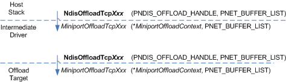

# Propagating an I/O Operation

\[The TCP chimney offload feature is deprecated and should not be used.\]

The following figure shows the propagation of a TCP chimney I/O operation through an intermediate driver.

The host stack initiates an I/O operation by calling one of the following NDIS function

-   [**NdisOffloadTcpDisconnect**](https://msdn.microsoft.com/library/windows/hardware/ff563696)

-   [**NdisOffloadTcpForward**](https://msdn.microsoft.com/library/windows/hardware/ff563696)

-   [**NdisOffloadTcpReceive**](https://msdn.microsoft.com/library/windows/hardware/ff563703)

-   [**NdisOffloadTcpReceiveReturn**](https://msdn.microsoft.com/library/windows/hardware/ff563706)

-   [**NdisOffloadTcpSend**](https://msdn.microsoft.com/library/windows/hardware/ff563708)

When calling an **NdisOffloadTcp*Xxx*** function, the host stack passes in the following:

-   An *NdisOffloadHandle* parameter, which is a pointer to the [**NDIS\_OFFLOAD\_HANDLE**](https://msdn.microsoft.com/library/windows/hardware/ff566705) structure in the host stack's Transmission Control Block (TCB). (For more information about how an offload target uses this handle, see [Referencing Offloaded State Through an Intermediate Driver](referencing-offloaded-state-through-an-intermediate-driver.md).

-   A pointer to a [**NET\_BUFFER\_LIST**](https://msdn.microsoft.com/library/windows/hardware/ff563672) structure. This structure can be a stand-alone structure or the first structure in a linked list of such structures. Each NET\_BUFFER\_LIST structure in the list describes one [**NET\_BUFFER**](https://msdn.microsoft.com/library/windows/hardware/ff568376) structure. The NET\_BUFFER structure maps to a chain of memory descriptor lists (MDLs).

In response to the host stack's call to an **NdisOffloadTcp*Xxx*** function, NDIS calls the intermediate driver's corresponding *MiniportTcpOffloadXxx* function:

-   [**MiniportTcpOffloadDisconnect**](https://msdn.microsoft.com/library/windows/hardware/ff559457)

-   [*MiniportTcpOffloadForward*](https://msdn.microsoft.com/library/windows/hardware/ff559458)

-   [*MiniportTcpOffloadReceive*](https://msdn.microsoft.com/library/windows/hardware/ff559460)

-   [*MiniportTcpOffloadReceiveReturn*](https://msdn.microsoft.com/library/windows/hardware/ff559462)

-   [*MiniportTcpOffloadSend*](https://msdn.microsoft.com/library/windows/hardware/ff559464)

From the host stack's NDIS\_OFFLOAD\_HANDLE structure, NDIS extracts the **MiniportOffloadContext** pointer and passes it, as the *MiniportOffloadContext* parameter, to the underlying intermediate driver's *MiniportTcpOffloadXxx* function. This pointer references the intermediate driver's context (called the *IM offload entry*) for the offloaded TCP connection.

To propagate the I/O operation to the underlying driver or offload target, the intermediate driver calls the corresponding **NdisOffloadTcp*Xxx*** function (the same function that the host stack called to initiate the I/O operation). To the **NdisOffloadTcp**Xxx**** function, the intermediate driver passes:

-   An *NdisOffloadHandle* parameter that references the NDIS\_OFFLOAD\_HANDLE structure that is stored in the intermediate driver's context for the offloaded TCP connection.

-   The same PNET\_BUFFER\_LIST pointer that NDIS passed to the intermediate driver's *MiniportTcpOffloadXxx* function.

From the intermediate driver's NDIS\_OFFLOAD\_HANDLE structure, NDIS extracts the **MiniportOffloadContext** pointer and passes it, as the *MiniportOffloadContext* parameter, to the offload target's *MiniportTcpOffloadXxx* function. This pointer references the offload target's context for the offloaded TCP connection. NDIS also passes the same PNET\_BUFFER\_LIST pointer that the intermediate driver passed to the **NdisOffloadTcp*Xxx*** function.

 

 

