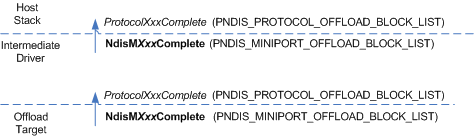

# Propagating the Completion of a State-Manipulation Operation

\[The TCP chimney offload feature is deprecated and should not be used.\]

The following figure shows the propagation of the completion of a state-manipulation operation through an intermediate driver.

An offload target completes a state-manipulation operation by calling one of the following functions:

-   [**NdisMInitiateOffloadComplete**](https://msdn.microsoft.com/library/windows/hardware/ff563604)

-   [**NdisMInvalidateOffloadComplete**](https://msdn.microsoft.com/library/windows/hardware/ff563609)

-   [**NdisMQueryOffloadStateComplete**](https://msdn.microsoft.com/library/windows/hardware/ff563634)

-   [**NdisMTerminateOffloadComplete**](https://msdn.microsoft.com/library/windows/hardware/ff563685)

-   [**NdisMUpdateOffloadComplete**](https://msdn.microsoft.com/library/windows/hardware/ff563694)

When calling one of these functions, the underlying driver or offload target passes a pointer to an [**NDIS\_MINIPORT\_OFFLOAD\_BLOCK\_LIST**](https://msdn.microsoft.com/library/windows/hardware/ff566469) structure. Any accompanying state immediately follows the NDIS\_MINIPORT\_OFFLOAD\_BLOCK\_LIST structure in memory.

In response to the underlying driver's or offload target's call to an **NdisM*Xxx*OffloadComplete** function, NDIS calls the intermediate driver's corresponding *ProtocolXxxOffloadComplete* function:

-   [*ProtocolInitiateOffloadComplete*](https://msdn.microsoft.com/library/windows/hardware/ff570261)

-   [*ProtocolInvalidateOffloadComplete*](https://msdn.microsoft.com/library/windows/hardware/ff570262)

-   [*ProtocolQueryOffloadComplete*](https://msdn.microsoft.com/library/windows/hardware/ff570266)

-   [*ProtocolTerminateOffloadComplete*](https://msdn.microsoft.com/library/windows/hardware/ff570277)

-   [*ProtocolUpdateOffloadComplete*](https://msdn.microsoft.com/library/windows/hardware/ff570280)

NDIS converts the NDIS\_MINIPORT\_OFFLOAD\_BLOCK\_LIST structure that was supplied by the offload target to an [**NDIS\_PROTOCOL\_OFFLOAD\_BLOCK\_LIST**](https://msdn.microsoft.com/library/windows/hardware/ff566833) structure. NDIS passes a pointer to the NDIS\_PROTOCOL\_OFFLOAD\_BLOCK\_LIST structure to the intermediate driver's *ProtocolXxxOffloadComplete* function.

To propagate the completion of the state-manipulation operation to the host stack, the intermediate driver calls the corresponding **NdisM*Xxx*OffloadComplete** function. For example, if NDIS called the intermediate driver's *ProtocolQueryOffloadComplete* function, the intermediate driver calls the **NdisMQueryOffloadStateComplete** function.

Before calling the corresponding NDIS completion function, the intermediate driver converts the NDIS\_PROTOCOL\_OFFLOAD\_BLOCK\_LIST structure that was passed in by NDIS into a NDIS\_MINIPORT\_OFFLOAD\_BLOCK\_LIST structure. (For more information about this process, see [Reusing an NDIS\_MINIPORT\_OFFLOAD\_BLOCK\_LIST Structure](reusing-an-ndis-miniport-offload-block-list-structure.md).) The intermediate driver passes a pointer to the stored NDIS\_MINIPORT\_OFFLOAD\_BLOCK\_LIST structure to the **NdisM*Xxx*OffloadComplete** function.

In addition, the intermediate driver deallocates the memory for the IM call entry that it allocated for the state-manipulation operation. For more information about the IM call entry, see [Reusing a NDIS\_MINIPORT\_OFFLOAD\_BLOCK\_LIST Structure](reusing-an-ndis-miniport-offload-block-list-structure.md).

In response to an intermediate driver's call to the **NdisM*Xxx*OffloadComplete** function, NDIS calls the host stack's corresponding *ProtocolXxxOffloadComplete* function.

NDIS converts the NDIS\_MINIPORT\_OFFLOAD\_BLOCK\_LIST structure that was supplied by the intermediate driver to an NDIS\_PROTOCOL\_OFFLOAD\_BLOCK\_LIST structure. NDIS passes a pointer to the NDIS\_PROTOCOL\_OFFLOAD\_BLOCK\_LIST structure to the host stack's *ProtocolXxxOffloadComplete* function.

 

 

