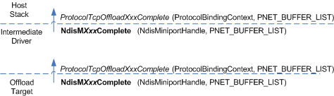

# Propagating the Completion of an I/O Operation

\[The TCP chimney offload feature is deprecated and should not be used.\]

The following figure shows the propagation of the completion of a TCP chimney I/O operation through an intermediate driver.

An offload target completes a TCP chimney I/O operation asynchronously by calling one of the following NDIS functions:

-   [**NdisTcpOffloadDisconnectComplete**](https://msdn.microsoft.com/library/windows/hardware/ff564590)

-   [**NdisTcpOffloadForwardComplete**](https://msdn.microsoft.com/library/windows/hardware/ff564597)

-   [**NdisTcpOffloadReceiveComplete**](https://msdn.microsoft.com/library/windows/hardware/ff564599)

-   [**NdisTcpOffloadSendComplete**](https://msdn.microsoft.com/library/windows/hardware/ff564609)

Note that an offload target does not asynchronously complete a call to its [*MiniportTcpOffloadReceiveReturn*](https://msdn.microsoft.com/library/windows/hardware/ff559462) function.

When calling an **NdisOffloadTcp*Xxx*Complete** function, an offload target passes:

-   An *NdisMiniportHandle* parameter, which is a handle that uniquely identifies the driver.

-   A pointer to a [**NET\_BUFFER\_LIST**](https://msdn.microsoft.com/library/windows/hardware/ff563672) structure. This structure can be a stand-alone structure or the first structure in a linked list of such structures. Each NET\_BUFFER\_LIST structure in the list describes one [**NET\_BUFFER**](https://msdn.microsoft.com/library/windows/hardware/ff568376) structure. The NET\_BUFFER structure maps to a chain of memory descriptor lists (MDLs).

In response to an offload target's call to an **NdisOffloadTcp*Xxx*Complete** function, NDIS calls the intermediate driver's corresponding *ProtocolTcpOffloadXxxComplete* function:

-   [*ProtocolTcpOffloadDisconnectComplete*](https://msdn.microsoft.com/library/windows/hardware/ff570271)

-   [*ProtocolTcpOffloadForwardComplete*](https://msdn.microsoft.com/library/windows/hardware/ff570273)

-   [*ProtocolTcpOffloadReceiveComplete*](https://msdn.microsoft.com/library/windows/hardware/ff570274)

-   [*ProtocolTcpOffloadSendComplete*](https://msdn.microsoft.com/library/windows/hardware/ff570276)

To the intermediate driver's *ProtocolTcpOffloadXxxComplete* function, NDIS passes:

-   A *ProtocolBindingContext* parameter, which is a handle that references the intermediate driver's context for its binding to the offload target.

-   The same PNET\_BUFFER\_LIST pointer that the offload target passed to the **NdisOffloadTcp*Xxx*Complete** function.

To propagate the completion of the I/O operation to the host stack, the intermediate driver calls the same **NdisOffloadTcp*Xxx*Complete** function that the offload target called to complete the I/O operation. To the **NdisOffloadTcp*Xxx*Complete** function, the intermediate driver passes the following:

-   An *NdisMiniportHandle* parameter, which is a handle that uniquely identifies the intermediate driver.

-   The same PNET\_BUFFER\_LIST pointer that NDIS passed to the intermediate driver's *ProtocolTcpOffloadXxxComplete* function.

In response, NDIS calls the host stack's *ProtocolTcpOffloadXxxComplete* function, passing a *ProtocolBindingContext* parameter and the same PNET\_BUFFER\_LIST pointer that was supplied by the intermediate driver to the **NdisOffloadTcp*Xxx*** function.

The intermediate driver then frees the memory for the IM call entry that it used to keep track of resources for the call. For more information about the IM Call Entry, see [Reusing an NDIS\_MINIPORT\_OFFLOAD\_BLOCK\_LIST Structure](reusing-an-ndis-miniport-offload-block-list-structure.md).

 

 

