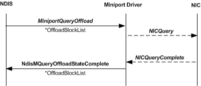

# Query Offload Sequence

\[The TCP chimney offload feature is deprecated and should not be used.\]

After the host stack sends a query request to NDIS, NDIS calls the offload target's [**MiniportQueryOffload**](https://msdn.microsoft.com/library/windows/hardware/ff559423) function. The *MiniportQueryOffload* function inputs the following parameters:

-   A handle in the *MiniportAdapterContext* parameter that references the adapter instance.

-   A pointer in the *OffloadBlockList* parameter that points to an [**NDIS\_MINIPORT\_OFFLOAD\_BLOCK\_LIST**](https://msdn.microsoft.com/library/windows/hardware/ff566469) structure. This structure can be a stand-alone structure or the root of a linked list of NDIS\_MINIPORT\_OFFLOAD\_BLOCK\_LIST structures that form the framework of an [offload state tree](offload-state-tree.md)

The *MiniportQueryOffload* function stores the pointer that is in *OffloadBlockList* and then returns. The offload target always completes the query operation asynchronously by calling [**NdisMQueryOffloadStateComplete**](https://msdn.microsoft.com/library/windows/hardware/ff563634).

The following figure shows the call sequence of a query offload operation.

The offload target's internal query function, which is labeled "NicQuery" in the preceding figure, queries the state that is specified in the state tree. After the internal query operation is complete, the offload target writes completion status to each NDIS\_MINIPORT\_OFFLOAD\_BLOCK\_LIST structure in the state tree and calls the **NdisMQueryOffloadStateComplete** function. The offload target returns the state tree to the host stack by passing to **NdisMQueryOffloadStateComplete** function the same pointer in *OffloadBlockList* that NDIS passed to the offload target's *MiniportQueryOffload* function.

Note that the host stack can query a state object while a query of that state object is in progress.

 

 

