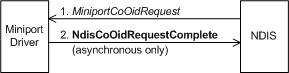

# Querying a Connection-Oriented Miniport Driver

To query information objects that a connection-oriented miniport driver maintains, a bound protocol calls [**NdisCoOidRequest**](https://msdn.microsoft.com/library/windows/hardware/ff561711) and passes an [**NDIS\_OID\_REQUEST**](https://msdn.microsoft.com/library/windows/hardware/ff566710) structure that specifies the object (OID) that is being queried and that provides a buffer into which NDIS eventually writes the requested information. The call to **NdisCoOidRequest** causes NDIS to call the miniport driver's [*MiniportCoOidRequest*](https://msdn.microsoft.com/library/windows/hardware/ff559362) function, which returns the requested information to NDIS. *MiniportCoOidRequest* can complete synchronously or asynchronously with a call to [**NdisCoOidRequestComplete**](https://msdn.microsoft.com/library/windows/hardware/ff561716).

NDIS can also call a miniport driver's [*MiniportCoOidRequest*](https://msdn.microsoft.com/library/windows/hardware/ff559362) function on its own behalf—for example, after the miniport driver's [*MiniportInitializeEx*](https://msdn.microsoft.com/library/windows/hardware/ff559389) function has returned NDIS\_STATUS\_SUCCESS—to query the miniport driver's capabilities, status, or statistics. The following diagram illustrates querying a connection-oriented miniport driver.

A connection-oriented miniport driver must be able to provide information about a global basis for all virtual connections (VCs) for a particular NIC and also on a per-VC basis. For example, if a non-**NULL** *NdisVcHandle* is supplied to [*MiniportCoOidRequest*](https://msdn.microsoft.com/library/windows/hardware/ff559362) for a query of [OID\_GEN\_CO\_RCV\_CRC\_ERROR](https://msdn.microsoft.com/library/windows/hardware/ff569562), the miniport driver returns the number of CRC errors that were encountered in all receives on the specified VC. For the same request with a **NULL** *NdisVcHandle*, the miniport driver returns the total number of CRC errors that are encountered for all incoming receives through a NIC.

The following list contains the set of mandatory general operational OIDs for connection-oriented miniport drivers:

[OID\_GEN\_CO\_SUPPORTED\_LIST](https://msdn.microsoft.com/library/windows/hardware/ff569567)

[OID\_GEN\_CO\_HARDWARE\_STATUS](https://msdn.microsoft.com/library/windows/hardware/ff569452)

[OID\_GEN\_CO\_MEDIA\_SUPPORTED](https://msdn.microsoft.com/library/windows/hardware/ff569558)

[OID\_GEN\_CO\_MEDIA\_IN\_USE](https://msdn.microsoft.com/library/windows/hardware/ff569557)

[OID\_GEN\_CO\_LINK\_SPEED](https://msdn.microsoft.com/library/windows/hardware/ff569453)

[OID\_GEN\_CO\_VENDOR\_ID](https://msdn.microsoft.com/library/windows/hardware/ff569571)

[OID\_GEN\_CO\_VENDOR\_DESCRIPTION](https://msdn.microsoft.com/library/windows/hardware/ff569569)

[OID\_GEN\_CO\_VENDOR\_DRIVER\_VERSION](https://msdn.microsoft.com/library/windows/hardware/ff569570)

[OID\_GEN\_CO\_DRIVER\_VERSION](https://msdn.microsoft.com/library/windows/hardware/ff569449)

[OID\_GEN\_CO\_MAC\_OPTIONS](https://msdn.microsoft.com/library/windows/hardware/ff569454)

[OID\_GEN\_CO\_MEDIA\_CONNECT\_STATUS](https://msdn.microsoft.com/library/windows/hardware/ff569455)

[OID\_GEN\_CO\_MINIMUM\_LINK\_SPEED](https://msdn.microsoft.com/library/windows/hardware/ff569559)

The miniport driver's [*MiniportCoOidRequest*](https://msdn.microsoft.com/library/windows/hardware/ff559362) function must be prepared to respond to queries or sets, as appropriate, to any of the preceding OIDs.

When [*MiniportCoOidRequest*](https://msdn.microsoft.com/library/windows/hardware/ff559362) is called with OID\_GEN\_CO\_MAC\_OPTIONS, it must return a bitmask that specifies the optional operations that the miniport driver performs. The set of flags includes:

-   NDIS\_MAC\_OPTION\_NO\_LOOPBACK. If this flag is set, the miniport driver does not loopback a packet that is passed to [**MiniportCoSendNetBufferLists**](https://msdn.microsoft.com/library/windows/hardware/ff559365) that is directed to a receiver on the same computer and that the miniport driver expects NDIS to perform the loopback. If NDIS performs the loopback of a packet, the packet is not passed down to the miniport driver. A miniport driver always sets this flag unless a NIC performs hardware loopbacks.

-   NDIS\_MAC\_ETOX\_INDICATION. If this flag is set, the miniport driver indicates that a send is complete only after the NIC transmits the packet.

A miniport driver must never use the NDIS\_MAC\_OPTION\_RESERVED flag, which is reserved for NDIS internal use.

[*MiniportCoOidRequest*](https://msdn.microsoft.com/library/windows/hardware/ff559362) will also be queried with a media-specific OID to determine the NIC's current address.

For more information, see [OIDs for Connection-Oriented Call Managers and Clients](https://msdn.microsoft.com/library/windows/hardware/ff569067) and [General Objects](https://msdn.microsoft.com/library/windows/hardware/ff546510).

 

 

