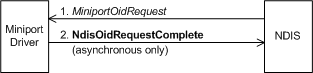

# Querying a Connectionless Miniport Driver

To query OIDs that a connectionless miniport driver maintains, a bound protocol calls [**NdisOidRequest**](https://msdn.microsoft.com/library/windows/hardware/ff563710) and passes an [**NDIS\_OID\_REQUEST**](https://msdn.microsoft.com/library/windows/hardware/ff566710) structure that specifies the object (OID) that is being queried and that points to a buffer into which NDIS eventually writes the requested information.

If NDIS does not respond for the miniport driver, the call to **NdisOidRequest** causes NDIS to call the miniport driver's [*MiniportOidRequest*](https://msdn.microsoft.com/library/windows/hardware/ff559416) function, which returns the requested information to NDIS. *MiniportOidRequest* can complete synchronously or asynchronously with a call to [**NdisMOidRequestComplete**](https://msdn.microsoft.com/library/windows/hardware/ff563622).

NDIS can also call a miniport driver's *MiniportOidRequest* function on its own behalf--for example, after the miniport driver's *MiniportInitializeEx* function has returned NDIS\_STATUS\_SUCCESS--to query the miniport driver's capabilities, status, or statistics. The following diagram illustrates querying a connectionless miniport driver.

NDIS responds to many OID requests on behalf of the miniport driver. The miniport driver reports many of its OID values during initialization and in status indications. For more information about OID values that are reported in attributes, see [**NDIS\_MINIPORT\_ADAPTER\_ATTRIBUTES**](https://msdn.microsoft.com/library/windows/hardware/ff565920) and the related attributes structures.

When *MiniportOidRequest* is called with OID\_GEN\_MAC\_OPTIONS, it must return a bitmask that specifies the optional operations that the miniport driver performs. The set of flags includes:

-   NDIS\_MAC\_OPTION\_COPY\_LOOKAHEAD\_DATA. This flag indicates to a protocol driver that it can access indicated data by any means. If a miniport driver indicates data out of on-board shared memory, it must not set this flag.

-   NDIS\_MAC\_OPTION\_NO\_LOOPBACK. If this flag is set, the miniport driver does not loopback a packet that is passed to *MiniportSendNetBufferLists(Packets)* that is directed to a receiver on the same computer and that the miniport driver expects NDIS to perform the loopback. If NDIS performs the loopback of a packet, the packet is not passed down to the miniport driver. A miniport driver always sets this flag unless a NIC performs hardware loopbacks.

-   NDIS\_MAC\_OPTION\_RECEIVE\_SERIALIZED. If this flag is set, the miniport driver does not indicate any newly received packet up until the previously received packet has been fully processed, including transferring the data. Most miniport drivers, except those that indicate up packets by calling [**NdisMIndicateReceiveNetBufferLists**](https://msdn.microsoft.com/library/windows/hardware/ff563598), set this flag.

A miniport driver must never use the flag NDIS\_MAC\_OPTION\_RESERVED, which is reserved for NDIS internal use.

*MiniportOidRequest* is also queried with a media-specific OID to determine the NIC's current address. For instance, the miniport driver for a NIC of type 802.3 will be queried with OID\_802\_3\_CURRENT\_ADDRESS.

The miniport drivers for certain media types will receive additional OIDs that are media-specific. For example, a miniport driver whose NIC is of type 802.3 is queried with OID\_802.3\_MAXIMUM\_LIST\_SIZE. For more information, see [General Objects](https://msdn.microsoft.com/library/windows/hardware/ff546510).

 

 

