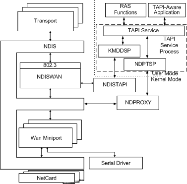

# RAS Architecture Overview

The Remote Access Service (RAS) enables remote workstations to establish a dial-up connection to a LAN and access resources on the LAN as if the remote workstation were on the LAN. WAN miniport drivers provide the interface between RAS and wide area network (WAN) cards such as ISDN, X.25, and Switched 56 adapters.

The primary system-supplied components of the RAS architecture include the following:

-   [NDISWAN](#ddk-ndiswan-ng)

-   [TAPI service](#ddk-tapi-service-ng)

-   [NDPROXY](#ddk-ndproxy-ng)

-   [NDISTAPI](#ddk-ndistapi-ng)

Developers provide TAPI-aware applications and WAN miniport drivers. CoNDIS WAN developers can also provide WAN client protocol drivers, a miniport call manager (MCM), or a separate call manager.

The following figure shows the RAS architecture.

The following sections briefly describe the components in the RAS architecture.

### RAS and TAPI Components

The components on the right side of the preceding figure implement TAPI-related call management operations, such as setting up and tearing down calls and connections. The details of these operations depend on the WAN model (NDIS WAN or CoNDIS WAN).

### RAS Functions

User-mode applications call RAS functions to make RAS connections with remote computers. After a RAS connection is established, such applications can connect to network services by using standard network interfaces such as Microsoft Windows Sockets, NetBIOS, Named Pipes, or RPC.

### TAPI-Aware Applications

TAPI-aware applications, which are capable of telephony communication, run in both application and service processes. Service providers communicate with specific devices. TAPI-aware applications communicate through the TAPI interface (Tapi32.dll) with their service providers. These service providers run in the [TAPI service](#ddk-tapi-service-ng) process.

### TAPI Service

The TAPI service (Tapisrv.exe) process presents the Telephony Service Provider Interface (TSPI) of service providers to [TAPI-aware applications](#ddk-tapi-aware-applications-ng). These service providers are DLLs that run in the context of the TAPI service process.

The operating system supplies service providers that NDIS WAN or CoNDIS WAN miniport drivers use to communicate with user-mode applications. The service provider for NDIS WAN miniport drivers is [KMDDSP](#ddk-kmddsp-ng). The service provider for CoNDIS WAN miniport drivers (and MCMs) is [NDPTSP](#ddk-ndptsp-ng).

### KMDDSP

KMDDSP (Kmddsp.tsp) is a service provider DLL that runs in the context of the TAPI service process. KMDDSP provides a TSPI interface that the TAPI service presents to [TAPI-aware applications](#ddk-tapi-aware-applications-ng) so that [NDISTAPI](#ddk-ndistapi-ng) can communicate with user-mode applications.

KMDDSP works with NDISTAPI to convert user-mode requests to corresponding TAPI OIDs (OID\_TAPI\_*Xxx*). For more information about TAPI OIDs, see [TAPI Objects](https://msdn.microsoft.com/library/windows/hardware/ff564235).

### NDPTSP

NDPTSP (Ndptsp.tsp) is a service provider DLL that runs in the context of the TAPI service process. NDPTSP provides a TSPI interface that the TAPI service presents to TAPI-aware applications so that [NDPROXY](#ddk-ndproxy-ng) can communicate with user-mode applications.

NDPTSP works with NDPROXY to convert user-mode requests to TAPI connection-oriented OIDs (OID\_CO\_TAPI\_*Xxx*). For more information about TAPI connection-oriented OIDs, see [TAPI Extensions for Connection-Oriented NDIS](https://msdn.microsoft.com/library/windows/hardware/ff570924).

### NDISTAPI

NDISTAPI (Ndistapi.sys) receives TAPI requests from [KMDDSP](#ddk-kmddsp-ng) and then calls [**NdisOidRequest**](https://msdn.microsoft.com/library/windows/hardware/ff563710) to route the corresponding TAPI OIDs to NDIS WAN miniport drivers. For more information about NDISTAPI, see [NDISTAPI Overview](ndistapi-overview.md).

### NDPROXY

NDPROXY (Ndproxy.sys) communicates with TAPI through the TSPI interface that [NDPTSP](#ddk-ndptsp-ng) provides. NDPROXY communicates through NDIS with NDISWAN and CoNDIS WAN miniport drivers, MCMs, and call managers.

For more information about NDPROXY, see [NDPROXY Overview](ndproxy-overview.md).

### Driver Stack

### WAN Transports

The RAS system component provides transports such as PPP Authentication (PAP, CHAP) and network configuration protocol drivers (IPCP, IPXCP, NBFCP, LCP, and so on). A WAN miniport driver (or MCM) implements only PPP media-specific framing.

### NDISWAN

NDISWAN (Ndiswan.sys) is an NDIS intermediate driver. NDISWAN binds to NDIS protocol drivers at its upper edge and [WAN miniport drivers](wan-miniport-drivers.md) at its lower edge.

NDISWAN provides PPP protocol/link framing, compression/decompression, and encryption/decryption. NDISWAN interfaces with both NDIS WAN and CoNDIS WAN miniport drivers.

For more information about NDISWAN, see [NDISWAN Overview](ndiswan-overview.md).

### Serial Driver

The serial driver component is a standard device driver for internal serial ports or multiport serial cards. The asynchronous WAN miniport driver included with Microsoft Windows 2000 and later uses the internal serial driver for modem communications. Any driver that exports the same functions as the serial driver can interface with the built-in asynchronous WAN miniport driver.

**Note**  X.25 vendors can implement serial driver emulators for an X.25 interface card. In this case, each virtual circuit on the X.25 card appears as a serial port with an X.25 packet assembler/disassembler (PAD) attached to it. The connection interface must correctly emulate serial signals such as DTR, DCD, CTS, RTS, and DSR.
X.25 vendors who implement a serial driver emulator for their X.25 card must also make an entry for their PAD in the Pad.inf file. This file contains the command/response script required to make a connection through the X.25 PAD. For more information about the Pad.inf file, see the Microsoft Windows SDK documentation.

 

### WAN Miniport Driver

A WAN miniport driver provides the interface between [NDISWAN](#ddk-ndiswan-ng) and WAN NICs.

A WAN miniport driver can be implemented as an NDIS WAN miniport driver or a CoNDIS WAN miniport driver. For more information about choosing the miniport driver model that is most appropriate for your application, see [Choosing a WAN Driver Model](choosing-a-wan-driver-model.md).

 

 

