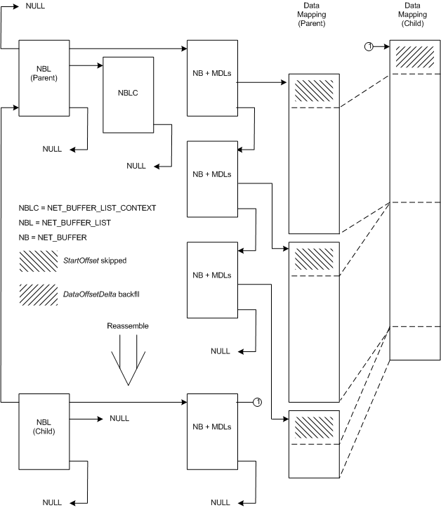

# Reassembled NET\_BUFFER\_LIST Structures

An NDIS driver can create a reassembled [**NET\_BUFFER\_LIST**](https://msdn.microsoft.com/library/windows/hardware/ff568388) structure from an existing NET\_BUFFER\_LIST structure. The reassembled structure references the original data from multiple source [**NET\_BUFFER**](https://msdn.microsoft.com/library/windows/hardware/ff568376) structures. Drivers can use this type of structure to efficiently combine many smaller buffers into a single large buffer.

The following figure shows the relationship between a parent NET\_BUFFER\_LIST structure and a reassembled child structure:

The preceding figure contains a parent [**NET\_BUFFER\_LIST**](https://msdn.microsoft.com/library/windows/hardware/ff568388) structure and a child structure that was derived from that parent. The parent structure has one [**NET\_BUFFER\_LIST\_CONTEXT**](https://msdn.microsoft.com/library/windows/hardware/ff568389) structure and three [**NET\_BUFFER**](https://msdn.microsoft.com/library/windows/hardware/ff568376) structures with MDLs attached. The parent structure's parent pointer is **NULL** indicating that it is not a derived structure.

The child NET\_BUFFER\_LIST structure has one NET\_BUFFER structure with MDLs attached. The child NET\_BUFFER\_LIST structure has a pointer to the parent structure. The **NULL** where a NET\_BUFFER\_LIST\_CONTEXT structure pointer would be indicates that the child has no NET\_BUFFER\_LIST\_CONTEXT structure.

NDIS drivers call the [**NdisAllocateReassembledNetBufferList**](https://msdn.microsoft.com/library/windows/hardware/ff561614) function to reassemble a fragmented [**NET\_BUFFER\_LIST**](https://msdn.microsoft.com/library/windows/hardware/ff568388) structure. NDIS allocates a new [**NET\_BUFFER**](https://msdn.microsoft.com/library/windows/hardware/ff568376) structure and MDLs with the reassembled NET\_BUFFER\_LIST structure. NDIS does not allocate a NET\_BUFFER\_LIST\_CONTEXT structure for the reassembled structure. The reassembled NET\_BUFFER structure and MDLs describe the same data as does the parent structure. The data is not copied.

To create the reassembled NET\_BUFFER\_LIST structure, **NdisAllocateReassembledNetBufferList** skips over the number of bytes specified in the *StartOffset* parameter in each of the parent NET\_BUFFER structures. **NdisAllocateReassembledNetBufferList** concatenates the remaining data in each parent NET\_BUFFER structure into the MDL chain of one reassembled NET\_BUFFER structure. **NdisAllocateReassembledNetBufferList** retreats (increases the used data space in) the reassembled NET\_BUFFER structure by the amount specified in *DataOffsetDelta* .

NDIS drivers call the [**NdisFreeReassembledNetBufferList**](https://msdn.microsoft.com/library/windows/hardware/ff562594) function to free a reassembled [**NET\_BUFFER\_LIST**](https://msdn.microsoft.com/library/windows/hardware/ff568388) structure and the associated [**NET\_BUFFER**](https://msdn.microsoft.com/library/windows/hardware/ff568376) structure and MDL chain.

## Related topics

[Derived NET\_BUFFER\_LIST Structures](derived-net-buffer-list-structures.md)

 

 

