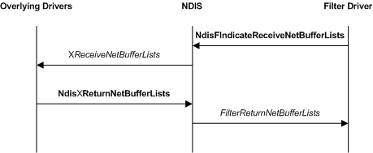
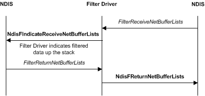

# Receiving Data in a Filter Driver

Filter drivers can initiate receive indications or filter receive indications from underlying drivers. When a miniport driver calls the [**NdisMIndicateReceiveNetBufferLists**](https://msdn.microsoft.com/library/windows/hardware/ff563598) function, NDIS submits the specified [**NET\_BUFFER\_LIST**](https://msdn.microsoft.com/library/windows/hardware/ff568388) structure to the lowest overlying filter module in the driver stack.

### Receive Indications Initiated by a Filter Driver

The following figure illustrates a receive indication that is initiated by a filter driver.

Filter drivers call the [**NdisFIndicateReceiveNetBufferLists**](https://msdn.microsoft.com/library/windows/hardware/ff561820) function to indicate received data. The **NdisFIndicateReceiveNetBufferLists** function passes the indicated list of [**NET\_BUFFER\_LIST**](https://msdn.microsoft.com/library/windows/hardware/ff568388) structures up the stack to overlying drivers. The filter driver allocates the structures from pools that it created during initialization.

If a filter driver sets the **NDIS\_RECEIVE\_FLAGS\_RESOURCES** flag in the *ReceiveFlags* parameter of [**NdisFIndicateReceiveNetBufferLists**](https://msdn.microsoft.com/library/windows/hardware/ff561820), this indicates that the filter driver must regain ownership of the [**NET\_BUFFER\_LIST**](https://msdn.microsoft.com/library/windows/hardware/ff568388) structures immediately. In this case, NDIS does not call the filter driver's [*FilterReturnNetBufferLists*](https://msdn.microsoft.com/library/windows/hardware/ff549964) function to return the **NET\_BUFFER\_LIST** structures. The filter driver regains ownership immediately after **NdisFIndicateReceiveNetBufferLists** returns.

If a filter driver does not set the **NDIS\_RECEIVE\_FLAGS\_RESOURCES** flag in the *ReceiveFlags* parameter of [**NdisFIndicateReceiveNetBufferLists**](https://msdn.microsoft.com/library/windows/hardware/ff561820), NDIS returns the indicated [**NET\_BUFFER\_LIST**](https://msdn.microsoft.com/library/windows/hardware/ff568388) structures to the filter driver's [*FilterReturnNetBufferLists*](https://msdn.microsoft.com/library/windows/hardware/ff549964) function. In this case, the filter driver relinquishes ownership of the indicated structures until NDIS returns them to *FilterReturnNetBufferLists*.

**Note**  A filter driver should keep track of receive indications that it initiates and make sure that it does not call the [**NdisFReturnNetBufferLists**](https://msdn.microsoft.com/library/windows/hardware/ff562613) function when the receive operation is complete.

 

### Filtering Receive Indications

The following figure illustrates a filtered receive indication that is initiated by an underlying driver.

NDIS calls a filter driver's [*FilterReceiveNetBufferLists*](https://msdn.microsoft.com/library/windows/hardware/ff549960) function to process receive indications that come from underlying drivers. NDIS calls *FilterReceiveNetBufferLists* after an underlying driver calls a receive indication function (for example, [**NdisMIndicateReceiveNetBufferLists**](https://msdn.microsoft.com/library/windows/hardware/ff563598)) to indicate received network data or loopback data.

If the **NDIS\_RECEIVE\_FLAGS\_RESOURCES** flag in the *ReceiveFlags* parameter of [*FilterReceiveNetBufferLists*](https://msdn.microsoft.com/library/windows/hardware/ff549960) is not set, the filter driver keeps ownership of the [**NET\_BUFFER\_LIST**](https://msdn.microsoft.com/library/windows/hardware/ff568388) structures until it calls the [**NdisFReturnNetBufferLists**](https://msdn.microsoft.com/library/windows/hardware/ff562613) function.

If the **NDIS\_RECEIVE\_FLAGS\_RESOURCES** flag in the *ReceiveFlags* parameter is set, the filter driver cannot keep the [**NET\_BUFFER\_LIST**](https://msdn.microsoft.com/library/windows/hardware/ff568388) structure and the associated underlying driver-allocated resources. This flag can indicate that the underlying driver is running low on receive resources. The [*FilterReceiveNetBufferLists*](https://msdn.microsoft.com/library/windows/hardware/ff549960) function should return as quickly as possible.

**Note**  If the **NDIS\_RECEIVE\_FLAGS\_RESOURCES** flag is set, the filter driver must retain the original set of [**NET\_BUFFER\_LIST**](https://msdn.microsoft.com/library/windows/hardware/ff568388) structures in the linked list. For example, when this flag is set, the driver might process the structures and indicate them up the stack one at a time but before the function returns, it must restore the original linked list.

 

Filter drivers can perform filter operations on received data before indicating the data to overlying drivers. For each buffer submitted to its [*FilterReceiveNetBufferLists*](https://msdn.microsoft.com/library/windows/hardware/ff549960) function a filter driver can do the following:

-   Pass it on to the next overlying driver by calling [**NdisFIndicateReceiveNetBufferLists**](https://msdn.microsoft.com/library/windows/hardware/ff561820). The driver can modify the contents of the buffer. NDIS guarantees the availability of context space (see [NET\_BUFFER\_LIST\_CONTEXT structure](net-buffer-list-context-structure.md)).

    A filter driver can change the status that NDIS passed to [*FilterReceiveNetBufferLists*](https://msdn.microsoft.com/library/windows/hardware/ff549960) or simply pass it on to [**NdisFIndicateReceiveNetBufferLists**](https://msdn.microsoft.com/library/windows/hardware/ff561820).

    **Note**  A filter driver can pass on a buffer with [**NdisFIndicateReceiveNetBufferLists**](https://msdn.microsoft.com/library/windows/hardware/ff561820) even if NDIS sets the **NDIS\_RECEIVE\_FLAGS\_RESOURCES** flag in the *ReceiveFlags* parameter of [*FilterReceiveNetBufferLists*](https://msdn.microsoft.com/library/windows/hardware/ff549960). In this case, the filter driver must not return from *FilterReceiveNetBufferLists* until it regains ownership of the buffer.

     

-   Discard the buffer. If NDIS cleared the **NDIS\_RECEIVE\_FLAGS\_RESOURCES** flag in the *ReceiveFlags* parameter of [*FilterReceiveNetBufferLists*](https://msdn.microsoft.com/library/windows/hardware/ff549960), call the [**NdisFReturnNetBufferLists**](https://msdn.microsoft.com/library/windows/hardware/ff562613) function to discard the buffer. If NDIS set the **NDIS\_RECEIVE\_FLAGS\_RESOURCES** flag in the *ReceiveFlags* parameter of *FilterReceiveNetBufferLists*, take no action and return from *FilterReceiveNetBufferLists* to discard the buffer.

-   Queue the buffer in a local data structure for later processing. If NDIS set the **NDIS\_RECEIVE\_FLAGS\_RESOURCES** flag in the *ReceiveFlags* parameter of [*FilterReceiveNetBufferLists*](https://msdn.microsoft.com/library/windows/hardware/ff549960), the filter driver must create a copy before returning from *FilterReceiveNetBufferLists*.

-   Copy the buffer and originate a receive indication with the copy. The receive indication is similar to a filter-driver-initiated receive indication. In this case, the driver must return the original buffer to the underlying driver.

The [**NdisFIndicateReceiveNetBufferLists**](https://msdn.microsoft.com/library/windows/hardware/ff561820) function passes the indicated list of [**NET\_BUFFER\_LIST**](https://msdn.microsoft.com/library/windows/hardware/ff568388) structures up the driver stack to overlying drivers. The receive operation proceeds similarly to a filter-driver-initiated receive operation.

If an overlying driver retained ownership of the buffer, NDIS calls the [*FilterReturnNetBufferLists*](https://msdn.microsoft.com/library/windows/hardware/ff549964) function for the filter module. In its *FilterReturnNetBufferLists* function, the filter driver will undo the operations that it performed on the buffer on the receive indication path.

When the lowest layer filter module indicates that it is done with a buffer, NDIS returns the buffer to the miniport driver. If NDIS cleared the **NDIS\_RECEIVE\_FLAGS\_RESOURCES** flag in the *ReceiveFlags* parameter of [*FilterReceiveNetBufferLists*](https://msdn.microsoft.com/library/windows/hardware/ff549960), the filter driver calls [**NdisFReturnNetBufferLists**](https://msdn.microsoft.com/library/windows/hardware/ff562613) to return the buffer. If NDIS set the **NDIS\_RECEIVE\_FLAGS\_RESOURCES** flag in the *ReceiveFlags* parameter of *FilterReceiveNetBufferLists*, returning from *FilterReceiveNetBufferLists* returns the buffer.

 

 

