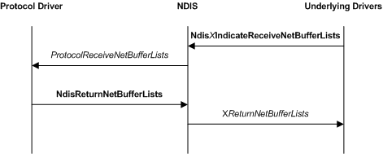

# Receiving Data in Protocol Drivers

The following figure illustrates a basic receive operation, which involves a protocol driver, NDIS, and underlying drivers in a driver stack.

NDIS calls a protocol driver's [*ProtocolReceiveNetBufferLists*](https://msdn.microsoft.com/library/windows/hardware/ff570267) function to process receive indications that come from underlying drivers. NDIS calls *ProtocolReceiveNetBufferLists* after an underlying driver calls a receive indication function (for example, [**NdisMIndicateReceiveNetBufferLists**](https://msdn.microsoft.com/library/windows/hardware/ff563598)) to indicate received network data or loop-back data.

If the **NDIS\_RECEIVE\_FLAGS\_RESOURCES** flag in the *ReceiveFlags* parameter of [*ProtocolReceiveNetBufferLists*](https://msdn.microsoft.com/library/windows/hardware/ff570267) is not set, the protocol driver retains ownership of the [**NET\_BUFFER\_LIST**](https://msdn.microsoft.com/library/windows/hardware/ff568388) structures until it calls the [**NdisReturnNetBufferLists**](https://msdn.microsoft.com/library/windows/hardware/ff564534) function. If NDIS sets the **NDIS\_RECEIVE\_FLAGS\_RESOURCES** flag, the protocol driver cannot retain the **NET\_BUFFER\_LIST** structure and the associated resources. The set **NDIS\_RECEIVE\_FLAGS\_RESOURCES** flag indicates that an underlying driver is running low on receive resources. In this case, the *ProtocolReceiveNetBufferLists* function should copy the received data into protocol-allocated storage and return as quickly as possible.

**Note**  NDIS can change the flags that an underlying driver indicates. For example, if a miniport driver sets the **NDIS\_RECEIVE\_FLAGS\_RESOURCES** flag in the *ReceiveFlags* parameter of the [**NdisMIndicateReceiveNetBufferLists**](https://msdn.microsoft.com/library/windows/hardware/ff563598) function, NDIS can copy the indicated data and pass the copy to [*ProtocolReceiveNetBufferLists*](https://msdn.microsoft.com/library/windows/hardware/ff570267) with the **NDIS\_RECEIVE\_FLAGS\_RESOURCES** flag cleared.

 

**Note**  If the **NDIS\_RECEIVE\_FLAGS\_RESOURCES** flag is set, the protocol driver must retain the original set of [**NET\_BUFFER\_LIST**](https://msdn.microsoft.com/library/windows/hardware/ff568388) structures in the linked list. For example, when this flag is set the driver might process the structures and indicate them up the stack one at a time but before the function returns it must restore the original linked list.

 

Protocol drivers call the [**NdisReturnNetBufferLists**](https://msdn.microsoft.com/library/windows/hardware/ff564534) function to release ownership of a list of [**NET\_BUFFER\_LIST**](https://msdn.microsoft.com/library/windows/hardware/ff568388) structures, along with the associated [**NET\_BUFFER**](https://msdn.microsoft.com/library/windows/hardware/ff568376) structures, and network data.

 

 

