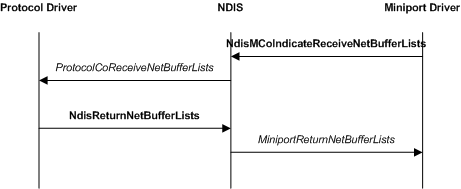

# Receiving NET\_BUFFER Structures in CoNDIS Drivers

The following figure illustrates a basic CoNDIS receive operation, which involves a protocol driver, NDIS, and a miniport driver.

As the preceding figure shows, miniport drivers call the [**NdisMCoIndicateReceiveNetBufferLists**](https://msdn.microsoft.com/library/windows/hardware/ff563561) function to indicate [**NET\_BUFFER**](https://msdn.microsoft.com/library/windows/hardware/ff568376) structures to overlying drivers. In most miniport drivers, each NET\_BUFFER structure is attached to a separate [**NET\_BUFFER\_LIST**](https://msdn.microsoft.com/library/windows/hardware/ff568388) structure, so protocol drivers can create a subset of the original list of NET\_BUFFER\_LIST structures and forward them to different clients. However, the number of NET\_BUFFER structures that are attached to a NET\_BUFFER\_LIST depends on the driver.

After the miniport driver links all the NET\_BUFFER\_LIST structures, the miniport driver passes a pointer to the first NET\_BUFFER\_LIST structure in the list to the **NdisMCoIndicateReceiveNetBufferLists** function. NDIS examines the NET\_BUFFER\_LIST structures and calls the [**ProtocolCoReceiveNetBufferLists**](https://msdn.microsoft.com/library/windows/hardware/ff570256) function of the protocol driver that is associated with the specified virtual connection (VC). NDIS passes a subset of the list that includes only the NET\_BUFFER\_LIST structures that are associated with the correct binding to each protocol driver.

If the NDIS\_RECEIVE\_FLAGS\_STATUS\_RESOURCES flag is set in the *CoReceiveFlags* parameter for a protocol driver's *ProtocolCoReceiveNetBufferLists* function, NDIS regains ownership of the [**NET\_BUFFER\_LIST**](https://msdn.microsoft.com/library/windows/hardware/ff568388) structures immediately after *ProtocolCoReceiveNetBufferLists* returns.

If the NDIS\_RECEIVE\_FLAGS\_STATUS\_RESOURCES flag is not set in the *CoReceiveFlags* parameter for a protocol driver's [**ProtocolCoReceiveNetBufferLists**](https://msdn.microsoft.com/library/windows/hardware/ff570256) function, the protocol driver can retain ownership of the NET\_BUFFER\_LIST structures. In this case, the protocol driver must return the NET\_BUFFER\_LIST structures by calling the [**NdisReturnNetBufferLists**](https://msdn.microsoft.com/library/windows/hardware/ff564534) function.

If a miniport driver runs low on receive resources, it can set the NDIS\_RECEIVE\_FLAGS\_STATUS\_RESOURCES flag in the *CoReceiveFlags* parameter for the [**NdisMCoIndicateReceiveNetBufferLists**](https://msdn.microsoft.com/library/windows/hardware/ff563561) function. In that case, the driver can reclaim ownership of all of the indicated [**NET\_BUFFER\_LIST**](https://msdn.microsoft.com/library/windows/hardware/ff568388) structures and embedded [**NET\_BUFFER**](https://msdn.microsoft.com/library/windows/hardware/ff568376) structures as soon as **NdisMCoIndicateReceiveNetBufferLists** returns. If a miniport driver indicates NET\_BUFFER structures with the NDIS\_RECEIVE\_FLAGS\_RESOURCES flag set, the protocol drivers must copy the data, so you should avoid using NDIS\_RECEIVE\_FLAGS\_RESOURCES in this way. A miniport driver should detect when it has low receive resources and should complete any steps that are necessary to avoid this situation.

NDIS calls a miniport driver's [*MiniportReturnNetBufferLists*](https://msdn.microsoft.com/library/windows/hardware/ff559437) function after the protocol driver calls **NdisReturnNetBufferLists**.

**Note**  If a miniport driver indicates a [**NET\_BUFFER\_LIST**](https://msdn.microsoft.com/library/windows/hardware/ff568388) structure with a given status, NDIS is not required to indicate the NET\_BUFFER\_LIST structure to the overlying drivers with the same status. For example, NDIS could copy a NET\_BUFFER\_LIST structure with the NDIS\_RECEIVE\_FLAGS\_RESOURCES flag set and indicate the copy to the overlying drivers with this flag cleared.

 

NDIS can return NET\_BUFFER\_LIST structures to the miniport driver in any arbitrary order and in any combination. That is, the linked list of NET\_BUFFER\_LIST structures that NDIS returns to a miniport driver by calling [*MiniportReturnNetBufferLists*](https://msdn.microsoft.com/library/windows/hardware/ff559437) can have NET\_BUFFER\_LIST structures from different previous calls to [**NdisMCoIndicateReceiveNetBufferLists**](https://msdn.microsoft.com/library/windows/hardware/ff563561).

Miniport drivers must set the **SourceHandle** member in the [**NET\_BUFFER\_LIST**](https://msdn.microsoft.com/library/windows/hardware/ff568388) structures to the same value as the *NdisVcHandle* parameter of **NdisMCoIndicateReceiveNetBufferLists**. so that NDIS can return the NET\_BUFFER\_LIST structures to the correct miniport driver.

Intermediate drivers also set the **SourceHandle** member in the NET\_BUFFER\_LIST structure to the *NdisVcHandle* value. If an intermediate driver forwards a receive indication, the driver must save the **SourceHandle** value that the underlying driver provided before it writes to the **SourceHandle** member. When NDIS returns a forwarded NET\_BUFFER\_LIST structure to the intermediate driver, the intermediate driver must restore the **SourceHandle** that it saved.

 

 

