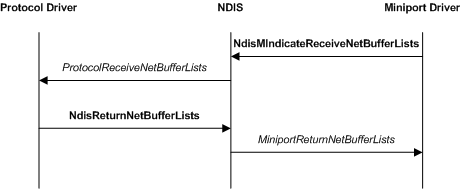

# Receiving Network Data

The following figure illustrates a basic receive operation, which involves a miniport driver, NDIS, and a protocol driver.

Miniport drivers call the [**NdisMIndicateReceiveNetBufferLists**](https://msdn.microsoft.com/library/windows/hardware/ff563598) function to indicated [**NET\_BUFFER**](https://msdn.microsoft.com/library/windows/hardware/ff568376) structures to higher level drivers. Every NET\_BUFFER structure should usually be attached to a separate [**NET\_BUFFER\_LIST**](https://msdn.microsoft.com/library/windows/hardware/ff568388) structure. This allows protocol drivers to create a subset of the original list of NET\_BUFFER\_LIST structures and forward them to different clients. Some drivers, for example native IEEE 802.11 miniport drivers, might attach more than one NET\_BUFFER structure to a NET\_BUFFER\_LIST structure.

After linking all the NET\_BUFFER\_LIST structures, a miniport driver passes a pointer to the first NET\_BUFFER\_LIST structure in the list to the **NdisMIndicateReceiveNetBufferLists** function. NDIS examines the NET\_BUFFER\_LIST structures and it calls the [**ProtocolReceiveNetBufferLists**](https://msdn.microsoft.com/library/windows/hardware/ff570267) function of each protocol driver that is associated with the NET\_BUFFER\_LIST structures. NDIS passes a subset of the list that includes only the NET\_BUFFER\_LIST structures that are associated with the correct binding to each protocol driver. NDIS matches the **NetBufferListFrameType** value that is specified in the NET\_BUFFER\_LIST structure to the frame type that each protocol driver registers.

If the NDIS\_RECEIVE\_FLAGS\_RESOURCES flag in the *ReceiveFlags* parameter that is passed to a protocol driver's *ProtocolReceiveNetBufferLists* function is set, NDIS regains the ownership of the [**NET\_BUFFER\_LIST**](https://msdn.microsoft.com/library/windows/hardware/ff568388) structures immediately after the *ProtocolReceiveNetBufferLists* call returns.

**Note**  If the NDIS\_RECEIVE\_FLAGS\_RESOURCES flag is set, the protocol driver must retain the original set of NET\_BUFFER\_LIST structures in the linked list. For example, when this flag is set the driver might process the structures and indicate them up the stack one at a time but before the function returns it must restore the original linked list.

 

If the NDIS\_RECEIVE\_FLAGS\_RESOURCES flag in the *ReceiveFlags* parameter that is passed to a protocol driver's *ProtocolReceiveNetBufferLists* function is not set, the protocol driver can retain ownership of the NET\_BUFFER\_LIST structures. In this case, the protocol driver must return the NET\_BUFFER\_LIST structures by calling the [**NdisReturnNetBufferLists**](https://msdn.microsoft.com/library/windows/hardware/ff564534) function.

If a miniport driver is running low on receive resources, it can set the NDIS\_RECEIVE\_FLAGS\_RESOURCES flag in the *ReceiveFlags* parameter in the call to **NdisMIndicateReceiveNetBufferLists**. In that case, the driver can reclaim the ownership of all the indicated [**NET\_BUFFER\_LIST**](https://msdn.microsoft.com/library/windows/hardware/ff568388) structures and embedded [**NET\_BUFFER**](https://msdn.microsoft.com/library/windows/hardware/ff568376) structures as soon as **NdisMIndicateReceiveNetBufferLists** returns. Indicating NET\_BUFFER structures with the NDIS\_RECEIVE\_FLAGS\_RESOURCES flag set forces the protocol drivers to copy the data and therefore should be avoided. A miniport driver should detect when it is about to run out of receive resources and take any steps that are necessary to avoid this situation.

NDIS calls a miniport driver's [*MiniportReturnNetBufferLists*](https://msdn.microsoft.com/library/windows/hardware/ff559437) function after the protocol driver calls **NdisReturnNetBufferLists**.

**Note**  If a miniport driver indicates a NET\_BUFFER\_LIST structure with the NDIS\_RECEIVE\_FLAGS\_RESOURCES flag set, that does not mean that NDIS will indicate the NET\_BUFFER\_LIST structure to the protocol driver with the same status. For example, NDIS could copy a NET\_BUFFER\_LIST structure with the NDIS\_RECEIVE\_FLAGS\_RESOURCES flag set and indicate the copy to the protocol driver with the flag cleared.

 

NDIS can return [**NET\_BUFFER\_LIST**](https://msdn.microsoft.com/library/windows/hardware/ff568388) structures to the miniport driver in any arbitrary order and in any combination. That is, the linked list of NET\_BUFFER\_LIST structures returned back to a miniport driver by a call to its *MiniportReturnNetBufferLists* function, can have NET\_BUFFER\_LIST structures from different previous calls to **NdisMIndicateReceiveNetBufferLists**.

Miniport drivers should set the **SourceHandle** member in the NET\_BUFFER\_LIST structures to the *MiniportAdapterHandle* that NDIS provided to the miniport driver in the [*MiniportInitializeEx*](https://msdn.microsoft.com/library/windows/hardware/ff559389) function. Filter drivers must set the **SourceHandle** member of each NET\_BUFFER\_LIST structure that the filter driver originated to the filter's **NdisFilterHandle** that NDIS provided to the filter driver in the [*FilterAttach*](https://msdn.microsoft.com/library/windows/hardware/ff549905) function. Filter drivers must not modify the **SourceHandle** member in any NET\_BUFFER\_LIST structures that were not originated by the filter driver.

Intermediate drivers also set the **SourceHandle** member in the NET\_BUFFER\_LIST structure to the *MiniportAdapterHandle* value that NDIS provided to the intermediate driver in the *MiniportInitializeEx* function. If an intermediate driver forwards a receive indication, the driver must save the **SourceHandle** value that the underlying driver provided before it writes to the **SourceHandle** member. When NDIS returns a forwarded NET\_BUFFER\_LIST structure to the intermediate driver, the intermediate driver must restore the **SourceHandle** that it saved.

 

 

