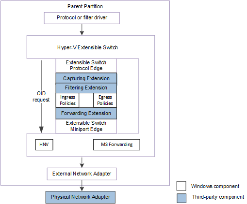

# Receiving OID Requests about Hyper-V Extensible Switch Configuration Changes

The extensible switch interface notifies underlying extensions about changes to the extensible switch component configuration and policy parameters by issuing extensible switch object identifier (OID) set requests. These requests are issued by the protocol edge of the extensible switch to notify underlying extensions about changes to the extensible switch component configuration and policy parameters. These OID requests move through the extensible switch driver stack to the underlying miniport edge of the extensible switch.

The following figure shows the extensible switch control path for OID requests for NDIS 6.40 (Windows Server 2012 R2) and later.

The following figure shows the extensible switch control path for OID requests for NDIS 6.30 (Windows Server 2012).

**Note**  In the extensible switch interface, NDIS filter drivers are known as *extensible switch extensions* and the driver stack is known as the *extensible switch driver stack*. 

The protocol edge of the extensible switch issues OID set requests for the following types of notifications:

-   Changes to the port configuration on the extensible switch.

    For example, the protocol driver issues [OID\_SWITCH\_PORT\_CREATE](https://docs.microsoft.com/windows-hardware/drivers/network/oid-switch-port-create) to notify underlying extensions about the creation of a port on the extensible switch. Similarly, the protocol driver issues [OID\_SWITCH\_PORT\_DELETE](https://docs.microsoft.com/windows-hardware/drivers/network/oid-switch-port-delete) to notify extensions about the deletion of a port.

    For more information about this type of OID notification, see [Hyper-V Extensible Switch Ports](hyper-v-extensible-switch-ports.md).

-   Changes to the network adapter connection to a port on the extensible switch.

    For example, the protocol driver issues [OID\_SWITCH\_NIC\_CONNECT](https://docs.microsoft.com/windows-hardware/drivers/network/oid-switch-nic-connect) to notify underlying extensions about the connection of a network adapter to a port on the extensible switch. Similarly, the protocol driver issues [OID\_SWITCH\_NIC\_DISCONNECT](https://docs.microsoft.com/windows-hardware/drivers/network/oid-switch-nic-disconnect) to notify extensions that the network adapter has been disconnected from the port.

    For more information about this type of OID notification, see [Hyper-V Extensible Switch Network Adapters](hyper-v-extensible-switch-network-adapters.md).

-   Changes to the extensible switch port or switch policies.

    For example, the protocol driver issues [OID\_SWITCH\_PROPERTY\_ADD](https://docs.microsoft.com/windows-hardware/drivers/network/oid-switch-property-add) to notify underlying extensions about the addition of an extensible switch property. Similarly, the protocol driver issues [OID\_SWITCH\_PORT\_PROPERTY\_DELETE](https://docs.microsoft.com/windows-hardware/drivers/network/oid-switch-port-property-delete) to notify extensions about the deletion of a port property.

    For more information about this type of OID notification, see [Managing Hyper-V Extensible Switch Policies](managing-hyper-v-extensible-switch-extensibility-policies.md).

    **Note**  The extension is not notified of changes to the default port or switch policies that are managed by the underlying miniport edge of the extensible switch.

-   Save or restore run-time port data.

    For example, the protocol driver issues [OID\_SWITCH\_NIC\_SAVE](https://docs.microsoft.com/windows-hardware/drivers/network/oid-switch-property-add) to notify underlying extensions to save run-time data for a specified port on the extensible switch. These OIDs are issued when the Hyper-V state is being saved or migrated to another host. Similarly, the protocol driver issues [OID\_SWITCH\_NIC\_RESTORE](https://docs.microsoft.com/windows-hardware/drivers/network/oid-switch-nic-restore) to notify extensions that run-time port data is being restored on the extensible switch.

    For more information about this type of OID notification, see [Managing Hyper-V Extensible Switch Run-Time Data](managing-hyper-v-extensible-switch-run-time-data.md).

The extensible switch extension miniport driver is responsible for completing these OID requests. However, with some extensible switch OID requests, an underlying extension can fail an OID request to veto a notification. For example, when the extensible switch protocol driver notifies the filter drivers about a new port that will be created on the extensible switch, it issues an OID set request of [OID\_SWITCH\_PORT\_CREATE](https://docs.microsoft.com/windows-hardware/drivers/network/oid-switch-port-create). An underlying filtering or forwarding extension can veto the port creation by completing the OID request with STATUS\_DATA\_NOT\_ACCEPTED.

The extensible switch extension must follow these guidelines when its [*FilterOidRequest*](https://docs.microsoft.com/windows-hardware/drivers/ddi/content/ndis/nc-ndis-filter_oid_request) function is called for an extensible switch OID request:

-   The extension must not modify any data that is pointed to by the *OidRequest* parameter.

-   For some extensible switch OID requests, the extension can complete the OID request with STATUS\_DATA\_NOT\_ACCEPTED. This vetoes the operation on an extensible switch component for which the OID request was issued.

    For example, the extension can complete the [OID\_SWITCH\_NIC\_CREATE](https://docs.microsoft.com/windows-hardware/drivers/network/oid-switch-nic-create) request with STATUS\_DATA\_NOT\_ACCEPTED. The driver may need to do this if it cannot satisfy its configured policies on the specified port to which the network connection is being created.

    The extension can complete requests in this manner for the following OIDs:

    -   [OID\_SWITCH\_NIC\_CREATE](https://docs.microsoft.com/windows-hardware/drivers/network/oid-switch-nic-create)

    -   [OID\_SWITCH\_PORT\_CREATE](https://docs.microsoft.com/windows-hardware/drivers/network/oid-switch-port-create)

    -   [OID\_SWITCH\_PORT\_PROPERTY\_ADD](https://docs.microsoft.com/windows-hardware/drivers/network/oid-switch-port-property-add)

    -   [OID\_SWITCH\_PORT\_PROPERTY\_DELETE](https://docs.microsoft.com/windows-hardware/drivers/network/oid-switch-port-property-delete)

    -   [OID\_SWITCH\_PORT\_PROPERTY\_UPDATE](https://docs.microsoft.com/windows-hardware/drivers/network/oid-switch-port-property-update)

    -   [OID\_SWITCH\_PROPERTY\_ADD](https://docs.microsoft.com/windows-hardware/drivers/network/oid-switch-property-add)

    -   [OID\_SWITCH\_PROPERTY\_DELETE](https://docs.microsoft.com/windows-hardware/drivers/network/oid-switch-property-delete)

    -   [OID\_SWITCH\_PROPERTY\_UPDATE](https://docs.microsoft.com/windows-hardware/drivers/network/oid-switch-property-update)

-   If the extension does not complete the OID request, it must call [**NdisFOidRequest**](https://docs.microsoft.com/windows-hardware/drivers/ddi/content/ndis/nf-ndis-ndisfoidrequest) to forward the request down the extensible switch driver stack.

    **Note**  Before the driver calls [**NdisFOidRequest**](https://docs.microsoft.com/windows-hardware/drivers/ddi/content/ndis/nf-ndis-ndisfoidrequest), the driver must call [**NdisAllocateCloneOidRequest**](https://docs.microsoft.com/windows-hardware/drivers/ddi/content/ndis/nf-ndis-ndisallocatecloneoidrequest) to allocate an [**NDIS\_OID\_REQUEST**](https://docs.microsoft.com/windows-hardware/drivers/ddi/content/ndis/ns-ndis-_ndis_oid_request) structure and transfer the request information to the new structure.

    The extension should monitor the completion result of the OID request when its [*FilterOidRequestComplete*](https://docs.microsoft.com/windows-hardware/drivers/ddi/content/ndis/nc-ndis-filter_oid_request_complete) function is called. This allows the extension to determine whether the operation on an extensible switch component completed successfully or was vetoed by an underlying extension.

    For more information on how to filter and forward an OID request, see [Filtering OID Requests in an NDIS Filter Driver](filtering-oid-requests-in-an-ndis-filter-driver.md).

-   NDIS and overlying protocol and filter drivers can issue OID requests for hardware offload technologies to the underlying physical network adapter. This includes OID requests for offload technologies, such as virtual machine queue (VMQ), Internet Protocol security (IPsec), and single root I/O virtualization (SR-IOV).

    When these OID requests arrive at the extensible switch interface, it encapsulates the OID request inside an [**NDIS\_SWITCH\_NIC\_OID\_REQUEST**](https://docs.microsoft.com/windows-hardware/drivers/ddi/content/ntddndis/ns-ntddndis-_ndis_switch_nic_oid_request). Then, the protocol edge of the extensible switch issues an OID request of [OID\_SWITCH\_NIC\_REQUEST](https://docs.microsoft.com/windows-hardware/drivers/network/oid-switch-nic-request) that contains this structure.

-   An extensible switch forwarding extension can provide support for an NDIS hardware offload technology on one or more physical adapters that are bound to the external network adapter. In this configuration, the extensible switch external network adapter is bound to the virtual miniport edge of an NDIS multiplexer (MUX) intermediate driver. The MUX intermediate driver is bound to a team of one or more physical networks on the host. This configuration is known as an *extensible switch team*. For more information about extensible switch teams, see [Types of Physical Network Adapter Configurations](types-of-physical-network-adapter-configurations.md).

    In this configuration, the extensible switch extensions are exposed to every network adapter in the team. This allows the forwarding extension in the extensible switch driver stack to manage the configuration and use of individual network adapters in the team. For example, the extension can provide support for a load balancing failover (LBFO) solution over the team by forwarding outgoing packets to individual adapters. Such an extension is known as a *teaming provider*. For more information about teaming providers, see [Teaming Provider Extensions](teaming-provider-extensions.md).

    By handling the OID request of [OID\_SWITCH\_NIC\_REQUEST](https://docs.microsoft.com/windows-hardware/drivers/network/oid-switch-nic-request), teaming providers can participate in the configuration of the adapter team for hardware offloads. For example, the extension can generate its own OID request of OID\_SWITCH\_NIC\_REQUEST to configure a physical adapter with parameters for the hardware offload.

    For more information on how to handle the [OID\_SWITCH\_NIC\_REQUEST](https://docs.microsoft.com/windows-hardware/drivers/network/oid-switch-nic-request) OID request, see [Forwarding OID Requests to Physical Network Adapters](forwarding-oid-requests-to-physical-network-adapters.md).

    **Note**  Extension filter drivers can generate OID requests of [OID\_SWITCH\_NIC\_REQUEST](https://docs.microsoft.com/windows-hardware/drivers/network/oid-switch-nic-request) to issue private OIDs to any physical adapter that is bound to the extensible switch external network adapter.

**Note**  Stack restart requests using [**NdisFRestartFilter**](https://docs.microsoft.com/windows-hardware/drivers/ddi/content/ndis/nf-ndis-ndisfrestartfilter) will not complete while an extensible switch OID request is pending. For this reason, an extension that is waiting for a stack restart must complete any ongoing OID requests.

For more information on the control path for extensible switch OID requests, see [Hyper-V Extensible Switch Control Path for OID Requests](hyper-v-extensible-switch-control-path-for-oid-requests.md).

