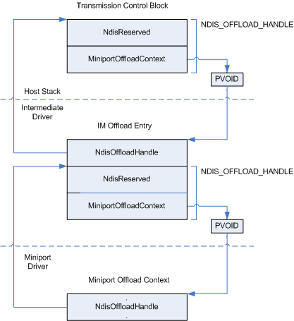

# Referencing Offloaded State Through an Intermediate Driver

\[The TCP chimney offload feature is deprecated and should not be used.\]

For each [state object](offload-state-objects.md) that is offloaded by the host stack to an intermediate driver's [*MiniportInitiateOffload*](https://msdn.microsoft.com/library/windows/hardware/ff559393) function, the intermediate driver must do the following:

-   Store the value of **NdisOffloadHandle** in the [**NDIS\_MINIPORT\_OFFLOAD\_BLOCK\_LIST**](https://msdn.microsoft.com/library/windows/hardware/ff566469) structure that is passed to the intermediate driver's *MiniportInitiateOffload* function.

-   Initialize and store an [**NDIS\_OFFLOAD\_HANDLE**](https://msdn.microsoft.com/library/windows/hardware/ff566705) structure that references the intermediate driver's context for the offloaded state object.

The intermediate driver stores both the value of **NdisOffloadHandle** and the NDIS\_OFFLOAD\_HANDLE structure in its context for the offloaded state object. This context, called an *IM offload entry*, is valid for the duration of the offload of the state object.

The following figure shows how an offloaded state object is referenced through an intermediate driver.

When offloading a state object, the host stack supplies a pointer to an [**NDIS\_OFFLOAD\_HANDLE**](https://msdn.microsoft.com/library/windows/hardware/ff566705) structure. This pointer references the host stack's Transmission Control Block (TCB). The NDIS\_OFFLOAD\_HANDLE structure contains a pointer in the **MiniportOffloadContext** member that references a memory location into which the intermediate driver writes a PVOID value before completing the initiate offload operation. This PVOID value references the intermediate driver's IM offload entry for the offloaded state object.

The intermediate driver stores the pointer to the host stack's NDIS\_OFFLOAD\_HANDLE structure, which was passed in as the value of **NdisOffloadHandle**, in its IM offload entry for the offloaded state object. Before offloading the state object to the underlying offload target, the intermediate driver initializes an NDIS\_OFFLOAD\_HANDLE structure of its own and stores this structure in its IM offload entry.

When offloading the state object to the underlying offload target, the intermediate driver supplies a pointer to its own NDIS\_OFFLOAD\_HANDLE structure. This pointer references the intermediate driver's IM offload entry for the offloaded state object. The NDIS\_OFFLOAD\_HANDLE structure contains a pointer in the **MiniportOffloadContext** member that references a memory location into which the offload target writes a PVOID value before completing the initiate offload operation. This PVOID value references the intermediate driver's miniport offload context for the offloaded state object.

The offload target stores the pointer to the intermediate driver's NDIS\_OFFLOAD\_HANDLE structure, which was passed in as the value of **NdisOffloadHandle**, in its miniport offload context for the offloaded state object.

When calling a state-manipulation function ([**NdisInitiateOffload**](https://msdn.microsoft.com/library/windows/hardware/ff562743), [**NdisInvalidateOffload**](https://msdn.microsoft.com/library/windows/hardware/ff562774), [**NdisQueryOffload**](https://msdn.microsoft.com/library/windows/hardware/ff563771), [**NdisTerminateOffload**](https://msdn.microsoft.com/library/windows/hardware/ff564615), or [**NdisUpdateOffload**](https://msdn.microsoft.com/library/windows/hardware/ff564646)), the host stack or intermediate driver supplies a pointer to its NDIS\_OFFLOAD\_HANDLE structure for the state object. The host stack or intermediate driver supplies this pointer in the **OffloadHandle** member of the [**NDIS\_PROTOCOL\_OFFLOAD\_BLOCK\_LIST**](https://msdn.microsoft.com/library/windows/hardware/ff566833) structure that it passes to the state-manipulation function. The underlying driver or offload target receives this pointer in the **NdisOffloadHandle** member in the [**NDIS\_MINIPORT\_OFFLOAD\_BLOCK\_LIST**](https://msdn.microsoft.com/library/windows/hardware/ff566469) structure that is passed to its corresponding state-manipulation function ( [*MiniportInitiateOffload*](https://msdn.microsoft.com/library/windows/hardware/ff559393), [**MiniportInvalidateOffload**](https://msdn.microsoft.com/library/windows/hardware/ff559406), [**MiniportQueryOffload**](https://msdn.microsoft.com/library/windows/hardware/ff559423), [**MiniportTerminateOffload**](https://msdn.microsoft.com/library/windows/hardware/ff559468), or [**MiniportUpdateOffload**](https://msdn.microsoft.com/library/windows/hardware/ff560463)).

When making an indication on an offloaded state object (that is, when referencing the offloaded state object in a call to the [**NdisTcpOffloadEventHandler**](https://msdn.microsoft.com/library/windows/hardware/ff564595) function or the [**NdisTcpOffloadReceiveHandler**](https://msdn.microsoft.com/library/windows/hardware/ff564606) function), the offload target or intermediate driver supplies its stored handle for the offloaded state object. The overlying driver receives this pointer in the **OffloadHandle** member of the NDIS\_PROTOCOL\_OFFLOAD\_BLOCK\_LIST structure that is passed to its corresponding indication function ( [**ProtocolTcpOffloadEvent**](https://msdn.microsoft.com/library/windows/hardware/ff570272) or [*ProtocolTcpOffloadReceiveIndicate*](https://msdn.microsoft.com/library/windows/hardware/ff570275)).

 

 

