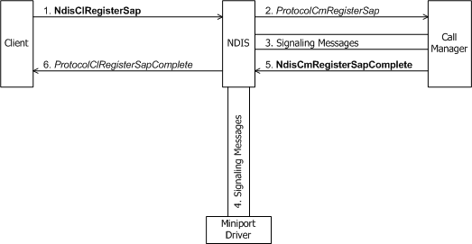
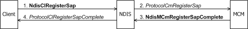

# Registering a SAP

If a client accepts incoming calls, its [**ProtocolClOpenAfCompleteEx**](https://msdn.microsoft.com/library/windows/hardware/ff570235) function usually registers one or more SAPs with the call manager by calling [**NdisClRegisterSap**](https://msdn.microsoft.com/library/windows/hardware/ff561648).

The following figure shows a client of a call manager registering a SAP.

The following figure shows a client of an MCM driver registering a SAP.

With the call to **NdisClRegisterSap**, a client requests notifications of incoming calls on a particular SAP. NDIS forwards the SAP information supplied by the client to the call manager's or MCM driver's [**ProtocolCmRegisterSap**](https://msdn.microsoft.com/library/windows/hardware/ff570250) function for validation. If the given SAP is already in use or if the call manager or MCM driver does not recognize the client-supplied SAP specification, the call manager or MCM driver fails this request.

In *ProtocolCmRegisterSap*, the call manager or MCM driver might communicate with network control devices or other media-specific agents to register the SAP on the network for a connection-oriented client. *ProtocolCmRegisterSap* also stores an NDIS-supplied *NdisSapHandle* that represents the SAP.

*ProtocolCmRegisterSap* can complete synchronously or asynchronously. To complete asynchronously, the *ProtocolCmRegisterSap* function of a call manager calls [**NdisCmRegisterSapComplete**](https://msdn.microsoft.com/library/windows/hardware/ff561689). The *ProtocolCmRegisterSap* function of an MCM driver calls [**NdisMCmRegisterSapComplete**](https://msdn.microsoft.com/library/windows/hardware/ff563557). The call to **Ndis(M)CmRegisterSapComplete** causes NDIS to call the client's [*ProtocolClRegisterSapComplete*](https://msdn.microsoft.com/library/windows/hardware/ff570237) function.

If the client's call to **NdisClRegisterSap** is successful, NDIS returns to the client an NdisSapHandle that represents the SAP.

After a call manager registers a SAP on behalf of a connection-oriented client, it notifies that client of an incoming call offer directed to that SAP by calling [**NdisCmDispatchIncomingCall**](https://msdn.microsoft.com/library/windows/hardware/ff561664). An MCM driver calls [**NdisMCmDispatchIncomingCall**](https://msdn.microsoft.com/library/windows/hardware/ff562830)(see [Indicating an Incoming Call](indicating-an-incoming-call.md)). A client can receive incoming calls on a SAP even while SAP registration is still pending; that is, before its *ProtocolClRegisterSapComplete* function is called.

 

 

