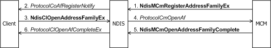

# Registering and Opening an Address Family

A call manager must register an address family for each NIC on which it provides call manager services to connection-oriented clients. Similarly, an MCM driver must register an address family for the NIC that it manages.

By registering an address family, a call manager or MCM driver causes NDIS to advertise the call manager's or MCM driver's services to all connection-oriented clients that bind to the adapter.

If a connection-oriented client can use the services advertised by a call manager or MCM driver, it can open an address family with the call manager or MCM driver.

### Registering an Address Family from a Call Manager

After its [*ProtocolBindAdapterEx*](/windows-hardware/drivers/ddi/ndis/nc-ndis-protocol_bind_adapter_ex) function binds to an underlying miniport driver with [**NdisOpenAdapterEx**](/windows-hardware/drivers/ddi/ndis/nf-ndis-ndisopenadapterex), a call manager calls [**NdisCmRegisterAddressFamilyEx**](/windows-hardware/drivers/ddi/ndis/nf-ndis-ndiscmregisteraddressfamilyex) to register an address family for the binding (see the following figure).

The call to **NdisCmRegisterAddressFamilyEx** advertises the call manager's specific signaling services. A call manager must register an address family each time that its *ProtocolBindAdapterEx* function and is called and successfully binds to a NIC with [**NdisOpenAdapterEx**](/windows-hardware/drivers/ddi/ndis/nf-ndis-ndisopenadapterex).

The call manager can support more than one address family across all the miniport drivers to which it is bound. The call manager can also support more than one address family on a single NIC to which it is bound. The call manager must register the same entry points for each address family on the binding. Only one call manager can support a particular type of address family for clients bound to any particular miniport driver. For more information about registering entry points for a call manager, see [CoNDIS Registration](condis-miniport-driver-registration.md).

### Registering an Address Family from an MCM Driver

An MCM driver calls **NdisMCmRegisterAddressFamilyEx** from its [*MiniportInitializeEx*](/windows-hardware/drivers/ddi/ndis/nc-ndis-miniport_initialize) function after registering its miniport driver entry points with [**NdisMRegisterMiniportDriver**](/windows-hardware/drivers/ddi/ndis/nf-ndis-ndismregisterminiportdriver). For more information about regsitering entry points see, [CoNDIS Registration](condis-miniport-driver-registration.md). An MCM driver calls [**NdisMCmRegisterAddressFamilyEx**](/windows-hardware/drivers/ddi/ndis/nf-ndis-ndismcmregisteraddressfamilyex) once to advertise its services to connection-oriented clients (see the following figure).

A miniport driver of a NIC that has on-board connection-oriented signaling support can register itself as an MCM driver even though a call manager may be available. By doing so, such an MCM driver preempts the call manager as the call manager for that NIC.

### Opening an Address Family

A call manager's or MCM driver's call to **Ndis(M)CmRegisterAddressFamily** causes NDIS to call the [**ProtocolCoAfRegisterNotify**](/windows-hardware/drivers/ddi/ndis/nc-ndis-protocol_co_af_register_notify) function of each connection-oriented client on the binding (as shown in two previous figures).

*ProtocolCoAfRegisterNotify* examines the address-family data to determine whether the client can use the services of this particular CM or MCM driver. Whether the client can make modifications in the (M)CM-supplied address-family data depends on the particular signaling-protocol support of the call manager or MCM driver.

If the client finds the offered call-management services acceptable, *ProtocolCoAfRegisterNotify* allocates a per-AF context area for the client and calls [**NdisClOpenAddressFamilyEx**](/windows-hardware/drivers/ddi/ndis/nf-ndis-ndisclopenaddressfamilyex). **NdisClOpenAddressFamilyEx** does not register the client's connection-oriented entry points with NDIS. For more information about registering connection-oriented entry points with NDIS, see [CoNDIS Registration](condis-miniport-driver-registration.md).

The call to **NdisClOpenAddressFamilyEx** causes NDIS to call the call manager's or MCM driver's [**ProtocolCmOpenAf**](/windows-hardware/drivers/ddi/ndis/nc-ndis-protocol_cm_open_af) function (as shown already in the two earlier figures). *ProtocolCmOpenAf* ensures that the client passed in a valid address family and allocates and initializes the resources necessary to perform operations on behalf of the client that is opening this instance of the address family. *ProtocolCmOpenAf* also stores an NDIS-supplied *NdisAfHandle* that represents the association between the call manager and client for the open address family.

*ProtocolCmOpenAf* can complete synchronously or asynchronously. To complete asynchronously, the *ProtocolCmOpenAf* function of a call manager calls [**NdisCmOpenAddressFamilyComplete**](/windows-hardware/drivers/ddi/ndis/nf-ndis-ndiscmopenaddressfamilycomplete); the *ProtocolCmOpenAf* function of an MCM driver calls [**NdisMCmOpenAddressFamilyComplete**](/windows-hardware/drivers/ddi/ndis/nf-ndis-ndismcmopenaddressfamilycomplete). The call to **Ndis(M)CmOpenAddressFamilyComplete** causes NDIS to call the *ProtocolOpenAfComplete* function of the client that originally called **NdisClOpenAddressFamilyEx**.

If the client's call to **NdisClOpenAddressFamilyEx** is successful, NDIS returns to the client an *NdisAfHandle* that represents the association between the call manager and client for the open address family.

If a client accepts incoming calls, it usually [registers one or more SAPs](registering-a-sap.md) from its *ProtocolClOpenAfCompleteEx* function by calling [**NdisClRegisterSap**](/windows-hardware/drivers/ddi/ndis/nf-ndis-ndisclregistersap) following its successful call to [**NdisClOpenAddressFamilyEx**](/windows-hardware/drivers/ddi/ndis/nf-ndis-ndisclopenaddressfamilyex).

If a client makes outgoing calls, it could [create one or more VCs](creating-a-vc.md) in its *ProtocolClOpenAfCompleteEx* function in anticipation of a request by one or more its clients to make an outgoing call.

 

