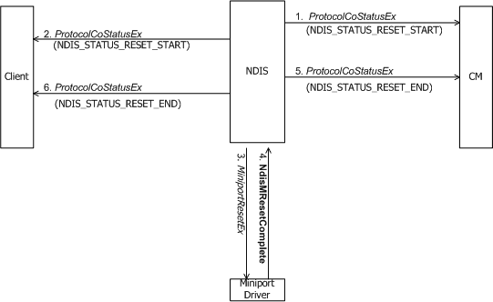
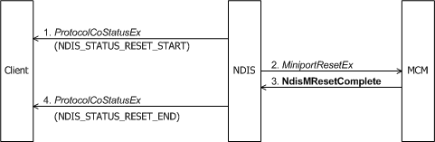

# Reset

NDIS might call a miniport driver's or MCM driver's [*MiniportResetEx*](https://msdn.microsoft.com/library/windows/hardware/ff559432) function to reset a NIC.

**Note**  AF, SAP, and VC handles that are active and valid before a reset are active and valid after the reset.

 

The following figure shows a client issuing a reset request to a miniport driver.

The next figure shows a client issuing a reset request to an MCM driver.

When an underlying connection-oriented driver is resetting a NIC, NDIS notifies each bound protocol by calling the protocol's [**ProtocolCoStatusEx**](https://msdn.microsoft.com/library/windows/hardware/ff570258) function with NDIS\_STATUS\_RESET\_START.

NDIS will not accept protocol-initiated sends and requests to a miniport driver or MCM driver while the miniport driver's or MCM driver's NIC is being reset. While a reset is in progress, a protocol driver must not attempt to send packets to the miniport driver with [**NdisCoSendNetBufferLists**](https://msdn.microsoft.com/library/windows/hardware/ff561728) or request information from the miniport driver with [**NdisCoOidRequest**](https://msdn.microsoft.com/library/windows/hardware/ff561711).

*MiniportResetEx* performs any device-dependent actions that are required to reset the NIC. *MiniportResetEx* can complete synchronously, or it can complete asynchronously with a call to [**NdisMResetComplete**](https://msdn.microsoft.com/library/windows/hardware/ff563663):

-   If the reset completes synchronously, NDIS calls each bound protocol's *ProtocolCoStatusEx* function with NDIS\_STATUS\_RESET\_END.

-   If the reset completes asynchronously, NDIS calls each bound protocol's *ProtocolCoStatusEx* function with NDIS\_STATUS\_RESET\_END.

 

 

