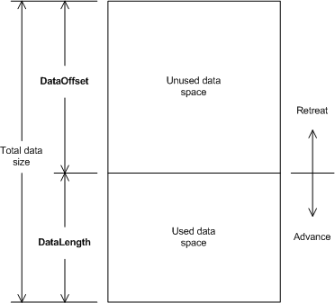

# Retreat and Advance Operations

NDIS provides retreat and advance functions to manipulate [**NET\_BUFFER**](https://msdn.microsoft.com/library/windows/hardware/ff568376) structures. [Retreat operations](retreat-operations.md) make more *used data space* available to the current driver. [Advance operations](advance-operations.md) release *used data space*.

Retreat operations are required during send operations or when a driver returns received data to an underlying driver. For example, during a send operation, a driver can call the [**NdisRetreatNetBufferDataStart**](https://msdn.microsoft.com/library/windows/hardware/ff564527) function to make room for header data.

Advance operations are required when a send operation is complete or when a driver receives data from an underlying driver. For example, during a receive operation, a driver can call the [**NdisAdvanceNetBufferDataStart**](https://msdn.microsoft.com/library/windows/hardware/ff560703) function to skip over the header data that was used by a lower level driver. In this case, the header data remains in the buffer in the *unused data space*.

The following figure shows the relationship between the network data and these operations.

The following topics provide more information about advance and retreat operations:

[Retreat Operations](retreat-operations.md)

[Advance Operations](advance-operations.md)

 

 

