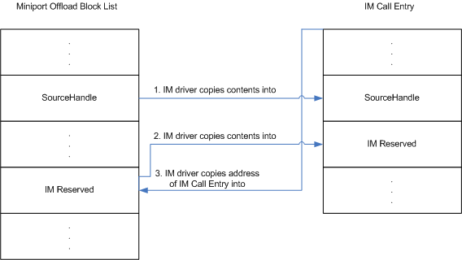

# Reusing an NDIS\_MINIPORT\_OFFLOAD\_BLOCK\_LIST Structure

\[The TCP chimney offload feature is deprecated and should not be used.\]

When [propagating a state-manipulation operation](propagating-a-state-manipulation-operation.md), an intermediate driver overlays most of the members of an incoming [**NDIS\_MINIPORT\_OFFLOAD\_BLOCK\_LIST**](https://msdn.microsoft.com/library/windows/hardware/ff566469) structure onto an [**NDIS\_PROTOCOL\_OFFLOAD\_BLOCK\_LIST**](https://msdn.microsoft.com/library/windows/hardware/ff566833) structure. (For a comparison of these structures, see [Comparison of Offload Block List Types](comparison-of-offload-block-list-types.md).)

The intermediate driver must also store the **ImReserved** and **SourceHandle** members of the NDIS\_MINIPORT\_OFFLOAD\_BLOCK\_LIST structure, as shown in the following figure.

After its *MiniportXxxOffload* function is called, the intermediate driver creates a context, called an *IM call entry*, for the state-manipulation operation. This context is valid only for the duration of the state-manipulation operation.

The intermediate driver copies the **ImReserved** and **SourceHandle** members from the incoming NDIS\_MINIPORT\_OFFLOAD\_BLOCK\_LIST structure into its IM call entry. (When completing the state-manipulation operation, the intermediate driver will copy the contents of the stored **ImReserved** and **SourceHandle** members into the **ImReserved** and **SourceHandle** members of the NDIS\_MINIPORT\_OFFLOAD\_BLOCK\_LIST structure that it passes to the **NdisM*Xxx*Complete** function.)

The intermediate driver writes a pointer into the **ImReserved** member of the NDIS\_MINIPORT\_OFFLOAD\_BLOCK\_LIST structure. This pointer points to the IM call entry. (When completing the state-manipulation operation, the intermediate driver will use this pointer to locate the IM call entry for the state-manipulation operation.)

When calling the **Ndis*Xxx*Offload** function to propagate the operation to the underlying driver, the intermediate driver passes a pointer to the newly constructed NDIS\_PROTOCOL\_OFFLOAD\_BLOCK\_LIST structure.

 

 

