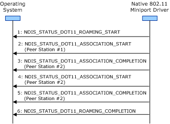

# Roaming Operation Guidelines for Independent BSS Networks

**Important**  The [Native 802.11 Wireless LAN](native-802-11-wireless-lan4.md) interface is deprecated in Windows 10 and later. Please use the WLAN Device Driver Interface (WDI) instead. For more information about WDI, see [WLAN Universal Windows driver model](wifi-universal-driver-model.md).

 

When roaming within an independent basic service set (IBSS) network, the miniport driver and 802.11 station must follow the general guidelines defined in [General Roaming Operation Guidelines](general-roaming-operation-guidelines.md).

**Note**  IBSS (Ad hoc) and SoftAP are deprecated. Starting with Windows 8.1 and Windows Server 2012 R2, use [Wi-Fi Direct](wi-fi-direct-miniport-initialization-and-configuration.md).

 

In addition, the miniport driver and 802.11 station must follow these guidelines for roaming operations within IBSS networks:

-   The miniport driver initiates an association operation with peer stations from the candidate list of BSS networks. For more information about the candidate list, see [BSS Network Candidate List](bss-network-candidate-list.md).

    The miniport driver must enclose the association operation between [NDIS\_STATUS\_DOT11\_ASSOCIATION\_START](https://msdn.microsoft.com/library/windows/hardware/ff567321) and [NDIS\_STATUS\_DOT11\_ASSOCIATION\_COMPLETION](https://msdn.microsoft.com/library/windows/hardware/ff567319) indications. For more information about the association operation, see [Association Operations](association-operations.md).

-   When joining an IBSS network during the roaming operation, the miniport driver must perform an association operation with one or more visible peer stations within the IBSS.

The following figure shows the sequence of events the miniport driver follows when the 802.11 station associates with two peer stations in an IBSS network during the connection operation.

 

 

