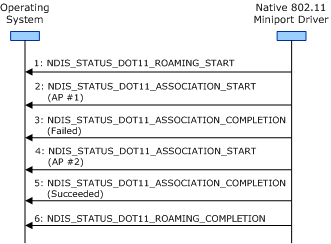

# Roaming Operation Guidelines for Infrastructure BSS Networks

**Important**  The [Native 802.11 Wireless LAN](native-802-11-wireless-lan4.md) interface is deprecated in Windows 10 and later. Please use the WLAN Device Driver Interface (WDI) instead. For more information about WDI, see [WLAN Universal Windows driver model](wifi-universal-driver-model.md).

 

When [roaming](roaming-operations.md) within an infrastructure basic service set (BSS) network, the miniport driver and 802.11 station must follow the general guidelines defined in [General Roaming Operation Guidelines](general-roaming-operation-guidelines.md).

In addition, the miniport driver and 802.11 station must follow these guidelines for roaming operations within an infrastructure BSS network:

-   The miniport driver initiates an association operation with access points (APs) from the candidate list of BSS networks. For more information about the candidate list, see [BSS Network Candidate List](bss-network-candidate-list.md).

    The miniport driver must enclose the association operation between [NDIS\_STATUS\_DOT11\_ASSOCIATION\_START](https://msdn.microsoft.com/library/windows/hardware/ff567321) and [NDIS\_STATUS\_DOT11\_ASSOCIATION\_COMPLETION](https://msdn.microsoft.com/library/windows/hardware/ff567319) indications. For more information about the association operation, see [Association Operations](association-operations.md).

-   The 802.11 station must successfully associate with no more than one AP during the roaming operation. The miniport driver must complete the roaming operation after the 802.11 station successfully associates with an AP within the infrastructure BSS network.

The following figure shows the sequence of events when the 802.11 station attempts to successfully associate with an AP in an infrastructure network during the roaming operation.

 

 

