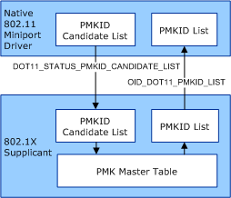

# RSNA Preauthentication Guidelines

**Important**  The [Native 802.11 Wireless LAN](native-802-11-wireless-lan4.md) interface is deprecated in Windows 10 and later. Please use the WLAN Device Driver Interface (WDI) instead. For more information about WDI, see [WLAN Universal Windows driver model](wifi-universal-driver-model.md).

 

If the 802.11 station supports the Robust Security Network Association (RSNA) authentication algorithm, it might support RSNA preauthentication for infrastructure basic service set (BSS) networks. RSNA preauthentication is defined in Clause 8.4.6.1 of the IEEE 802.11i-2004 standard. For an overview of preauthentication, see [RSNA Preauthentication](rsna-preauthentication.md).

In order to support RSNA preauthentication, the miniport driver must support the following:

[OID\_DOT11\_PMKID\_LIST](https://msdn.microsoft.com/library/windows/hardware/ff569400)  
This object identifier (OID) is used to set or query the list of pairwise master key (PMK) identifiers (PMKIDs) used by the 802.11 station for RSNA preauthentication. Each PMKID in the PMKID list is referenced by the basic service set (BSS) identifier (BSSID) of the access point (AP).

The miniport driver returns the maximum size of its PMKID list when queried by [OID\_DOT11\_EXTSTA\_CAPABILITY](https://msdn.microsoft.com/library/windows/hardware/ff569366). If the 802.11 station does not support preauthentication, the driver returns a list size of zero. Otherwise, the miniport driver must return a list size of three or more PMKID entries.

[NDIS\_STATUS\_DOT11\_PMKID\_CANDIDATE\_LIST](https://msdn.microsoft.com/library/windows/hardware/ff567355)  
This media-specific indication is made by the miniport driver to request PMKIDs for APs that the 802.11 station can potentially roam to. When roaming, the 802.11 station uses the PMKID value for the AP's BSSID to authenticate with the AP.

The miniport driver typically makes the [NDIS\_STATUS\_DOT11\_PMKID\_CANDIDATE\_LIST](https://msdn.microsoft.com/library/windows/hardware/ff567355) indication following a scan operation if it detects the BSSID candidate list changes within the BSS network with which the 802.11 is connected. For more information about scan operations, see [Native 802.11 Scan Operations](native-802-11-scan-operations.md).

The miniport driver should keep the frequency of these indications to a minimum. For example, the driver should not make an [NDIS\_STATUS\_DOT11\_PMKID\_CANDIDATE\_LIST](https://msdn.microsoft.com/library/windows/hardware/ff567355) indication if only one new entry was added to its BSSID candidate list. Instead, it must make the indication after the number of new entries inserted into its BSSID candidate list reaches a driver-specific threshold.

The 802.1X supplicant will do the following when the miniport driver makes an [NDIS\_STATUS\_DOT11\_PMKID\_CANDIDATE\_LIST](https://msdn.microsoft.com/library/windows/hardware/ff567355) indication:

-   Replace the contents of its PMKID candidate list with the list associated with the indication.

-   Take the intersection of its PMKID candidate list and the Master PMK Table, which stores PMKID values resolved from previous authentication or preauthentication operations. The operating system uses the results of the intersection to immediately issue a set request of [OID\_DOT11\_PMKID\_LIST](https://msdn.microsoft.com/library/windows/hardware/ff569400) to the miniport driver. If the intersection of the two lists results in an empty list, the operating system makes the set request to clear the driver's PMKID list.

The following figure shows the actions performed when the miniport driver makes an [NDIS\_STATUS\_DOT11\_PMKID\_CANDIDATE\_LIST](https://msdn.microsoft.com/library/windows/hardware/ff567355) indication.

The 802.1X supplicant can initiate preauthentication to the entries in its PMKID candidate list. After it resolves a PMK for a BSSID in the candidate list, the supplicant adds the new PMKID entry to its Master PMK Table and issues a set request of [OID\_DOT11\_PMKID\_LIST](https://msdn.microsoft.com/library/windows/hardware/ff569400) to the miniport driver to update the 802.11 station's PMKID candidate list.

For more information about the 802.1X supplicant, refer to the IEEE 802.1X-2001 standard.

The miniport driver must clear its PMKID list if any of the following occurs:

-   The miniport driver's [*MiniportInitializeEx*](https://msdn.microsoft.com/library/windows/hardware/ff559389) function is called.

-   A method request of [OID\_DOT11\_RESET\_REQUEST](https://msdn.microsoft.com/library/windows/hardware/ff569409) is made.

 

 

