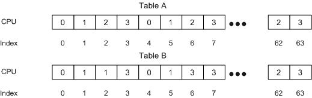

# RSS Configuration

To obtain RSS configuration information, an overlying driver can send an OID query of [OID\_GEN\_RECEIVE\_SCALE\_CAPABILITIES](https://msdn.microsoft.com/library/windows/hardware/ff569636) to a miniport driver. NDIS also provides the RSS configuration information to overlying protocol drivers in the [**NDIS\_BIND\_PARAMETERS**](https://msdn.microsoft.com/library/windows/hardware/ff564832) structure during initialization.

The overlying driver chooses a hashing function, type, and indirection table. To set these configuration options, the driver sends an OID set request of [OID\_GEN\_RECEIVE\_SCALE\_PARAMETERS](https://msdn.microsoft.com/library/windows/hardware/ff569637) to the miniport driver. Overlying drivers can also query this OID to obtain the current RSS settings. The information buffer for the OID\_GEN\_RECEIVE\_SCALE\_PARAMETERS OID contains a pointer to an [**NDIS\_RECEIVE\_SCALE\_PARAMETERS**](https://msdn.microsoft.com/library/windows/hardware/ff567228) structure.

The overlying driver can disable RSS on the NIC. In this case, the driver sets the NDIS\_RSS\_PARAM\_FLAG\_DISABLE\_RSS flag in the **Flags** member of the NDIS\_RECEIVE\_SCALE\_PARAMETERS structure. When this flag is set, the miniport driver should ignore all of the other flags and settings and disable RSS on the NIC.

NDIS processes OID\_GEN\_RECEIVE\_SCALE\_PARAMETERS before passing it to the miniport driver and updates the miniport adapter's \*RSS standardized keyword, if required. For more information about the **\*RSS** keyword, see [Standardized INF Keywords for RSS](standardized-inf-keywords-for-rss.md).

After receiving an [OID\_GEN\_RECEIVE\_SCALE\_PARAMETERS](https://msdn.microsoft.com/library/windows/hardware/ff569637) set request with the NDIS\_RSS\_PARAM\_FLAG\_DISABLE\_RSS flag set, the miniport driver should set the RSS state of the NIC to the initial state of the NIC after initialization. Therefore, if the miniport driver receives a subsequent OID\_GEN\_RECEIVE\_SCALE\_PARAMETERS set request with the NDIS\_RSS\_PARAM\_FLAG\_DISABLE\_RSS flag cleared, all of the parameters should have the same values that were set after the miniport driver received the OID\_GEN\_RECEIVE\_SCALE\_PARAMETERS set request for the first time after the miniport adapter was initialized.

An overlying driver can use the [OID\_GEN\_RECEIVE\_HASH](https://msdn.microsoft.com/library/windows/hardware/ff569635) OID to enable and configure hash calculations on received frames without enabling RSS. Overlying drivers can also query this OID to obtain the current receive hash settings.

The information buffer for the OID\_GEN\_RECEIVE\_HASH OID contains a pointer to an [**NDIS\_RECEIVE\_HASH\_PARAMETERS**](https://msdn.microsoft.com/library/windows/hardware/ff567190) structure. For a set request, the OID specifies the hash parameters that the miniport adapter should use. For a query request, the OID returns the hash parameters that the miniport adapter is using. This OID is optional for drivers that support RSS.

**Note**  If receive hash calculation is enabled, NDIS disables receive hash calculation before it enables RSS. If RSS is enabled, NDIS disables RSS before it enables receive hash calculation.

 

All of the miniport adapters that the miniport driver supports must provide the same hash configuration settings to all subsequent protocol bindings. This OID also includes the secret key that the miniport driver or NIC must use for hash calculations. The key is 320 bits long (40 bytes) and can contain any data that the overlying driver chooses, for example, a random stream of bytes.

To rebalance the processing load, the overlying driver can set the RSS parameters and modify the indirection table. Normally, all the parameters are unchanged except for the indirection table. However, after RSS is initialized, the overlying driver might change other RSS initialization parameters. If necessary, the miniport driver can reset the NIC hardware to change the hash function, hash secret key, hash type, base CPU number, or the number of bits that are used to index the indirection table.

**Note**  The overlying driver can set these parameters at any time. This can cause out of order receive indications. Miniport drivers that support TCP are not required to purge their receive queues in this instance.

 

The following figure provides example contents for two instances of the indirection table.

The preceding figure assumes a four processor configuration, and the number of least significant bits used from the hash value is 6 bits. Therefore, the indirection table contains 64 entries.

In the figure, table A lists the values in the indirection table immediately after initialization. Later, as normal traffic load varies, the processor load grows unbalanced. The overlying driver detects the unbalanced condition and attempts to rebalance the load by defining a new indirection table. Table B lists the new indirection table values. In the table B, some of the load from CPU 2 is moved to CPUs 1 and 3.

**Note**  When the indirection table is changed, for a short time (while the current receive descriptor queues are being processed), packets can be processed on the wrong CPU. This is a normal transient condition.

 

The size of the indirection table is typically two to eight times the number of processors in the system.

When the miniport driver distributes packets to CPUs, if there are far too many CPUs, the effort spent in distributing the load could become prohibitive. In this case, overlying drivers should choose a subset of CPUs on which the processing of network data occurs.

In some cases, the number of available hardware receive queues might be less than the number of CPUs on the system. The miniport driver must examine the indirection table to determine the CPU numbers to associate with hardware queues. If the total number of different CPU numbers that appear in the indirection table is more than the number of hardware queues that the NIC supports, the miniport driver must pick a subset of the CPU numbers from the indirection table. The subset is equal in number to the number of hardware queues. The miniport driver obtained the **IndirectionTableSize** parameter from [OID\_GEN\_RECEIVE\_SCALE\_PARAMETERS](https://msdn.microsoft.com/library/windows/hardware/ff569637). The miniport driver specified the **NumberOfReceiveQueues** value in response to OID\_GEN\_RECEIVE\_SCALE\_CAPABILITIES.

 

 

