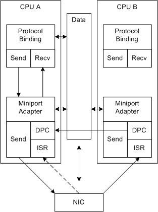

# RSS with a Single Hardware Receive Queue

Miniport drivers can support RSS for NICs that support RSS hash calculation and a single receive descriptor queue.

The following figure illustrates RSS processing with a single receive descriptor queue.

In the figure, the dashed arrows represent an alternate path for the receive processing. RSS cannot control the CPU that receives the initial ISR call.

Unlike the non-RSS receive processing, RSS-based receive processing is distributed over multiple CPUs. Also, the processing for a given connection can be tied to a given CPU.

The following process repeats for each interrupt:

1.  The NIC uses DMA to fill buffers with received data and interrupts the system.

    The miniport driver allocated the receive buffers in shared memory during initialization.

2.  The NIC can fill additional receive buffers at any time but does not interrupt again until the miniport driver enables the interrupts.

    The received buffers that the system handles in one interrupt can be associated with many different network connections.

3.  NDIS calls the miniport driver's [*MiniportInterrupt*](https://msdn.microsoft.com/library/windows/hardware/ff559395) function (ISR) on a system-determined CPU.

4.  The ISR disables the interrupts and requests NDIS to queue a deferred procedure call (DPC) to process the received data.

5.  NDIS calls the [*MiniportInterruptDPC*](https://msdn.microsoft.com/library/windows/hardware/ff559398) function (DPC) on the current CPU. In the DPC:

    1.  The miniport driver uses the hash values that the NIC calculated for each received buffer and reassigns each received buffer to a receive queue that is associated with a CPU.
    2.  The current DPC requests NDIS to queue a DPC for each of the other CPUs that are associated with a non-empty receive queue.
    3.  If the current DPC is running on a CPU that is associated with a non-empty queue, the current DPC processes the associated receive buffers and indicates the received data up the driver stack.

    Assigning queues, and queuing additional DPCs requires additional processing overhead. To achieve improved system performance, this overhead must be offset by better utilization of available CPUs.

6.  The DPC on a given CPU:
    1.  Processes the receive buffers that are associated with its receive queue and indicates the data up the driver stack. For more information, see [Indicating RSS Receive Data](indicating-rss-receive-data.md).
    2.  Enables the interrupts, if it is the last DPC to complete. This interrupt is complete and the process starts again. The driver must use an atomic operation to identify the last DPC to complete. For example, the driver can use the [**NdisInterlockedDecrement**](https://msdn.microsoft.com/library/windows/hardware/ff562751) function to implement an atomic counter.

 

 

