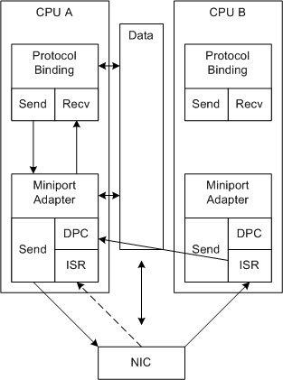

# RSS with Hardware Queuing

RSS with hardware queuing improves system performance relative to RSS with a single hardware receive queue solution. NICs that support hardware queuing assign received data to multiple receive queues. The receive queues are associated with a CPU. The NIC assigns received data to CPUs based on hash values and an indirection table.

The following figure illustrates RSS with NIC receive queuing.

In the figure, the dashed arrows represent an alternate path for the receive processing. RSS cannot control the CPU that receives the initial ISR call. The driver does not have to queue the data so it can immediately schedule the initial DPCs on the correct CPUs.

The following process repeats for each interrupt:

1.  The NIC:
    1.  Uses DMA to fill buffers with received data.

        The miniport driver allocated the receive buffers in shared memory during initialization.

    2.  Computes a hash value.
    3.  Queues the buffer for a CPU and provides the queue assignments to the miniport driver.

        For example, the NIC could loop steps 1-3 and DMA a list of CPU assignments after some number of packets are received. The specific mechanism is left to the NIC design.

    4.  Interrupts the system.

        The received buffers that the system handles in one interrupt are distributed between the CPUs.

2.  NDIS calls the miniport driver's [*MiniportInterrupt*](https://msdn.microsoft.com/library/windows/hardware/ff559395) function (ISR) on a system-determined CPU.

3.  The miniport driver requests NDIS to queue deferred procedure calls (DPCs) for each of the CPUs that have a non-empty queue.

    Note that all the DPCs must complete before the driver enables interrupts. Also, note that the ISR might be running on a CPU that has no buffers to process.

4.  NDIS calls the [*MiniportInterruptDPC*](https://msdn.microsoft.com/library/windows/hardware/ff559398) function for each queued DPC. The DPC on a given CPU:
    1.  Builds receive descriptors for all of the received buffers in its queue and indicates the data up the driver stack.

        For more information, see [Indicating RSS Receive Data](indicating-rss-receive-data.md).

    2.  Enables the interrupts, if it is the last DPC to complete. This interrupt is complete and the process starts again. The driver must use an atomic operation to identify the last DPC to complete. For example, the driver can use the [**NdisInterlockedDecrement**](https://msdn.microsoft.com/library/windows/hardware/ff562751) function to implement an atomic counter.

 

 

