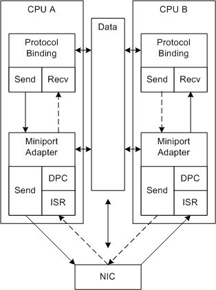

# RSS with Message Signaled Interrupts

Miniport drivers can support message signaled interrupts (MSIs) to improve RSS performance. MSIs enable the NIC to request an interrupt on the CPU that will process the received data. For more information about NDIS support for MSI, see [NDIS MSI-X](ndis-msi-x.md).

The following figure illustrates RSS with MSI-X.

In the figure, the dashed arrows represent processing on a different connection. RSS with MSI-X allows the NIC to interrupt the correct CPU for a connection.

The following process repeats for each interrupt:

1.  The NIC:
    1.  Uses DMA to fill buffers with received data.

        The miniport driver allocated the receive buffers in shared memory during initialization.

    2.  Computes a hash value.
    3.  Queues the buffer to a CPU and provides the queue assignments to the miniport driver. For example, the NIC could loop steps 1-3 and DMA a list of CPU assignments after some number of packets are received. The specific mechanism is left to the NIC design.
    4.  Using MSI-X, interrupts the CPU that is associated with a non-empty queue.

2.  The NIC can fill additional receive buffers and add them to the queue at any time but does not interrupt that CPU again until the miniport driver enables the interrupts for that CPU.

3.  NDIS calls the miniport driver's ISR ( [*MiniportInterrupt*](https://msdn.microsoft.com/library/windows/hardware/ff559395)) on the current CPU.

4.  The ISR disables interrupts on the current CPU and queues a DPC on the current CPU.

    Interrupts can still occur on the other CPUs while the DPC is running on the current CPU.

5.  NDIS calls the [*MiniportInterruptDPC*](https://msdn.microsoft.com/library/windows/hardware/ff559398) function for each queued DPC. Each DPC:
    1.  Builds receive descriptors for all of the received buffers in its queue and indicates the data up the driver stack. For more information, see [Indicating RSS Receive Data](indicating-rss-receive-data.md).
    2.  Enables interrupts for the current CPU. This interrupt is complete and the process starts again. Note that no atomic operation is required to track the progress of other DPCs.

 

 

