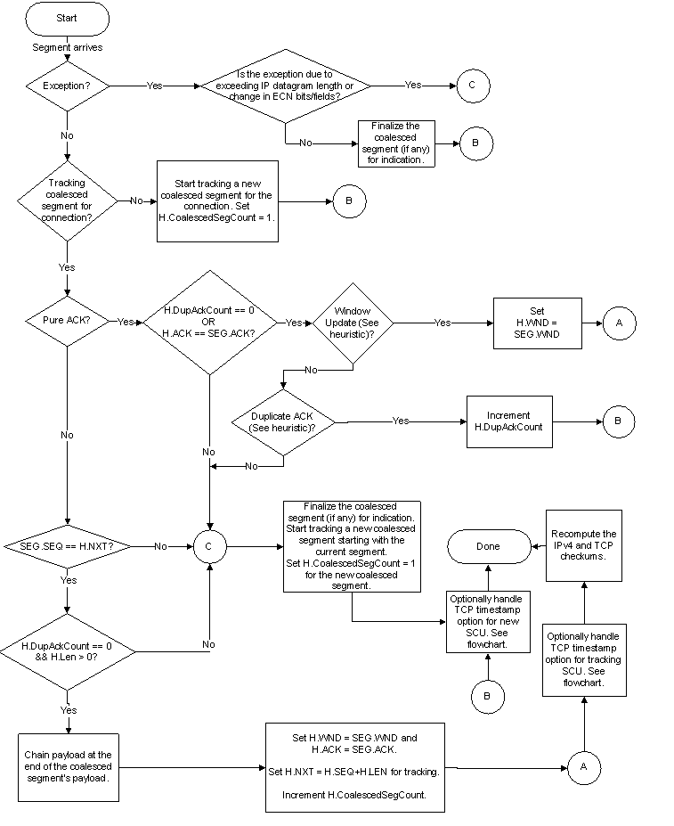
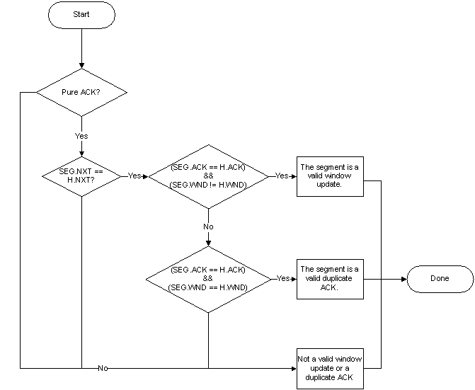
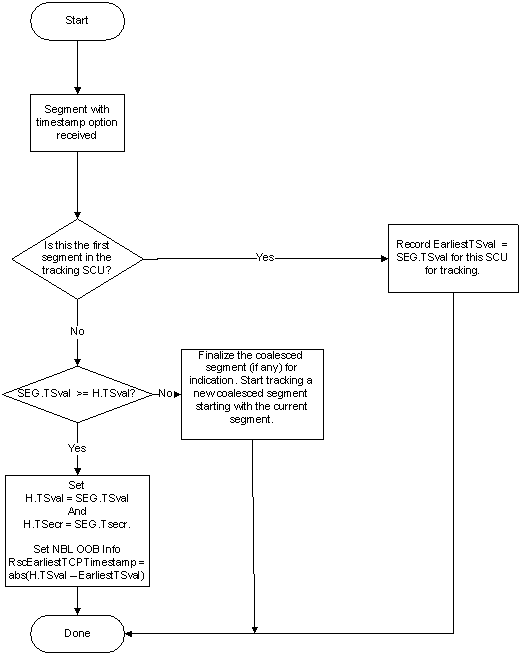

# Rules for Coalescing TCP/IP Segments

This section defines the rules that specify when a receive segment coalescing (RSC)-capable miniport driver must coalesce a segment for a given TCP connection. If any of the rules are violated, an exception is generated, and the miniport driver must abort the coalescing of the segment.

The miniport driver must update the IP and TCP headers for the single coalesced unit (SCU). The miniport driver must recompute the TCP and IPv4 checksums over the SCU and chain the TCP payload.

The first of the following two flowcharts describes the rules for coalescing segments and updating the TCP headers. This flowchart refers to mechanisms for distinguishing valid duplicate ACKs and window updates. The second flowchart describes these mechanisms.

These flowcharts are provided as a reference for understanding the RSC rules. A hardware implementation can optimize the flowchart, as long as correctness is maintained.

The following terms are used in the flowcharts:

<table>
<colgroup>
<col width="50%" />
<col width="50%" />
</colgroup>
<thead>
<tr class="header">
<th align="left">Term</th>
<th align="left">Description</th>
</tr>
</thead>
<tbody>
<tr class="odd">
<td align="left">
<strong>SEG.SEQ</strong>
</td>
<td align="left">
Sequence number of the incoming segment.
</td>
</tr>
<tr class="even">
<td align="left">
<strong>H.SEQ</strong>
</td>
<td align="left">
Sequence number of the currently tracked SCU.
</td>
</tr>
<tr class="odd">
<td align="left">
<strong>SEG.ACK</strong>
</td>
<td align="left">
Acknowledgment number of the incoming segment.
</td>
</tr>
<tr class="even">
<td align="left">
<strong>H.ACK</strong>
</td>
<td align="left">
Acknowledgment number of the currently tracked SCU.
</td>
</tr>
<tr class="odd">
<td align="left">
<strong>SEG.WND</strong>
</td>
<td align="left">
The window that is advertised by the incoming segment.
</td>
</tr>
<tr class="even">
<td align="left">
<strong>H.WND</strong>
</td>
<td align="left">
The window that is advertised by the currently tracked SCU.
</td>
</tr>
<tr class="odd">
<td align="left">
<strong>SEG.LEN</strong>
</td>
<td align="left">
TCP payload length of the incoming segment.
</td>
</tr>
<tr class="even">
<td align="left">
<strong>H.LEN</strong>
</td>
<td align="left">
TCP payload length of the currently tracked SCU.
</td>
</tr>
<tr class="odd">
<td align="left">
<strong>SEG.NXT</strong>
</td>
<td align="left">
The sum of <strong>SEG.SEQ</strong> and <strong>SEG.LEN</strong>.
</td>
</tr>
<tr class="even">
<td align="left">
<strong>H.NXT</strong>
</td>
<td align="left">
The sum of <strong>H.SEQ</strong> and <strong>H.LEN</strong>.
</td>
</tr>
<tr class="odd">
<td align="left">
<strong>H.DupAckCount</strong>
</td>
<td align="left">
The number of duplicate ACKs that have been coalesced into the SCU. This number should be zero.
</td>
</tr>
<tr class="even">
<td align="left">
<strong>SEG.Tsval</strong>
</td>
<td align="left">
The <strong>Timestamp</strong> value in the currently received segment. The format for this value is defined in <a href="http://www.ietf.org/rfc/rfc1323.txt" data-raw-source="[RFC 1323](http://www.ietf.org/rfc/rfc1323.txt)">RFC 1323</a>.
</td>
</tr>
<tr class="odd">
<td align="left">
<strong>H.Tsval</strong>
</td>
<td align="left">
The <strong>Timestamp</strong> value in the currently tracked SCU.
</td>
</tr>
<tr class="even">
<td align="left">
<strong>SEG.TSecr</strong>
</td>
<td align="left">
The <strong>Timestamp Echo Reply</strong> in the currently received segment.
</td>
</tr>
<tr class="odd">
<td align="left">
<strong>H.TSecr</strong>
</td>
<td align="left">
The <strong>Timestamp Echo Reply</strong> in the currently tracked SCU.
</td>
</tr>
</tbody>
</table>

 

The flowcharts show that the miniport driver may coalesce segments with different ACK numbers. However, the miniport driver must obey the following rules regarding ACK numbers, as shown in the first flowchart above:

-   After performing the sequence number check, an incoming pure ACK may be coalesced into the currently tracked SCU if it meets one or both of the following conditions:

    -   **H.ACK** == **SEG.ACK**.
    -   The duplicate-ACK count in the coalesced segment that is being tracked is zero. In other words, **H.DupAckCount** == 0.

    In other words, any pure ACK that is not a duplicate ACK or a window update triggers an exception and must not be coalesced. All such pure ACKs must be indicated as individual segments. This rule ensures that RSC does not affect the behavior or performance of the Windows TCP congestion control algorithms.

-   An incoming data segment (**SEG.ACK** == **H.ACK**) or an incoming piggy-backed ACK (**SEG.ACK** &gt; **H.ACK**) may be coalesced into the currently tracked SCU if both of the following conditions are met:

    -   The segment is contiguous to the SCU in the sequence space. In other words, **SEG.SEQ** == **H.NXT**.
    -   The duplicate-ACK count in the coalesced segment that is being tracked is zero. In other words, **H.DupAckCount** == 0.

## Additional notes on Duplicate ACK coalescing

### Duplicate ACK Behavior

The miniport driver should treat a duplicate ACK segment equivalent to a pure ACK and not coalesce it. In this case, it must finalize the current SCU (if any) for indication and indicate the duplicate ACK segment as an individual segment. Because Windows clients use selective acknowledgments (SACK) by default, a duplicate ACK segment will likely generate an exception. See [Examples of Receive Segment Coalescing](examples-of-receive-segment-coalescing.md) for an example. If a segment with **DupAckCount** &gt; 0 is indicated, NDIS will disable RSC on the interface.

### Handling Duplicate ACK when tracking a SCU consisting of data segments

When tracking an SCU with **H.LEN** &gt; 0 (in other words, a coalesced segment that contains data), if a duplicate ACK arrives next, then the tracking SCU should be finalized as follows:

1.  A new SCU should be tracked, starting with the duplicate ACK.

2.  The **DupAckCount** for the new SCU should be set to zero.

3.  The **DupAckCount** should be incremented if additional duplicate ACKs are received.

In this case, **DupAckCount** will be 1 less than the number of duplicate ACKs. The host stack will handle the counting correctly.

### Handling Duplicate ACK when tracking a SCU consisting of a pure cumulative ACK

When tracking an SCU that consists of a single pure cumulative ACK (rules forbid coalescing multiple pure ACKs), if a duplicate ACK arrives next, then the **DupAckCount** for the tracking SCU should be incremented. It should also be incremented if additional duplicate ACKs are received. In this case, **DupAckCount** will be equal to the number of duplicate ACKs that are coalesced.

### When the first segment that is received in a DPC is a duplicate ACK

In this case, the NIC cannot determine whether the received segment is a duplicate ACK, because it does not maintain any state. So the segment should be treated as a pure ACK instead as follows:

1.  A new SCU should be tracked, starting with this segment.

2.  The **DupAckCount** for the new SCU should be set to zero.

3.  The **DupAckCount** should be incremented by 1 for each additional duplicate ACK that is received.

In this case, **DupAckCount** will be equal to 1 less than the actual number of duplicate ACKs. The host stack will handle the counting correctly.

### Duplicate ACK Exemption

The miniport driver may treat a duplicate ACK segment equivalent to a pure ACK and not coalesce it. In this case, it must finalize the current SCU (if any) for indication and indicate the duplicate ACK segment as an individual segment. Because Windows clients use SACK by default, a duplicate ACK segment will likely generate an exception. For an example, see [Examples of Receive Segment Coalescing](examples-of-receive-segment-coalescing.md). This exemption does not apply to window update segments.

## Coalescing Segments with the Timestamp Option

The TCP timestamp option is the only option that may be legally coalesced. Coalescing segments with this option is left as an implementation-specific decision. If the miniport driver coalesces segments with the timestamp option, then it must follow the rules outlined in the following flowchart:

**Note**  The check **SEG.TSval** &gt;= **H.TSval** must be performed using modulo-232 arithmetic similar to that used for TCP sequence numbers. See [RFC 793](http://www.ietf.org/rfc/rfc793.txt), section 3.3.

 

When indicating a coalesced segment, the following out-of-band information must be indicated as follows by setting the **NetBufferListInfo** member of the [**NET\_BUFFER\_LIST**](https://msdn.microsoft.com/library/windows/hardware/ff568388) structure that describes the coalesced segment:

-   The number of segments that were coalesced must be stored into the **NetBufferListInfo**\[**TcpRecvSegCoalesceInfo**\].**CoalescedSegCount** member. This number only represents data segments that were coalesced. Pure ACK coalescing is forbidden and window update segments must not be counted as part of this field.

-   The duplicate ACK count must be stored into the **NetBufferListInfo**\[**TcpRecvSegCoalesceInfo**\].**DupAckCount** member. The first flowchart above explains how this value is calculated.

-   When segments with the TCP timestamp option are coalesced, **NetBufferListInfo**\[**RscTcpTimestampDelta**\] must be filled with the absolute delta between the earliest and the latest TCP timestamp value seen in the sequence of coalesced segments comprising the SCU. The SCU itself should contain the latest TCP timestamp value seen in the sequence of coalesced segments.

The **DupAckCount** and **RscTcpTimestampDelta** members are interpreted if and only if the **CoalescedSegCount** member is greater than zero. If the **CoalescedSegCount** is zero, the segment is treated as a non-coalesced non-RSC segment.

For information about the contents of the **NetBufferListInfo** member, see [**NDIS\_NET\_BUFFER\_LIST\_INFO**](https://msdn.microsoft.com/library/windows/hardware/ff566569) and [**NDIS\_RSC\_NBL\_INFO**](https://msdn.microsoft.com/library/windows/hardware/hh451655).

The PSH bit should be ORed for all coalesced segments. In other words, if the PSH bit was set in any of the individual segments, the miniport driver should set the PSH bit in the SCU.

Finalizing an SCU involves:

-   Recomputing the TCP and, if applicable, the IPv4 checksum.

-   Updating the IP headers as described in [Updating the IP Headers for Coalesced Segments](updating-the-ip-headers-for-coalesced-segments.md).

-   Setting the ECN bits and ECN fields in the TCP and IP headers to the same values that were set in the individual segments.

## Handling TCP/IP IPsec segments

A network card may report both RSC and IPsec task offload capabilities. (See [Determining the RSC Capabilities of a Network Adapter](determining-the-rsc-capabilities-of-a-network-adapter.md).) However, if it supports IPsec task offload, it must not attempt to coalesce segments that are protected by IPsec.

 

 

