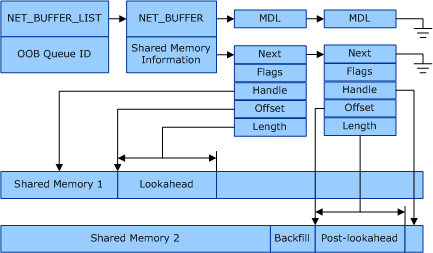

# Security Issues with NDIS Virtual Machine (VM) Shared Memory


This topic discusses the potential security issues involved with allocating shared memory from a virtual machine (VM) for virtual machine queue (VMQ) receive buffers. The topic includes the following sections:

-   [Overview of the Security Issues with VM Shared Memory](#overview)

-   [How Windows Server 2008 R2 Addresses the Security Issue](#ndis620)

-   [How Windows Server 2012 and Later Versions Address the Security Issue](#ndis630)

**Note**  In Hyper-V, a child partition is also known as a VM.

 

### <a href="" id="overview"></a>Overview of the Security Issues with VM Shared Memory

VMs are not trusted software entities. That is, a malicious VM must not be able to interfere with other VMs or the management operating system that runs in the Hyper-V parent partition. This section provides background information and requirements to ensure that driver writers understand VMQ security issues and requirements for shared memory. For more information about shared memory, see the [Shared Memory Resource Allocation](shared-memory-resource-allocation.md) topic in the [Writing VMQ Drivers](writing-vmq-drivers.md) section.

In the virtualized environment, VM shared memory can be viewed or modified by the VM. However, viewing or modifying data that is associated with other VMs is not allowed. VMs are also not allowed to access the management operating address space.

The header portion of the received packets must be protected. A VM is not allowed to affect the behavior of the Hyper-V extensible switch in a network virtual service provider (VSP). Therefore, VLAN (virtual LAN) filtering must happen before the network adapter uses DMA to transfer the data to VM shared memory. Also, the media access control (MAC) address learning of the switch cannot be affected.

If the Hyper-V extensible switch port that is connected to a VM has an associated VLAN identifier, the host computer must ensure that the destination MAC address and the VLAN identifier of the incoming frame match those respective attributes of the port before the host forwards the packet to the VM's virtual network adapter. If the VLAN identifier of the frame does not match the VLAN identifier of the port, the packet is dropped. When the receive buffers for a virtual network adapter are allocated from host memory, the host can check the VLAN identifier and drop the frame if necessary before making the contents of the frame visible to the target VM. If the frame is not copied to a VM's address space, it cannot be accessed by that VM.

However, when VMQ is configured to use shared memory, the network adapter uses DMA to transfer incoming frames directly to the VM address space. This transfer introduces a security issue in which a VM can examine the contents of the received frames without waiting for the extensible switch to apply the required VLAN filtering.

### <a href="" id="ndis620"></a>How Windows Server 2008 R2 Addresses the Security Issue

In Windows Server 2008 R2, before the VSP configures a VM queue to use shared memory that is allocated from the VM address space, it uses the following filtering test for the queue.

```syntax
(MAC address == x) && (VLAN identifier == n)
```

If the network adapter hardware can support this test before the DMA transfer to the receive buffers, the network adapter can either drop frames with invalid VLAN identifiers or send them to the default queue so that they can be filtered out by the extensible switch. If the miniport driver succeeds in a request to set a filter with this test on a queue, the extensible switch can use VM shared memory for that queue. However, if the network adapter hardware is not capable of filtering the frames based on both destination MAC address and VLAN identifier, the extensible switch uses host shared memory for that queue.

The extensible switch inspects the source MAC address of received frames to configure the routing information for transmit frames—that is, it is similar to a physical learning switch. It is possible to install firewall filter drivers in the host stack; for example, above the miniport driver for the network adapter hardware and below the extensible switch driver. Firewall filter drivers can access data in a received frame before the extensible switch. If the entire receive buffer for each frame is allocated from VM address space, a malicious VM could access parts of the frame that would be examined by either a filter driver or the extensible switch that runs in the host.

To address this security issue, when using VM shared memory for a VM queue, the network adapter must split the packet at a byte offset that is at least the lookahead size, which is a predetermined fixed value. Any lookahead data— meaning data that is ahead of the byte offset for the lookahead size—must be transferred with DMA to shared memory that was allocated for lookahead data. The post-lookahead data—the rest of the frame payload—should be transferred with DMA to shared memory that was allocated for the post-lookahead data.

The following illustration shows the relationships for the network data structures when the incoming data is split into lookahead and post-lookahead shared memory buffers.



The summary requirements for VMQ shared memory are as follows:

-   A network adapter can split a received frame at a network-header boundary that is larger than the lookahead size. However, when requested by NDIS, and without exception, all of the frames that are received and assigned to a VMQ must be split at or beyond the lookahead size boundary that NDIS requests.

-   The lookahead data must be transferred with DMA to shared memory that is allocated by the miniport driver. The miniport driver must specify in the allocation call that the memory will be used for lookahead data.

-   The post-lookahead data must be transferred with DMA to shared memory that is allocated by the miniport driver. The miniport driver must specify in the allocation call that the memory will be used for post-lookahead data.

-   Miniport drivers must not be dependent upon which address space NDIS will use to complete the shared memory allocation request. That is, the shared memory address space for lookahead or post-lookahead data is implementation specific. In many cases, NDIS or the extensible switch might satisfy all the requests, including those for post-lookahead use, from host memory address space.

-   The order in which frames are received on a VMQ receive queue must be preserved when the frames in that queue are indicated up the driver stack.

-   The network adapter must allocate enough backfill memory space in each post-lookahead buffer. This allocation allows the lookahead data to be copied to the backfill portion of the post-lookahead buffer, and allows the frame to be delivered to the VM in a contiguous buffer.

If there is no mechanism in hardware to meet these requirements for VMQ shared memory, the hardware that supports scatter-gather DMA on the receive side might achieve the same results by allocating two receive buffers for each received frame. In this case, the size of the first buffer is limited to the requested lookahead size.

If the network adapter cannot meet these requirements for VMQ shared memory by any method, the VSP will allocate memory for the VMQ receive buffers from the host address space and will copy the received packets from the network adapter receive buffers to VM address space.

### <a href="" id="ndis630"></a>How Windows Server 2012 and Later Versions Address the Security Issue

Starting with Windows Server 2012, the VSP does not allocate shared memory from the VM for the VMQ receive buffers. Instead, the VSP allocates memory for the VMQ receive buffers from the host address space and then copies the received packets from the network adapter receive buffers to VM address space.

The following points apply to VMQ miniport drivers that run on Windows Server 2012 and later versions of Windows:

-   For NDIS 6.20 VMQ miniport drivers, no change is required. However, when the VSP allocates a VM queue by issuing an OID (object identifier) method request of [OID\_RECEIVE\_FILTER\_ALLOCATE\_QUEUE](https://msdn.microsoft.com/library/windows/hardware/ff569784), it will set the **LookaheadSize** member of the [**NDIS\_RECEIVE\_QUEUE\_PARAMETERS**](https://msdn.microsoft.com/library/windows/hardware/ff567211) structure to zero. This will force a miniport driver to not split the packet into pre-lookahead and post-lookahead buffers.

-   Starting with NDIS 6.30, VMQ miniport drivers must not advertise support for splitting packet data into pre-lookahead and post-lookahead buffers. When a miniport driver registers its VMQ capabilities, it must follow these rules when it initializes the [**NDIS\_RECEIVE\_FILTER\_CAPABILITIES**](https://msdn.microsoft.com/library/windows/hardware/ff566864) structure:

    -   The miniport driver must not set the **NDIS\_RECEIVE\_FILTER\_LOOKAHEAD\_SPLIT\_SUPPORTED** flag in the **Flags** member.

    -   The miniport driver must set the **MinLookaheadSplitSize** and **MinLookaheadSplitSize** members to zero.

    For more information about how to register VMQ capabilities, see [Determining the VMQ Capabilities of a Network Adapter](determining-the-vmq-capabilities-of-a-network-adapter.md).

 

 


